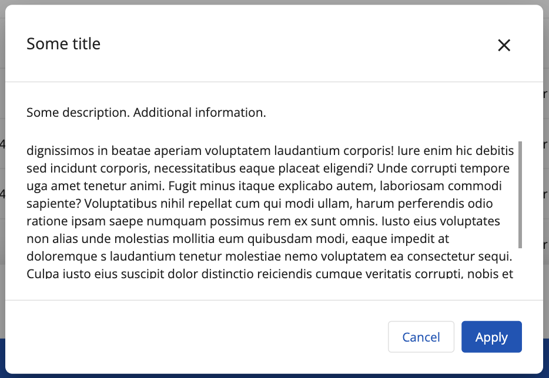
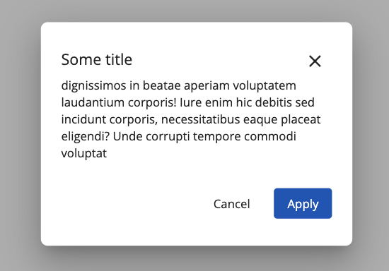
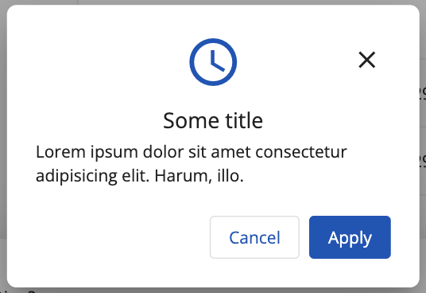
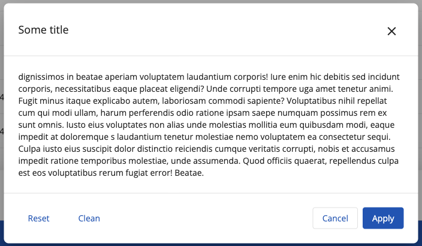

# [Dialog component](../../../lib/content-services/src/lib/dialogs/dialog/ "Defined in dialog.component.ts")

Dialog wrapper styled according to a consistent design system.

## Dialog views

### Large size and Medium

Looks the same but have different sizes.
Max-width for Large dialog is `1075px`;
Max-width for Medium dialog is `778px`;



### Alert dialogs

Standard:



With icon:



### Dialog with additional buttons



## Basic Usage 

```html

<ng-template #contentDialogTemplate>
  Lorem ipsum dolor sit amet consectetur adipisicing elit. Similique nihil, natus corrupti asperiores voluptas, incidunt veritatis.
</ng-template>

<ng-template #actionsDialogTemplate>
  <button
    mat-button
    adf-auto-focus
    id="aspect-dialog-actions-cancel"
    data-automation-id="aspect-list-dialog-actions-cancel"
  >
    Reset
  </button>

  <button
    mat-button
    mat-ghost-button
    color="primary"
    id="adf-dialog-actions-confirm"
    data-automation-id="adf-dialog-actions-confirm"
  >
    Clean
  </button>
</ng-template>
```

```ts
@ViewChild('contentDialogTemplate') contentDialogTemplate: TemplateRef<any>;
@ViewChild('actionsDialogTemplate') actionsDialogTemplate: TemplateRef<any>;

constructor(private dialog: MatDialog) {}

...

function openDialog() {
    const data: DialogData = {
        title: 'Dialog title',
        dialogSize: DialogSize.Alert,
        isConfirmButtonDisabled$: of(true),
        contentTemplate: this.contentDialogTemplate,
        actionsTemplate: this.actionsDialogTemplate
    };

    this.dialog.open(DialogComponent, { data });
}
```

## Details

This component lets the user reuse styled dialog wrapper. Use the
Angular [`MatDialog`](https://material.angular.io/components/dialog/overview)
service to open the dialog, as shown in the example, and pass a `data` object
with properties.

## See also

- [Dialog Data Interface](../interfaces/dialog.interface.md)
- [Dialog Model](../models/dialog.model.md)
