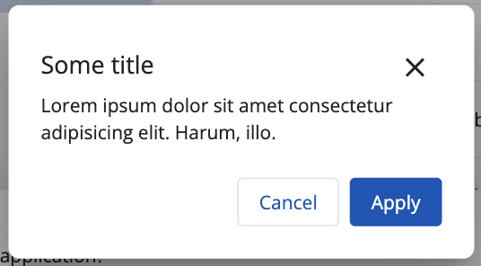

# [Dialog component](../../../lib/content-services/src/lib/dialogs/dialog/ "Defined in dialog.component.ts")

Dialog wrapper styled according to a consistent design system.

## Dialog views

### Large size and Medium

Looks the same but have different sizes.
Max-width for Large dialog is `1075px`;
Max-width for Medium dialog is `778px`;


### Alert dialogs

Standard:


With icon


### Dialog with additional buttons


## Dialog inputs

| Name | Type | Default value | Description |
| ---- | ---- | ------------- | ----------- |
| title | `string` | `no` | It will be placed in the dialog title section. |
| headerIcon | `string` | `no` | It will be placed in header section. Should be used with Alert dialogs. (optional) |
| description | `string` | `no` | It will be placed first in the dialog content section. (optional) |
| confirmButtonTitle | `string` | `COMMON.APPLY` | Confirmation action. After this, the dialog is closed and the `isConfirmButtonDisabled$` is set to `true`. (optional) |
| cancelButtonTitle | `string` | `COMMON.CANCEL` | Cancellation action. After this, the dialog is closed |
| isCancelButtonHidden | `boolean` | `false` | Toggles cancel button visibility. (optional) |
| isCloseButtonHidden | `boolean` | `false` | Toggles close button visibility. (optional) |
| isConfirmButtonDisabled$ | `Subject<boolean>` | `false` | Toggles confirm button disability. (optional) |
| dialogSize | `DialogSize` | `MEDIUM` | Set dialog size. Can be `LARGE`, `MEDIUM`, `ALERT`. (optional) |
| contentTemplate | `TemplateRef<any>` | `no` | Inserts a content template. (optional) |
| actionsTemplate | `TemplateRef<any>` | `no` | Inserts a template styled on the left. Should be used for additional `ghost` style buttons. (optional) |
| descriptionTemplate | `TemplateRef<any>` | `no` | Inserts a description template. (optional) |

## Basic Usage 

```html

<ng-template #contentDialogTemplate>
  Lorem ipsum dolor sit amet consectetur adipisicing elit. Similique nihil, natus corrupti asperiores voluptas, incidunt veritatis.
</ng-template>

<ng-template #actionsDialogTemplate>
  <button
    mat-button
    adf-auto-focus
    id="aspect-dialog-actions-cancel"
    data-automation-id="aspect-list-dialog-actions-cancel"
  >
    Reset
  </button>

  <button
    mat-button
    mat-ghost-button
    color="primary"
    id="adf-dialog-actions-confirm"
    data-automation-id="adf-dialog-actions-confirm"
  >
    Clean
  </button>
</ng-template>
```

```ts
@ViewChild('contentDialogTemplate') contentDialogTemplate: TemplateRef<any>;
@ViewChild('actionsDialogTemplate') actionsDialogTemplate: TemplateRef<any>;

constructor(private dialog: MatDialog) {}

...

function openCatDialog() {
    const data: DialogComponentData = {
        title: 'title',
        dialogSize: DialogSize.ALERT,
        isConfirmButtonDisabled$: of(true),
        contentTemplate: this.contentDialogTemplate,
        actionsTemplate: this.actionsDialogTemplate
    };

    this.dialog.open(DialogComponent, { data });
}
```

## Details

This component lets the user reuse styled dialog wrapper. Use the
Angular [`MatDialog`](https://material.angular.io/components/dialog/overview)
service to open the dialog, as shown in the example, and pass a `data` object
with properties.
