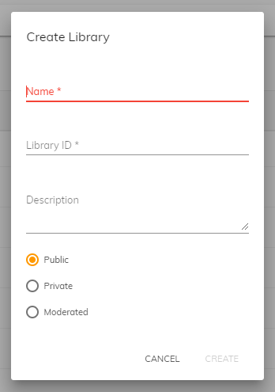

# [Library dialog component](../../../lib/content-services/src/lib/dialogs/library/library.dialog.ts "Defined in library.dialog.ts")

Creates a new Content Services document library/site.



## Basic Usage

```html
<adf-library-dialog
    (success)="useLibraryDetails($event)"
    (error)="handleError()"
>
</adf-library-dialog>
```

## Class members

### Events

| Name | Type | Description |
| --- | --- | --- |
| error | [`EventEmitter`](https://angular.io/api/core/EventEmitter)`<any>` | Emitted when an error occurs. |
| success | [`EventEmitter`](https://angular.io/api/core/EventEmitter)`<any>` | Emitted when the new library is created successfully. The event parameter is a SiteEntry object with the details of the newly-created library. |

## Details

This component lets the user create a new document library/site with the usual
name, ID, description and access restrictions. See the
[Sites](https://docs.alfresco.com/6.0/concepts/sites-intro.html)
section of the Content Services documentation for more information.

## See also

*   [Sites dropdown component](../components/sites-dropdown.component.md)
