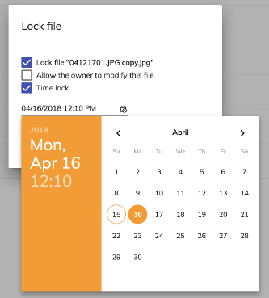

# [Node Lock directive](../../../lib/content-services/src/lib/directives/node-lock.directive.ts "Defined in node-lock.directive.ts")

Locks or unlocks a node.

## Basic Usage

```html
<button mat-icon-button [adf-node-lock]="node.entry">
    <mat-icon>lock</mat-icon> Lock file
</button>
```

## Class members

### Properties

| Name | Type | Default value | Description |
| ---- | ---- | ------------- | ----------- |
| node | `Node` |  | Node to lock/unlock. |

## Details

When the user clicks the decorated element (eg, div), a dialog is shown to let them lock
or unlock a file (a folder cannot be locked).

There are two types of lock that the user can choose from the dialog: indefinite lock and time lock. The time lock will expire at the specified time
but the indefinite lock remains in place until the user cancels it.

When a file is locked it can be locked and unlocked by default only by the user that creates the lock but you can also allow the other file owners to modify it:



This directive calls the `openLockNodeDialog` method from the
[Content Node Dialog service](../services/content-node-dialog.service.md)
when clicked.
It disables the target button if the provided node is not a file or the user doesn't
have permissions.
