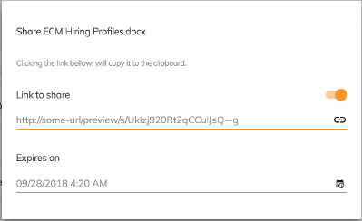

# Node Public File Share Directive

Creates and manages public shared links for files.



## Basic Usage

```html
<adf-toolbar>
    <button mat-icon-button
            [baseShareUrl]="http://localhost:8080/myrouteForShareFile/"
            [adf-share]="documentList.selection[0]">
            <mat-icon>share</mat-icon>
    </button>
</adf-toolbar>

<adf-document-list #documentList ...>
 ...
</adf-document-list>
```

## Class members

### Properties

| Name | Type | Default value | Description |
| ---- | ---- | ------------- | ----------- |
| baseShareUrl | `string` |  | Prefix to add to the generated link. |
| node | [`MinimalNodeEntity`](../content-services/document-library.model.md) |  | Node to share. |

## Details

This dialog will generate a link with the form "baseShareUrl + sharedId".
For example, if you set the input parameter as follows:

    [baseShareUrl]="http://localhost:8080/myrouteForShareFile/"

...then the directive will ask the [Content service](../core/content.service.md) to generate
a `sharedId` for the file. This will create a URL like the following:

    http://localhost:8080/myrouteForShareFile/NEW_GENERATED_SHAREID

To use this, you will need to implement some code that gets the `NEW_GENERATED_SHAREID` with the router
and passes it to a [Viewer component](../core/viewer.component.md):

```html
<adf-viewer
    [sharedLinkId]="NEW_GENERATED_SHAREID"
    [allowGoBack]="false">
</adf-viewer>
```
