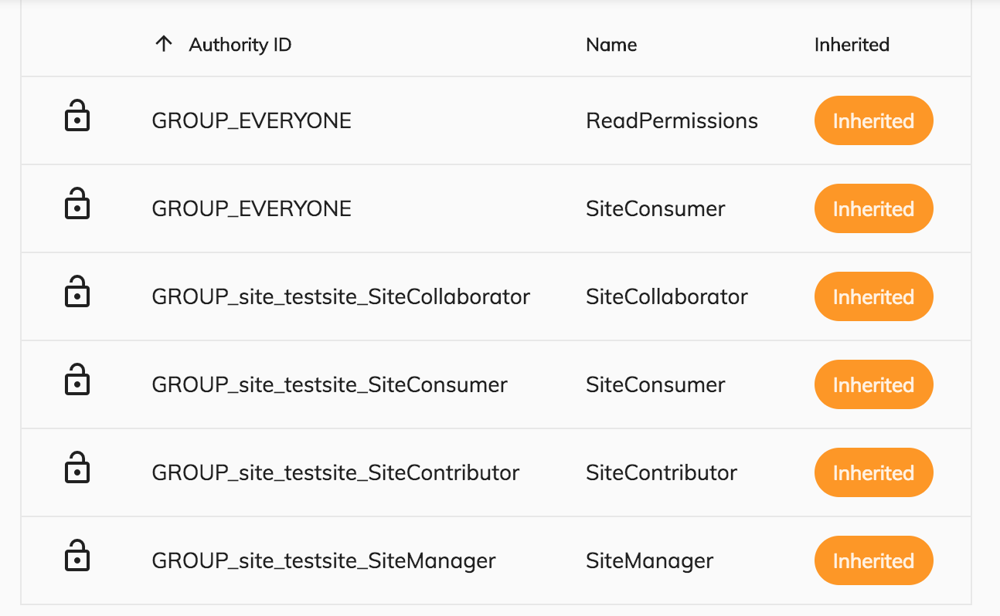

# Permission List Component

Shows node permissions as a table.



## Basic Usage

```html
<adf-permission-list [nodeId]="nodeId">
</adf-permission-list>
```

### [Transclusions](../user-guide/transclusion.md)

When the list is empty, the contents will simply say "No permissions" by default, 
but you can also supply your own content: 

```html
<adf-permission-list [nodeId]="nodeId">
  <adf-no-permission-template>
    Custom no permission template!
  </adf-no-permission-template>
</adf-permission-list>
```

## Class members

### Properties

| Name | Type | Default value | Description |
| ---- | ---- | ------------- | ----------- |
| nodeId | `string` | "" | ID of the node whose permissions you want to show. |

### Events

| Name | Type | Description |
| ---- | ---- | ----------- |
| error | [`EventEmitter`](https://angular.io/api/core/EventEmitter)`<any>` | Emitted when an error occurs. |
| update | [`EventEmitter`](https://angular.io/api/core/EventEmitter)`<PermissionElement>` | Emitted when the permission is updated. |

## Details

This component uses a [Datatable component](../core/datatable.component.md) to show the
permissions retrieved from the [Node service](../core/node.service.md).
For the locally set permissions a role dropdown will be shown to let the user select a new role.
When the user selects a new value, the permission role is automatically updated and the `update` event is emitted.
