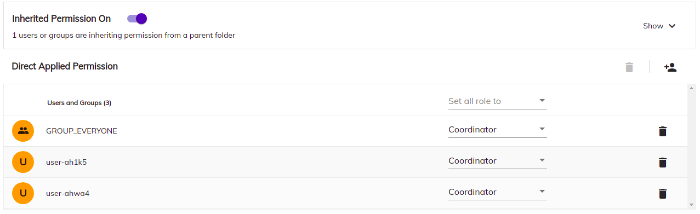

# Permission List Component



## Basic Usage

```html
<adf-permission-list [nodeId]="nodeId">
</adf-permission-list>
```

### Properties

| Name | Type | Default value | Description |
| ---- | ---- | ------------- | ----------- |
| nodeId | `string` | `null` | node id which we want to show the permissions  |

## Details

This component use the `datatable` to show the permission retrieved from the node service.