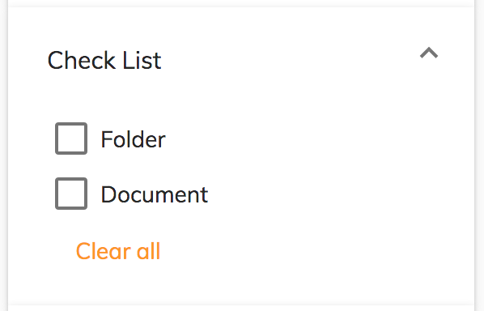

# Search check list component

Implements a checklist widget for the [Search Filter component](../content-services/search-filter.component.md).



## Basic usage

```json
{
    "search": {
        "categories": [
            {
                "id": "checkList",
                "name": "Check List",
                "enabled": true,
                "component": {
                    "selector": "check-list",
                    "pageSize": 5,
                    "settings": {
                        "operator": "OR",
                        "options": [
                            { "name": "Folder", "value": "TYPE:'cm:folder'" },
                            { "name": "Document", "value": "TYPE:'cm:content'" }
                        ]
                    }
                }
            }
        ]
    }
}
```

### Settings

| Name | Type | Description |
| ---- | ---- | ----------- |
| operator | `string` | Logical operator to combine query fragments. Can be 'AND' or 'OR'. |
| options | `array` | Array of objects with `name` and `value` properties. Each object defines a checkbox, labelled with `name`, that adds the query fragment in `value` to the query when enabled. |

## Details

This widget displays a list of checkboxes, each of which toggles a particular query fragment
in the search. See the [Search filter component](../content-services/search-filter.component.md) for full details of how to use the widgets
in a search query.

In the settings, the `options` array, defines the checkboxes that toggle the supplied query
fragments and the `operator` selects logical `AND` or `OR` to combine the fragments.
In the example above, if the user checks both boxes then the following fragment will be added
to the query:

```text
... (TYPE:'cm:folder' OR TYPE:'cm:content') ...
```

The component can be set to split a long checklist into separate pages of checkboxes
using the `pageSize` value as the number of boxes to show per page (default is 5).
When there is more than one page, the widget will display "Show more" and "Show less"
buttons as appropriate.

A "Clear all" button is also displayed at the bottom of the widget to clear all checked
items in the list.

## See also

-   [Search filter component](../content-services/search-filter.component.md)
-   [Search date range component](../content-services/search-date-range.component.md)
-   [Search number range component](../content-services/search-number-range.component.md)
-   [Search radio component](../content-services/search-radio.component.md)
-   [Search slider component](../content-services/search-slider.component.md)
-   [Search text component](../content-services/search-text.component.md)
