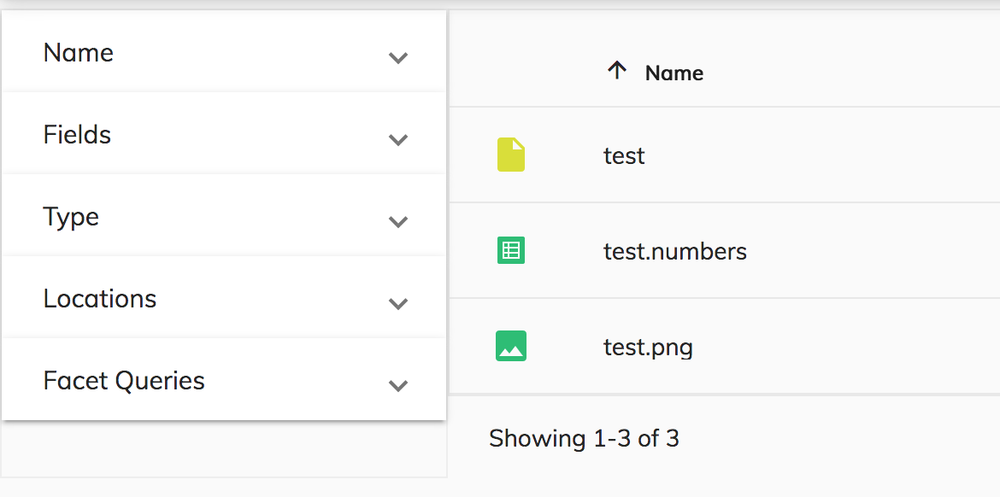
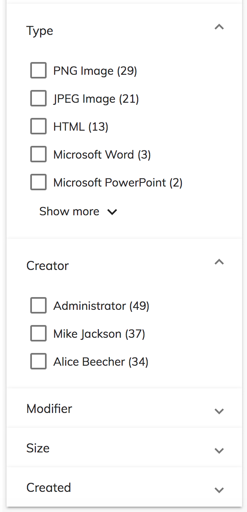
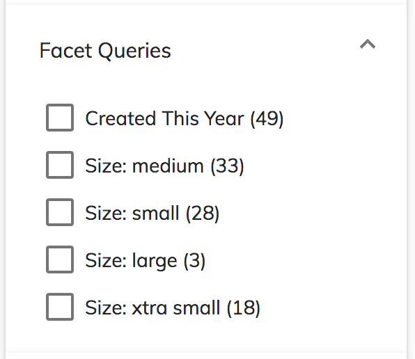

# [Search Filter component](../../lib/content-services/search/components/search-filter/search-filter.component.ts "Defined in search-filter.component.ts")

Represents a main container component for custom search and faceted search settings.

## Contents

-   [Basic usage](#basic-usage)
-   [Details](#details)
    -   [Configuration](#configuration)
    -   [Extra fields and filter queries](#extra-fields-and-filter-queries)
    -   [Sorting](#sorting)
    -   [Categories and widgets](#categories-and-widgets)
    -   [Facet Fields](#facet-fields)
    -   [Facet Queries](#facet-queries)
-   [See also](#see-also)

## Basic usage

```html
<adf-search-filter #settings></adf-search-filter>
```

## Details

The component UI uses dynamically created widgets to specify the search query and its
options. It then uses the [Search Query Builder service](search-query-builder.service.md)
to build and execute the query.

You may find it useful to check out the following resources for background information
before customizing the search UI:

-   [Search API](https://docs.alfresco.com/5.2/concepts/search-api.html)
-   [Alfresco Full Text Search Reference](https://docs.alfresco.com/5.2/concepts/rm-searchsyntax-intro.html)
-   [ACS API Explorer](https://api-explorer.alfresco.com/api-explorer/#!/search/search)

### Configuration

You can configure the component using the `search` entry in the `app.config.json` file.
A typical configuration is shown below:

```json
{
    "search": {
        "sorting": {
            "options": [
                { "key": "name", "label": "Name", "type": "FIELD", "field": "cm:name", "ascending": true },
                { "key": "content.sizeInBytes", "label": "Size", "type": "FIELD", "field": "content.size", "ascending": true },
                { "key": "description", "label": "Description", "type": "FIELD", "field": "cm:description", "ascending": true }
            ],
            "defaults": [
                { "key": "name", "type": "FIELD", "field": "cm:name", "ascending": true }
            ]
        },
        "filterQueries": [
            { "query": "TYPE:'cm:folder' OR TYPE:'cm:content'" },
            { "query": "NOT cm:creator:System" }
        ],
        "facetFields": {
          "expanded": true,
          "fields": [
            { "field": "content.mimetype", "mincount": 1, "label": "Type" },
            { "field": "content.size", "mincount": 1, "label": "Size" },
            { "field": "creator", "mincount": 1, "label": "Creator" },
            { "field": "modifier", "mincount": 1, "label": "Modifier" }
          ]
        },
        "facetQueries": {
            "label": "My facet queries",
            "pageSize": 4,
            "queries": [
                { "query": "created:2018", "label": "Created This Year" },
                { "query": "content.mimetype:text/html", "label": "Type: HTML" },
                { "query": "content.size:[0 TO 10240]", "label": "Size: xtra small"},
                { "query": "content.size:[10240 TO 102400]", "label": "Size: small"},
                { "query": "content.size:[102400 TO 1048576]", "label": "Size: medium" },
                { "query": "content.size:[1048576 TO 16777216]", "label": "Size: large" },
                { "query": "content.size:[16777216 TO 134217728]", "label": "Size: xtra large" },
                { "query": "content.size:[134217728 TO MAX]", "label": "Size: XX large" }
            ]
        },
        "categories": [
            {
                "id": "queryName",
                "name": "Name",
                "enabled": true,
                "expanded": true,
                "component": {
                    "selector": "adf-search-text",
                    "settings": {
                        "pattern": "cm:name:'(.*?)'",
                        "field": "cm:name",
                        "placeholder": "Enter the name"
                    }
                }
            }
        ]
    }
}
```

The
[schema.json](https://github.com/Alfresco/alfresco-ng2-components/blob/master/lib/core/app-config/schema.json)
file for the app config has further details about available settings, values and formats for
the configuration options.

### Extra fields and filter queries

You can explicitly define the `include` section for the query from within the application configuration file. This array is a list of extra data fields to be added to the search
results:

```json
{
    "search": {
        "include": ["path", "allowableOperations"]
    }
}
```

You can choose to filter facet field results using 'contains' instead of 'starts with', by using the `filterWithContains` boolean (default is `false`):

```json
{
    "search": {
        "filterWithContains": true
    }
}
```

You can also provide a set of queries that are always executed alongside the user-defined
settings:

```json
{
    "search": {
        "filterQueries": [
            { "query": "TYPE:'cm:folder' OR TYPE:'cm:content'" },
            { "query": "NOT cm:creator:System" }
        ]
    }
}
```

Note that the entries of the `filterQueries` array are joined using the `AND` operator. 

### Sorting

The Sorting configuration section consists of two blocks:

-   `options`: a list of items that users can select from
-   `defaults`: predefined sorting to use by default

```json
{
    "search": {
        "sorting": {
            "options": [
                { "key": "name", "label": "Name", "type": "FIELD", "field": "cm:name", "ascending": true },
                { "key": "content.sizeInBytes", "label": "Size", "type": "FIELD", "field": "content.size", "ascending": true },
                { "key": "description", "label": "Description", "type": "FIELD", "field": "cm:description", "ascending": true }
            ],
            "defaults": [
                { "key": "name", "type": "FIELD", "field": "cm:name", "ascending": true }
            ]
        }
    }
}
```

The properties of the `options` objects are as follows:

| Name | Type | Description |
| ---- | ---- | ----------- |
| key | string | Unique key to identify the entry. This can also be used to map [`DataColumn`](../../lib/core/datatable/data/data-column.model.ts) instances. |
| label | string | Display text, which can also be an [i18n resource key](../user-guide/internationalization.md). |
| type | string | This specifies how to order the results. It can be based on a field, based on the position of the document in the index, or by score/relevance. |
| field | string | The name of the field. |
| ascending | boolean | The sorting order defined as `true` for ascending order and `false` for descending order |

See the [Sort](https://docs.alfresco.com/5.2/concepts/search-api-sort.html)
element in the [ACS Search API](https://docs.alfresco.com/5.2/concepts/search-api.html)
for further details.

### Categories and widgets

The Search Settings component and Query Builder require a `categories` section in the
configuration.

Categories are used to configure the UI widgets that let the user edit the search query
at runtime. Every category is represented by a single Angular component, which can be
either a simple one or a composite one.

```ts
export interface SearchCategory {
    id: string;
    name: string;
    enabled: boolean;
    expanded: boolean;
    component: {
        selector: string;
        settings: SearchWidgetSettings;
    };
}
```

The interface above also describes entries in the `search.query.categories` section for the `app.config.json` file.



> **Note:** you must provide at least one category field in order to execute the query,
> so that filters and selected facets are applied.

The Search Filter supports a number of widgets out of the box, each implemented
by an ADF component. The `selector` property specifies which widget is used for
a category:

| Widget name | Selector | Description |
| ----------- | -------- | ----------- |
| [Check List](search-check-list.component.md) | `check-list` | Toggles individual query fragments for the search |
| [Date Range](search-date-range.component.md) | `date-range` | Specifies a range f dates that a field may contain |
| [Number Range](search-number-range.component.md) | `number-range` | Specifies a range of numeric values that a field may contain |
| [Radio List](search-radio.component.md) | `radio` | Selects one query fragment from a list of options |
| [Slider](search-slider.component.md) | `slider` | Selects a single numeric value in a given range that a field may contain |
| [Text](search-text.component.md) | `text` | Specifies a text value that a field may contain |

See the individual [search widget](../../lib/content-services/search/search-widget.interface.ts) pages for full details of their usage and settings.

You can also implement your own custom search widgets. See the [`SearchWidget`](../../lib/content-services/search/search-widget.interface.ts) interface
page for full details of how to do this.

#### Widget settings

Each type of widget has its own settings.
For example Number editors may parse minimum and maximum values, while Text editors can support value formats or length constraints.

You can use `component.settings` to pass any information to a widget using the 
[`SearchWidgetSettings`](../../lib/content-services/search/search-widget-settings.interface.ts) interface:

```ts
export interface SearchWidgetSettings {
    field: string;
    [indexer: string]: any;
}
```

### Facet Fields

```json
{
    "search": {
        "facetFields": [
            { "field": "content.mimetype", "mincount": 1, "label": "Type" },
            { "field": "content.size", "mincount": 1, "label": "Size" },
            { "field": "creator", "mincount": 1, "label": "Creator" },
            { "field": "modifier", "mincount": 1, "label": "Modifier" },
            { "field": "created", "mincount": 1, "label": "Created" }
        ]
    }
}
```

Every field declared within the `facetFields` group is presented by a separate collapsible category at runtime. 

By default, users see only the top 5 entries. 
If there are more than 5 entries, the "Show more" button is displayed to let the user move to
the next block of results.



#### FacetField Properties

| Name | Type | Default | Description |
| ---- | ---- | ------- | ----------- |
| field | string |  | Specifies the facet field. |
| mincount | number | 1 | Specifies the minimum count required for a facet field to be included in the response. The default value is 1. |
| label | string |  | Specifies the label to include in place of the facet field. |
| prefix | string |  | Restricts the possible constraints to only indexed values with a specified prefix. |
| limit | number |  | Maximum number of results |
| pageSize | number | 5 | Display page size |
| offset | number |  | Offset position |

### Facet Queries

These provide custom categories based on admin-defined facet queries.

```json
{
    "search": {
        "facetQueries": {
            "label": "Facet queries",
            "pageSize": 5,
            "expanded": true,
            "queries": [
                { "query": "created:2018", "label": "Created This Year" },
                { "query": "content.mimetype:text/html", "label": "Type: HTML" },
                { "query": "content.size:[0 TO 10240]", "label": "Size: xtra small"},
                { "query": "content.size:[10240 TO 102400]", "label": "Size: small"},
                { "query": "content.size:[102400 TO 1048576]", "label": "Size: medium" },
                { "query": "content.size:[1048576 TO 16777216]", "label": "Size: large" },
                { "query": "content.size:[16777216 TO 134217728]", "label": "Size: xtra large" },
                { "query": "content.size:[134217728 TO MAX]", "label": "Size: XX large" }
            ]
        }
    }
}
```

By default, the queries declared in the `facetQueries` are collected into a single collapsible category.
The `mincount` property allows setting the minimum count required for a facet field to be displayed. By default, only the queries that have 1 or more response entries are displayed at runtime.
The component provides a `Show more` button to display more items if the number of items
exceeds the `pageSize` value.

You can also provide a custom `label` (or i18n resource key) for the default resulting collapsible category.
If you need to display more resulting collapsible categories, you can group different facet queries under custom labels by using the `group` property on those facet queries:
```json
{
    "search": {
        "facetQueries": {
            "label": "Facet queries",
            "pageSize": 5,
            "expanded": true,
            "mincount": 0,
            "queries": [
                { "query": "created:2018", "label": "Created This Year" },
                { "query": "modifier:admin", "label": "Admin modifier" },
                { "query": "content.mimetype:text/html", "label": "Type: HTML", "group":"Type facet queries" },
                { "query": "content.mimetype:image/png", "label": "Type: PNG", "group":"Type facet queries" },
                { "query": "content.size:[0 TO 10240]", "label": "Size: xtra small", "group":"Size facet queries"},
                { "query": "content.size:[10240 TO 102400]", "label": "Size: small", "group":"Size facet queries"},
                { "query": "content.size:[102400 TO 1048576]", "label": "Size: medium", "group":"Size facet queries" },
                { "query": "content.size:[1048576 TO 16777216]", "label": "Size: large", "group":"Size facet queries" },
                { "query": "content.size:[16777216 TO 134217728]", "label": "Size: xtra large", "group":"Size facet queries" },
                { "query": "content.size:[134217728 TO MAX]", "label": "Size: XX large", "group":"Size facet queries" }
           ]
        }
    }
}
``` 
This will result in the following display of the grouped facet queries:


The `pageSize` property allows you to define the number of results to display.
Users will see `Show more` or `Show less` buttons as appropriate for the result set.
The default page size of 5 will be used if you set the value to 0 or omit it entirely.



### Facet Intervals

#### FacetIntervals Properties
| Name | Type | Description |
| ---- | ---- | ----------- |
|intervals|array|Specifies the fields to facet by interval.|
Note: `sets` (Sets the intervals for all fields.) is not yet supported.


```json
{
    "search": {
      "facetIntervals":{
        "intervals":[
          {
            "label":"TheCreated",
            "field":"cm:created",
            "sets":[
              { "label":"lastYear", "start":"2017", "end":"2018", "endInclusive":false },
              { "label":"currentYear", "start":"NOW/YEAR", "end":"NOW/YEAR+1YEAR" },
              { "label":"earlier", "start":"*", "end":"2017", "endInclusive":false }
            ]
          },
          {
            "label":"TheModified",
            "field":"cm:modified",
            "sets":[
              { "label":"2016", "start":"2017", "end":"2018", "endInclusive":false },
              { "label":"currentYear", "start":"NOW/YEAR", "end":"NOW/YEAR+1YEAR" },
              { "label":"earlierThan2017", "start":"*", "end":"2017", "endInclusive":false }
            ]
          }
        ]
      }
  }
}
```
## See also

-   [Search Query Builder service](search-query-builder.service.md)
-   [Search Chip List Component](search-chip-list.component.md)
-   [Search Sorting Picker Component](search-sorting-picker.component.md)
-   [`SearchWidget`](../../lib/content-services/search/search-widget.interface.ts)
-   [Search check list component](../content-services/search-check-list.component.md)
-   [Search date range component](../content-services/search-date-range.component.md)
-   [Search number range component](../content-services/search-number-range.component.md)
-   [Search radio component](../content-services/search-radio.component.md)
-   [Search slider component](../content-services/search-slider.component.md)
-   [Search text component](../content-services/search-text.component.md)
