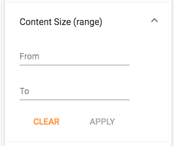
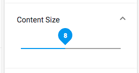

# Search Filter component

Represents a main container component for custom search and faceted search settings.

## Basic usage

```html
<adf-search-filter #settings></adf-search-filter>
```

## Details

The component is based on dynamically created widgets to modify the resulting query and options,
and the [Search Query Builder service](search-query-builder.service.md)\` to build and execute the search queries.

### Configuration

The configuration should be provided via the `search` entry in the `app.config.json` file.

Below is an example configuration:

```json
{
    "search": {
        "filterQueries": [
            { "query": "TYPE:'cm:folder' OR TYPE:'cm:content'" },
            { "query": "NOT cm:creator:System" }
        ],
        "facetFields": [
            { "field": "content.mimetype", "mincount": 1, "label": "Type" },
            { "field": "content.size", "mincount": 1, "label": "Size" },
            { "field": "creator", "mincount": 1, "label": "Creator" },
            { "field": "modifier", "mincount": 1, "label": "Modifier" }
        ],
        "facetQueries": [
            { "query": "created:2018", "label": "Created This Year" },
            { "query": "content.mimetype", "label": "Type" },
            { "query": "content.size:[0 TO 10240]", "label": "Size: xtra small"},
            { "query": "content.size:[10240 TO 102400]", "label": "Size: small"},
            { "query": "content.size:[102400 TO 1048576]", "label": "Size: medium" },
            { "query": "content.size:[1048576 TO 16777216]", "label": "Size: large" },
            { "query": "content.size:[16777216 TO 134217728]", "label": "Size: xtra large" },
            { "query": "content.size:[134217728 TO MAX]", "label": "Size: XX large" }
        ],
        "categories": [
            {
                "id": "queryName",
                "name": "Name",
                "enabled": true,
                "expanded": true,
                "component": {
                    "selector": "adf-search-text",
                    "settings": {
                        "pattern": "cm:name:'(.*?)'",
                        "field": "cm:name",
                        "placeholder": "Enter the name"
                    }
                }
            }
        ]
    }
}
```

Please refer to the [schema.json](https://github.com/Alfresco/alfresco-ng2-components/blob/master/lib/core/app-config/schema.json) to get more details on available settings, values and formats.

### Extra fields and filter queries

You can explicitly define the `include` section for the query from within the application configuration file. 

```json
{
    "search": {
        "include": ["path", "allowableOperations"]
    }
}
```

In addition, it is also possible to provide a set of queries that are always executed alongside user-defined settings:

```json
{
    "search": {
        "filterQueries": [
            { "query": "TYPE:'cm:folder' OR TYPE:'cm:content'" },
            { "query": "NOT cm:creator:System" }
        ]
    }
}
```

Note that the entries of the `filterQueries` array are joined using the `AND` operator. 

### Categories

The Search Settings component and Query Builder require a `categories` section provided within the configuration.

Categories are needed to build widgets so that users can modify the search query at runtime.
Every Category can be represented by a single Angular component, which can be either a simple one or a composite one.

```ts
export interface SearchCategory {
    id: string;
    name: string;
    enabled: boolean;
    expanded: boolean;
    component: {
        selector: string;
        settings: SearchWidgetSettings;
    };
}
```

The interface above also describes entries in the `search.query.categories` section for the `app.config.json` file.


### Settings

Every use case will have a different set of settings.
For example Number editors may parse minimum and maximum values, while Text editors can support value formats or length constraints.

You can use `component.settings` to pass any information to your custom widget using the 
`SearchWidgetSettings` interface:

```ts
export interface SearchWidgetSettings {
    field: string;
    [indexer: string]: any;
}
```

### Facet Fields

```json
{
    "search": {
        "facetFields": [
            { "field": "content.mimetype", "mincount": 1, "label": "Type" },
            { "field": "content.size", "mincount": 1, "label": "Size" },
            { "field": "creator", "mincount": 1, "label": "Creator" },
            { "field": "modifier", "mincount": 1, "label": "Modifier" },
            { "field": "created", "mincount": 1, "label": "Created" }
        ]
    }
}
```


### Facet Queries

```json
{
    "search": {
        "facetQueries": [
            { "query": "created:2018", "label": "Created This Year" },
            { "query": "content.mimetype", "label": "Type" },
            { "query": "content.size:[0 TO 10240]", "label": "Size: xtra small"},
            { "query": "content.size:[10240 TO 102400]", "label": "Size: small"},
            { "query": "content.size:[102400 TO 1048576]", "label": "Size: medium" },
            { "query": "content.size:[1048576 TO 16777216]", "label": "Size: large" },
            { "query": "content.size:[16777216 TO 134217728]", "label": "Size: xtra large" },
            { "query": "content.size:[134217728 TO MAX]", "label": "Size: XX large" }
        ]
    }
}
```


## Widgets

You can use external application configuration to define a set of Angular components (aka Search Filter Widgets)
that provide extra features and/or behaviour for the Search Filter component.

The Search Filter supports the following widgets out of the box:

- Check List (`check-list`)
- Date Range (`date-range`)
- Number Range (`number-range`)
- Radio List (`radio`)
- Slider (`slider`)
- Text (`text`)

At runtime, ADF uses `selector` attribute values to map and create corresponding Angular element.

### Check List Widget

Provides you with a list of check-boxes, each backed by a particular query fragment.
You can choose a `label` (or i18n resources key) and a `value`, alongside the conditional `operator` (either `AND` or `OR`).

```json
{
    "search": {
        "categories": [
            {
                "id": "checkList",
                "name": "Check List",
                "enabled": true,
                "component": {
                    "selector": "check-list",
                    "settings": {
                        "operator": "OR",
                        "options": [
                            { "name": "Folder", "value": "TYPE:'cm:folder'" },
                            { "name": "Document", "value": "TYPE:'cm:content'" }
                        ]
                    }
                }
            }
        ]
    }
}
```


If user checks both boxes, the underlying query will get the following fragment:

```text
... (TYPE:'cm:folder' OR TYPE:'cm:content') ...
```

### Date Range Widget

Provides ability to select a range between two Dates based on the particular `field`.

```json
{
    "search": {
        "categories": [
            {
                "id": "createdDateRange",
                "name": "Created Date (range)",
                "enabled": true,
                "component": {
                    "selector": "date-range",
                    "settings": {
                        "field": "cm:created"
                    }
                }
            }
        ]
    }
}
```


### Number Range Widget

Provides ability to select a range between two Numbers based on the particular `field`.

```json
{
    "search": {
        "categories": [
            {
                "id": "contentSizeRange",
                "name": "Content Size (range)",
                "enabled": true,
                "component": {
                    "selector": "number-range",
                    "settings": {
                        "field": "cm:content.size"
                    }
                }
            }
        ]
    }
}
```



### Radio List Widget

Provides you with a list of radio-boxes, each backed by a particular query fragment.
The behaviour is very similar to those of the `check-list` except `radio` allows selecting only one item.

```json
{
    "search": {
        "categories": [
            {
                "id": "queryType",
                "name": "Type",
                "enabled": true,
                "component": {
                    "selector": "radio",
                    "settings": {
                        "field": null,
                        "options": [
                            { "name": "None", "value": "", "default": true },
                            { "name": "All", "value": "TYPE:'cm:folder' OR TYPE:'cm:content'" },
                            { "name": "Folder", "value": "TYPE:'cm:folder'" },
                            { "name": "Document", "value": "TYPE:'cm:content'" }
                        ]
                    }
                }
            }
        ]
    }
}
```


### Slider Widget

Provides ability to select a numeric range based on `min` and `max` values in the form of horizontal slider.

```json
{
    "search": {
        "categories": [
            {
                "id": "contentSize",
                "name": "Content Size",
                "enabled": true,
                "component": {
                    "selector": "slider",
                    "settings": {
                        "field": "cm:content.size",
                        "min": 0,
                        "max": 18,
                        "step": 1,
                        "thumbLabel": true
                    }
                }
            }
        ]
    }
}
```



### Text Widget

```json
{
    "search": {
        "categories": [
            {
                "id": "queryName",
                "name": "Name",
                "enabled": true,
                "expanded": true,
                "component": {
                    "selector": "text",
                    "settings": {
                        "pattern": "cm:name:'(.*?)'",
                        "field": "cm:name",
                        "placeholder": "Enter the name"
                    }
                }
            }
        ]
    }
}
```


## Custom Widgets

### Implementing custom widget

It is possible to create custom Angular components that display and/or modify resulting search query.

You start creating a Search Filter widget by generating a blank Angular component that implements `SearchWidget` interface:

```ts
export interface SearchWidget {
    id: string;
    settings?: SearchWidgetSettings;
    context?: SearchQueryBuilderService;
}
```

Every widget implementation must have an `id`, and may also support external `settings`.
At runtime, every time a new instance of the widget is created, it also receives a reference to the `SearchQueryBuilderService`
so that you component can access query related information, events and methods.

```ts
@Component({...})
export class MyComponent implements SearchWidget, OnInit {

    id: string;
    settings: SearchWidgetSettings;
    context: SearchQueryBuilderService;

    key1: string;
    key2: string;
} 
```

### Reading external settings

At runtime, ADF provides every Search Filter widget with the `settings` instance, based on the JSON data
that administrator has provided for your widget in the external configuration file.

It is your responsibility to parse the `settings` property values, convert types or setup defaults.
ADF does not provide any validation of the objects, it only reads from the configuration and passes data to your component instance.

```ts
@Component({...})
export class MyComponent implements SearchWidget, OnInit {

    id: string;
    settings: SearchWidgetSettings;
    context: SearchQueryBuilderService;

    key1: string;
    key2: string;

    ngOnInit() {
        if (this.settings) {
            this.key1 = this.settings['key1'];
            this.key2 = this.settings['key2'];
        }
    }
} 
```

### Updating final query

The `SearchQueryBuilderService` keeps track on all query fragments populated by widgets
and composes them together alongside other settings when performing a final query.

Every query fragment is stored/retrieved using widget `id`.
It is your responsibility to format the query correctly.

Once your value is ready, update the context and run `update` method to let other components know the query has been changed:

```ts
@Component({...})
export class MyComponent implements SearchWidget, OnInit {

    ...

    onUIChanged() {
        this.context.queryFragments[this.id] = `some query`;
        this.context.update();
    }

}
```

When executed, your fragment will be injected into the resulting query based on the category order in the application configuration file.

```text
... AND (widget1) AND (some query) AND (widget2) AND ...
```

### Registering custom widget

You can register your own Widgets by utilizing the `SearchFilterService` service:

```ts
import { MyComponent } from './my-component.ts'

@Component({...})
export class MyAppOrComponent {

    constructor(searchFilterService: SearchFilterService) {
        searchFilterService.widgets['my-widget'] = MyComponent;
    }

}
```

That allows you to declare your widget in the external configuration 
and pass custom attributes in case your component supports them:

```json
{
    "search": {
        "categories": [
            {
                "id": "someUniqueId",
                "name": "String or i18n key",
                "enabled": true,
                "component": {
                    "selector": "my-widget",
                    "settings": {
                        "key1": "value1",
                        "key2": "value2",
                        "keyN": "valueN"
                    }
                }
            }
        ]
    }
}
```

## See also

-   [Search Query Builder service](search-query-builder.service.md)
