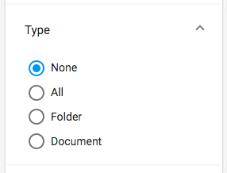

# Search radio component 

Implements a radio button list widget for the Search Filter component.



## Basic usage

```json
{
    "search": {
        "categories": [
            {
                "id": "queryType",
                "name": "Type",
                "enabled": true,
                "component": {
                    "selector": "radio",
                    "settings": {
                        "field": null,
                        "pageSize": 5,
                        "options": [
                            { "name": "None", "value": "", "default": true },
                            { "name": "All", "value": "TYPE:'cm:folder' OR TYPE:'cm:content'" },
                            { "name": "Folder", "value": "TYPE:'cm:folder'" },
                            { "name": "Document", "value": "TYPE:'cm:content'" }
                        ]
                    }
                }
            }
        ]
    }
}
```

### Settings

| Name | Type | Description |
| ---- | ---- | ----------- |
| options | `array` | Array of objects with `name` and `value` properties. Each object defines a radio button, labelled with `name`, that adds the query fragment in `value` to the query when enabled. Add the `default` property to one item to have it selected initially when the widget is displayed. |

## Details

This component displays a list of radio buttons, each of which toggles a particular
query fragment in the search. This behaviour is very similar to that of the
Search check list component except only one item at a time can be selected. See the
Search filter component for full details of how to use the widgets in a search query.

The component can be set to split a long list of buttons into separate pages
using the `pageSize` value as the number of buttons to show per page (default is 5).
When there is more than one page, the widget will display "Show more" and "Show less"
buttons as appropriate.

## See also

- Search filter component
- Search check list component
- Search date range component
- Search number range component
- Search slider component
- Search text component
