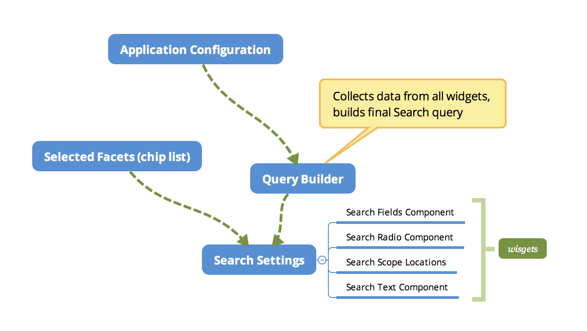

# Search Settings component

Represents a main container component for custom search and faceted search settings.



## Usage example

```html
<adf-search-settings #settings
    [queryBuilder]="queryBuilder">
</adf-search-settings>
```

The component is based on dynamically created Widgets to modify the resulting query and options,
and the `Query Builder` to build and execute the search queries.

## Query Builder

Stores information from all the custom search and faceted search widgets,
compiles and runs the final Search query.

The Query Builder is UI agnostic and does not rely on Angular components.
It is possible to reuse it with multiple component implementations.

Allows custom widgets to populate and edit the following parts of the resulting query:

- categories
- query fragments that form query expression
- include fields
- scope settings
- filter queries
- facet fields
- range queries

```ts
constructor(api: AlfrescoApiService, appConfig: AppConfigService) {
    const config = appConfig.get<SearchConfiguration>('search');

    this.queryBuilder = new SearchQueryBuilder(config, api);

    this.queryBuilder.updated.subscribe(query => {
        this.queryBuilder.execute();
    });

    this.queryBuilder.executed.subscribe(data => {
        this.onDataLoaded(data);
    });
}
```

## Configuration

The configuration should be provided via the `search` entry in the `app.config.json` file.

Below is an example configuration:

```json
{
    "search": {
        "limits": {
            "permissionEvaluationTime": null,
            "permissionEvaluationCount": null
        },
        "filterQueries": [
            { "query": "TYPE:'cm:folder' OR TYPE:'cm:content'" },
            { "query": "NOT cm:creator:System" }
        ],
        "facetFields": {
            "facets": [
            { "field": "content.mimetype", "mincount": 1, "label": "Type" },
            { "field": "content.size", "mincount": 1, "label": "Size" },
            { "field": "creator", "mincount": 1, "label": "Creator" },
            { "field": "modifier", "mincount": 1, "label": "Modifier" }
            ]
        },
        "facetQueries": [
            { "query": "created:2018", "label": "Created This Year" },
            { "query": "content.mimetype", "label": "Type" },
            { "query": "content.size:[0 TO 10240]", "label": "Size: xtra small"},
            { "query": "content.size:[10240 TO 102400]", "label": "Size: small"},
            { "query": "content.size:[102400 TO 1048576]", "label": "Size: medium" },
            { "query": "content.size:[1048576 TO 16777216]", "label": "Size: large" },
            { "query": "content.size:[16777216 TO 134217728]", "label": "Size: xtra large" },
            { "query": "content.size:[134217728 TO MAX]", "label": "Size: XX large" }
        ],
        "query": {
            "categories": [
                {
                    "id": "queryName",
                    "name": "Name",
                    "enabled": true,
                    "expanded": true,
                    "component": {
                        "selector": "adf-search-text",
                        "settings": {
                            "pattern": "cm:name:'(.*?)'",
                            "field": "cm:name",
                            "placeholder": "Enter the name"
                        }
                    }
                }
            ]
        }
    }
}
```

## Categories

The Search Settings component and Query Builder require `categories` section provided within the configuration.

Categories are needed to build Widgets so that users can modify the search query at runtime. Every Category can be represented by a single Angular component, either simple or composite one.

```ts
export interface SearchCategory {
    id: string;
    name: string;
    enabled: boolean;
    expanded: boolean;
    component: {
        selector: string;
        settings: SearchWidgetSettings;
    };
}
```

The interface above also describes entries in the `search.query.categories` section for the `app.config.json`.


### Properties

For the property types please refer to the `SearchCategory` interface.

| Property | Description |
| --- | --- |
| id | Unique identifier of the category. Also used to access QueryBuilder customisations for a particular widget. |
| name | Public display name for the category.  |
| enabled | Toggles category availability. Set to `false` if you want to exclude a category from processing. |
| expanded | Toggles the expanded state of the category. Use it  |
| component.selector | The id of the Angular component selector to render the Category |
| component.settings | An object containing component specific settings. Put any properties needed for the target component. |

Every component can expect different set of settings.
For example Number editors may parse minimum and maximum values, while Text editors can support value formats or length constraints.

You can use `component.settings` to pass any information to your custom Widget using the following interface:

```ts
export interface SearchWidgetSettings {
    field: string;
    [indexer: string]: any;
}
```