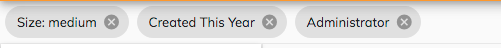

# Selected Facets Component

```html
<adf-selected-facets
    [facetQueries]="settings.selectedFacetQueries"
    [facetBuckets]="settings.selectedBuckets"
    (removeFacetQuery)="settings.unselectFacetQuery($event)"
    (removeFacetBucket)="settings.unselectFacetBucket($event)">
</adf-selected-facets>

<adf-search-settings #settings ...>
</adf-search-settings>
```

