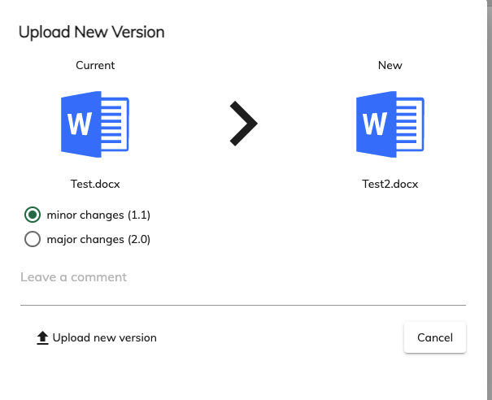
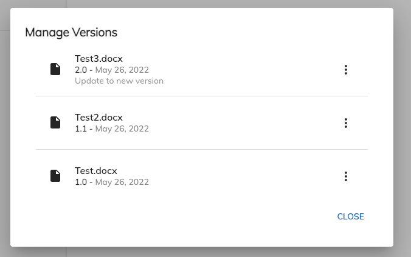

# [New Version Uploader service](../../../lib/content-services/src/lib/new-version-uploader/new-version-uploader.service.ts "Defined in new-version-uploader.service.ts")

Display a dialog that allows to upload new file version or to manage the current node versions.

## Class members

### Methods

-   **openUploadNewVersionDialog**(data: [`NewVersionUploaderDialogData`](../../../lib/content-services/src/lib/new-version-uploader/models/new-version-uploader.model.ts), config: `MatDialogConfig`): [`Observable`](http://reactivex.io/documentation/observable.html)<br/>
      Opens a dialog to upload new file version or to manage current node versions
    -   _data:_ [`NewVersionUploaderDialogData`](../../../lib/content-services/src/lib/new-version-uploader/models/new-version-uploader.model.ts) - The data to pass to the dialog
    -   _config:_ `MatDialogConfig` - A configuration object that allows to override default dialog configuration 
    -   _selectorAutoFocusedOnClose:_ `string` - Element's selector which should be autofocused after closing modal
    -   **Returns** [`Observable`](http://reactivex.io/documentation/observable.html) - [`Observable`](http://reactivex.io/documentation/observable.html) which you can subscribe in order to get information about the dialog actions or error notification in case of error condition.

## Details

You can open dialog in two different ways:

-   [Upload new file version](#upload-new-version)
-   [Manage node versions](#manage-versions)

### Upload New Version

The dialog shows

-   a side by side comparison between the current target node (type, name, icon) and the new file that should update it's version
-   the new version's minor/major changes
-   the optional comment
-   a button to upload a new file version
      

Usage example:

```ts
import { NewVersionUploaderService } from '@alfresco/adf-content-services'

constructor(private newVersionUploaderService: NewVersionUploaderService){}

yourFunctionToOpenDialog(){
    const newVersionUploaderDialogData: NewVersionUploaderDialogData = {
        file,
        node
    };
    this.newVersionUploaderService.openUploadNewVersionDialog(newVersionUploaderDialogData).subscribe(
        (data: NewVersionUploaderData) => {
            // place your action here on operation success!
        },
        (error) => {
            // place your action here on operation error!
            })
}
```

* * *

### Manage Versions

Setting `showVersionsOnly` to `true` the dialog displays the version history of a node, with the ability to restore, delete and view version of the current node


Usage example:

```ts
import { NewVersionUploaderService } from '@alfresco/adf-content-services'

constructor(private newVersionUploaderService: NewVersionUploaderService){}

yourFunctionToOpenDialog(){
    const newVersionUploaderDialogData: NewVersionUploaderDialogData = {
        file,
        node,
        showVersionsOnly: true
    };
    this.newVersionUploaderService.openUploadNewVersionDialog(newVersionUploaderDialogData).subscribe(
        (data: NewVersionUploaderData) => {
            // place your action here on operation success!
        })
}
```

## See Also

-   [Version list component](../components/docs/content-services/components/version-list.component.md)
-   [Version Comparison Component](../components/docs/content-services/components/version-comparison.component.md)
-   [Version Upload Component](../components/docs/content-services/components/version-upload.component.md)
