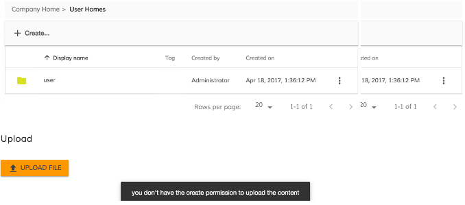

# Upload Button Component

Activates a file upload.

## Basic usage

```html
<adf-upload-button 
    [rootFolderId]="-my-"
    [uploadFolders]="true"
    [multipleFiles]="false"
    [acceptedFilesType]=".jpg,.gif,.png,.svg"
    [versioning]="false"
    (success)="customMethod($event)">
</adf-upload-button>
<adf-file-uploading-dialog></adf-file-uploading-dialog>
```

## Class members

### Properties

| Name | Type | Default value | Description |
| ---- | ---- | ------------- | ----------- |
| acceptedFilesType | `string` | "\*" | Filter for accepted file types. |
| comment | `string` |  | When you overwrite existing content, you can use the comment field to add a version comment that appears in the version history |
| disabled | `boolean` | false | Toggles component disabled state (if there is no node permission checking). |
| majorVersion | `boolean` | false | majorVersion boolean field to true to indicate a major version should be created. |
| maxFilesSize | `number` |  | Sets a limit on the maximum size (in bytes) of a file to be uploaded. Has no effect if undefined. |
| multipleFiles | `boolean` | false | Allows/disallows multiple files |
| nodeType | `string` | "cm:content" | Custom node type for uploaded file |
| rootFolderId | `string` | "-root-" | The ID of the root. Use the nodeId for Content Services or the taskId/processId for Process Services. |
| staticTitle | `string` |  | Defines the text of the upload button. |
| tooltip | `string` | null | Custom tooltip text. |
| uploadFolders | `boolean` | false | Allows/disallows upload folders (only for Chrome). |
| versioning | `boolean` | false | Toggles versioning. |

### Events

| Name | Type | Description |
| ---- | ---- | ----------- |
| beginUpload | [`EventEmitter`](https://angular.io/api/core/EventEmitter)`<`[`UploadFilesEvent`](../../lib/content-services/upload/components/upload-files.event.ts)`>` | Emitted when the upload begins. |
| createFolder | [`EventEmitter`](https://angular.io/api/core/EventEmitter)`<Object>` | Emitted when a folder is created. |
| error | [`EventEmitter`](https://angular.io/api/core/EventEmitter)`<Object>` | Emitted when an error occurs. |
| permissionEvent | [`EventEmitter`](https://angular.io/api/core/EventEmitter)`<`[`PermissionModel`](../../lib/content-services/document-list/models/permissions.model.ts)`>` | Emitted when create permission is missing. |
| success | [`EventEmitter`](https://angular.io/api/core/EventEmitter)`<Object>` | Emitted when the file is uploaded successfully. |

## Details

### How to show a notification message for bad permission

You can show a notification error when the user doesn't have the right permission to perform
the action. The component emits a `permissionEvent` when the user does not have delete permission.
You can subscribe to this event from your component and use the 
[Notification service](../core/notification.service.md) to show a message.

```html
<adf-upload-button
    [rootFolderId]="currentFolderId"
    (permissionEvent)="onUploadPermissionFailed($event)">
</adf-upload-button>
```

```ts
export class MyComponent {

    onUploadPermissionFailed(event: any) {
        this.notificationService.openSnackMessage(
            `you don't have the ${event.permission} permission to ${event.action} the ${event.type} `, 4000
        );
    }

}
```



## See also

-   [Upload Version Button component](upload-version-button.component.md)
