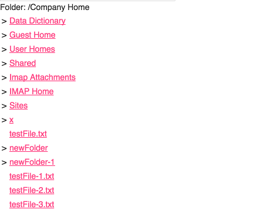

# Webscript component

Provides access to Webscript features.

## Contents

-   [Basic usage](#basic-usage)
-   [Class members](#class-members)
    -   [Properties](#properties)
    -   [Events](#events)
-   [Details](#details)
    -   [Webscript View HTML example](#webscript-view-html-example)
    -   [Webscript View DATATABLE example](#webscript-view-datatable-example)
    -   [Webscript View JSON example](#webscript-view-json-example)

## Basic usage

```html
<adf-webscript-get 
    [scriptPath]="string"
    [scriptArgs]="Object"
    [contextRoot]="string"
    [servicePath]="string"
    [showData]="boolean"
    [contentType]="JSON | HTML | DATATABLE | TEXT"
    (success)= "logData($event)">
 </adf-webscript-get>
```

Another example:

**[app.component](demo-shell/src/app/app.component.ts).html**

```html
<adf-webscript-get 
    [scriptPath]="scriptPath"
    [scriptArgs]="scriptArgs"
    [contextRoot]="contextRoot"
    [servicePath]="servicePath" 
    [contentType]="'HTML'">
</adf-webscript-get>
```

**[app.component](demo-shell/src/app/app.component.ts).ts**

```ts
export class AppComponent {
    scriptPath: string = 'sample/folder/Company%20Home';
    contextRoot: string = 'alfresco';
    servicePath: string = 'service';
}
```

## Class members

### Properties

| Name | Type | Default value | Description |
| ---- | ---- | ------------- | ----------- |
| contentType | `string` | "TEXT" | Content type to interpret the data received from the webscript. Can be "JSON" , "HTML" , "DATATABLE" or "TEXT" |
| contextRoot | `string` | "alfresco" | Path where the application is deployed |
| scriptArgs | `any` |  | Arguments to pass to the webscript. |
| scriptPath | `string` |  | (required) Path to the webscript (as defined by webscript). |
| servicePath | `string` | "service" | Path that the webscript service is mapped to. |
| showData | `boolean` | true | Toggles whether to show or hide the data. |

### Events

| Name | Type | Description |
| ---- | ---- | ----------- |
| success | [`EventEmitter`](https://angular.io/api/core/EventEmitter)`<Object>` | Emitted when the operation succeeds. You can get the plain data from the webscript through the **success** event parameter and use it as you need in your application. |

## Details

### Webscript View HTML example

This sample demonstrates how to implement a [Webscript component](../content-services/webscript.component.md) that renders the HTML contents that come from a webscript
This sample Web Scripts reside in your Alfresco Server. You can access the folder webscript here:

`http://localhost:8080/alfresco/service/sample/folder/Company%20Home`

```html
<adf-webscript-get 
    [scriptPath]="scriptPath"
    [contextRoot]="'alfresco'"
    [servicePath]="'service'";
    [scriptPath]="'Sample/folder/Company%20Home'"
    [contentType]="'HTML'">
</adf-webscript-get>
```

                         

### Webscript View DATATABLE example

This sample demonstrates how to implement a [Webscript component](../content-services/webscript.component.md) that renders the JSON contents that come from a webscript

`http://localhost:8080/alfresco/service/sample/folder/DATATABLE`

```html
<adf-webscript-get 
    [scriptPath]="scriptPath"
    [contextRoot]="'alfresco'"
    [servicePath]="'service'";
    [scriptPath]="'Sample/folder/DATATABLE'"
    [contentType]="'DATATABLE'">
</adf-webscript-get>
```

If you want to show the result from a webscript inside a ng2-alfresco-datatable you have to return from the GET of the webscript the datastructure below:
subdivide in data and schema

```ts
data: [],
schema: []
```

this is an example: 

```ts
data: [
    {id: 1, name: 'Name 1'},
    {id: 2, name: 'Name 2'}
],
schema: [{
    type: 'text',
    key: 'id',
    title: 'Id',
    sortable: true
}, {
    type: 'text',
    key: 'name',
    title: 'Name',
    sortable: true
}]
```

or you can send just the array data and the component will create a schema for you: 

```ts
data: [
    {id: 1, name: 'Name 1'},
    {id: 2, name: 'Name 2'}
]]
```

that will render the following table


### Webscript View JSON example

This sample demonstrates how to implement a [Webscript component](../content-services/webscript.component.md) that renders the JSON contents that come from a webscript
This sample Web Scripts reside in your Alfresco Server. You can access the folder webscript here:

`http://localhost:8080/alfresco/service/sample/folder/JSON%EXAMPLE`

```html
<adf-webscript-get 
    [scriptPath]="scriptPath"
    [contextRoot]="'alfresco'"
    [servicePath]="'service'";
    [scriptPath]="'Sample/folder/JSON_EXAMPLE'"
    [contentType]="'HTML'"
    [showData]="false"
    (success)="logDataExample($event)">
</adf-webscript-get>
```

You can get the plain data from the webscript through the **success** event parameter and use it as you need in your application

```ts
logDataExample(data) {
    console.log('You webscript data are here' + data);
}
```
