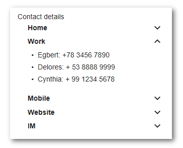

# Accordion Group component

Adds a collapsible panel to an accordion menu.



## Basic Usage

```html
<adf-accordion>
    <adf-accordion-group [heading]="titleHeading" [isSelected]="true" [headingIcon]="'assignment'" [headingIconTooltip]="'Group Tooltip'">
        <my-list></my-list>
    </adf-accordion-group>
</adf-accordion>
```

```ts
@Component({
    selector: 'my-component'
})
export class MyComponent implements OnInit {

    titleHeading: string;

    constructor() {
        this.titleHeading = 'My Group';
    }

}
```

## Class members

### Properties

| Name | Type | Default value | Description |
| ---- | ---- | ------------- | ----------- |
| hasAccordionIcon | `boolean` | true | Should the (expanded) accordion icon be shown? |
| heading | `string` |  | Title heading for the group. |
| headingIcon | `string` |  | The material design icon. |
| headingIconTooltip | `string` |  | Tooltip message to be shown for headingIcon |

### Events

| Name | Type | Description |
| ---- | ---- | ----------- |
| headingClick | [`EventEmitter`](https://angular.io/api/core/EventEmitter)`<any>` | Emitted when the heading is clicked. |

## Details

Place one or more accordion groups within an [Accordion component](accordion.component.md) to define a menu. 

## See also

-   [Accordion component](accordion.component.md)
