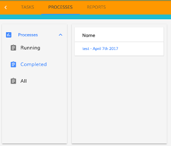

# Accordion Component

Creates a collapsible accordion menu.


## Basic Usage

```html
<adf-accordion>
    <adf-accordion-group [heading]="titleHeading" [isSelected]="true" [headingIcon]="'assignment'">
        <my-list></my-list>
    </adf-accordion-group>
</adf-accordion>
```

```ts
@Component({
    selector: 'my-component'
})
export class MyComponent implements OnInit {

    titleHeading: string;

    constructor() {
        this.titleHeading = 'My Group';
    }

}
```

### [Transclusions](../user-guide/transclusion.md)

Content for the accordion menu is transcluded within one or more
[Accordion group components](accordion-group.component.md)

## Details

An accordion menu contains several panels of content, only one of which is visible at any time. The
hidden panels are collapsed down to just the title and pushed together (like the bellows of an accordion)
while the visible panel fills the remaining space in the menu.

Use one or more [Accordion Group](accordion-group.component.md) subcomponents to transclude the content
for the panels and set their properties (title, selection status, etc).

### Example

You can use an accordion menu to wrap a [process filter](../process-services/process-filters.component.md), as shown in
the following example:

```html
<adf-accordion>
    <adf-accordion-group 
        [heading]="'Processes'" 
        [isSelected]="true" 
        [headingIcon]="'assessment'">
        <adf-process-instance-filters
            [appId]="appId"
            (filterClick)="onProcessFilterClick($event)"
            (success)="onSuccessProcessFilterList($event)">
        </adf-process-instance-filters>
    </adf-accordion-group>
</adf-accordion>
```



## See also

-   [Accordion group component](accordion-group.component.md)
