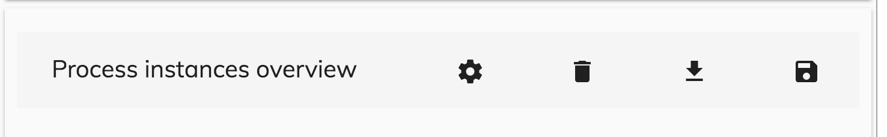

# [Buttons Menu Component](../../../lib/core/src/lib/buttons-menu/buttons-menu.component.ts "Defined in buttons-menu.component.ts")

Displays buttons on a responsive menu. 



## Basic Usage

### [Transclusions](../../user-guide/transclusion.md)

Place the buttons for the menu inside this component's HTML tags.
They must use the following structure:

```html
<adf-buttons-action-menu>
    <button mat-menu-item (click)="showSettings()">
        <mat-icon>settings</mat-icon><span>Settings</span>
    </button>
    <button mat-menu-item (click)="delete()">
        <mat-icon>delete</mat-icon><span>Delete</span>
    </button>
</adf-buttons-action-menu>  
```

Note that the buttons themselves also have an icon (supplied as a `<mat-icon`)
and a label (supplied as a `<span>`).
They also make use of the Angular material directive `mat-menu-item`.

```html
<button mat-menu-item (click)="event()">
        <mat-icon> icon </mat-icon>
        <span> label </span>
</button>
```

## Details

This component is fully responsive and it will display one of two different layouts
depending on the screen size:

**Desktop View**


**Mobile View**


The component has a property called `isMenuEmpty` that you can access from code. If this is
set to true then the component will not show an empty menu with no buttons defined.
