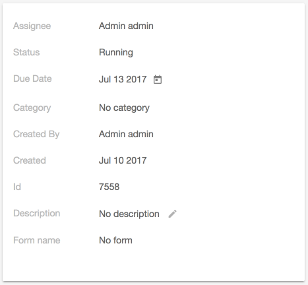

# [Card View component](../../../lib/core/src/lib/card-view/components/card-view/card-view.component.ts "Defined in card-view.component.ts")

Displays a configurable property list renderer.



## Basic Usage

Defining properties from HTML:

```html
<adf-card-view
    [properties]="[{label: 'My Label', value: 'My value'}]"
    [editable]="false">
</adf-card-view>
```

Defining properties from Typescript:

```ts
 this.properties = [
    new CardViewTextItemModel({
        label: 'Name',
        value: 'Spock',
        key: 'name',
        default: 'default bar' ,
        multiline: false,
        icon: 'icon',
        clickCallBack : ()=>{ myClickImplementation()} 
    }),
    new CardViewMapItemModel({
        label: 'My map',
        value: new Map([['999', 'My Value']]),
        key: 'map',
        default: 'default map value' ,
        clickable: true,
    }),
    new CardViewDateItemModel({
        label: 'Date of birth',
        value: someDate,
        key: 'date-of-birth',
        default: new Date(),
        format: '<any format that momentjs accepts>',
        editable: true
    }),
    new CardViewDatetimeItemModel({
        label: 'Datetime of birth',
        value: someDatetime,
        key: 'datetime-of-birth',
        default: new Date(),
        format: '<any format that momentjs accepts>',
        editable: true
    }),
    new CardViewBoolItemModel({
        label: 'Vulcanian',
        value: true,
        key: 'vulcanian',
        default: false
    }),
    new CardViewIntItemModel({
        label: 'Intelligence',
        value: 213,
        key: 'intelligence',
        default: 1
    }),
    new CardViewFloatItemModel({
        label: 'Mental stability',
        value: 9.9,
        key: 'mental-stability',
        default: 0.0
    }),
    new CardViewKeyValuePairsItemModel({
        label: 'Variables',
        value: [],
        key: 'key-value-pairs'
    }),
    new CardViewSelectItemModel({
        label: 'Select box',
        value: 'one',
        options$: of([{ key: 'one', label: 'One' }, { key: 'two', label: 'Two' }]),
        key: 'select'
    }),
    new CardViewArrayItemModel({
        label: 'Array of items',
        value: '',
        items$: of([
            { icon: 'person', value: 'One' }, { icon: 'person', value: 'Two' },
            { icon: 'person', value: 'Three' }, { icon: 'person', value: 'Four' }
            ]),
        key: 'array',
        default: 'Empty',
        noOfItemsToDisplay: 2
    })
    ...
]
```

## Class members

### Properties

| Name | Type | Default value | Description |
| ---- | ---- | ------------- | ----------- |
| copyToClipboardAction | `boolean` | true | Toggles whether or not to enable copy to clipboard action. |
| displayClearAction | `boolean` | true | Toggles whether or not to display clear action. |
| displayEmpty | `boolean` | true | Toggles whether or not to show empty items in non-editable mode. |
| displayNoneOption | `boolean` | true | Toggles whether or not to display none option. |
| editable | `boolean` |  | Toggles whether or not the items can be edited. |
| multiValueSeparator | `string` | DEFAULT_SEPARATOR | String separator between multi-value property items. |
| properties | [`CardViewItem`](../../../lib/core/src/lib/card-view/interfaces/card-view-item.interface.ts)`[]` |  | (**required**) Items to show in the card view. |
| useChipsForMultiValueProperty | `boolean` | true | Toggles whether or not to enable chips for multivalued properties. |

## Details

You define the property list, the [`CardViewComponent`](../../core/components/card-view.component.md) does the rest. Each property represents a card view item (a row) in the [card view component](card-view.component.md). The following item types are available by default:

-   [**CardViewTextItemModel**](#card-text-item) - _for text items_
-   [**CardViewMapItemModel**](#card-map-item) - _for map items_
-   [**CardViewDateItemModel**](#card-date-item) - _for date items_
-   [**CardViewDatetimeItemModel**](#card-datetime-item) - _for datetime items_
-   [**CardViewBoolItemModel**](#card-bool-item) - _for bool items (checkbox)_
-   [**CardViewIntItemModel**](#card-int-item) - _for integer items_
-   [**CardViewFloatItemModel**](#card-float-item) - _for float items_
-   [**CardViewKeyValuePairsItemModel**](#card-key-value-pairs-item) - _for key-value-pairs items_
-   [**CardViewSelectItemModel**](#card-select-item) - _for select items_
-   [**CardViewArrayItemModel**](#card-array-item) - _for array items_

Each of these types implements the [Card View Item interface](../interfaces/card-view-item.interface.md):

```ts
export interface CardViewItem {
    label: string;
    value: any;
    key: string;
    default?: any;
    type: string;
    displayValue: string;
    editable?: boolean;
    icon?: string;
}
```

You can also define your own item types. See the
[Card View Item interface](../interfaces/card-view-item.interface.md) page for details of how to do
this.

### Editing

You can optionally set up the card view so that its properties can be edited. You can control
the editing of properties at two levels:

-   **Global level** - _via the editable parameter of the card-view.component_
-   **[`Property`](../../../lib/content-services/src/lib/content-metadata/interfaces/property.interface.ts) level** -  _in each property via the editable attribute_

If you set the global editable parameter to false, no properties can be edited regardless of their
individual `editable` settings.

See the [Card View Update service](../services/card-view-update.service.md)
page for details of how to use the service to respond to clicks and edits in a card view.
You can use this, for example, to save the edits within your application or to highlight a
clicked item.

### Defining properties

The `properties` array contains instances of models that represent the layout of the Card View.
The ordering of the models in the array matches the ordering of items in the view. Each of the
models extends the abstract [`CardViewBaseItemModel`](../../../lib/core/src/lib/card-view/models/card-view-baseitem.model.ts) class to add functionality for
specific data types, as described below.

#### Card Text Item

[`CardViewTextItemModel`](../../../lib/core/src/lib/card-view/models/card-view-textitem.model.ts) is a property type for text properties.

```ts
const textItemProperty = new CardViewTextItemModel(options);
```

| Name | Type | Default | Description |
| ---- | ---- | ------- | ----------- |
| label\* | string |  | Item label |
| value\* | any |  | The original data value for the item |
| key\* | string |  | Identifying key (important when editing the item) |
| default | any |  | The default value to display if the value is empty |
| displayValue\* | string |  | The value to display |
| editable | boolean | false | Toggles whether the item is editable |
| clickable | boolean | false | Toggles whether the property responds to clicks |
| clickableCallBack | function | null | Function to execute when click the element |
| copyToClipboardAction | `boolean` | true | Toggles whether or not to enable copy to clipboard action. |
| useChipsForMultiValueProperty | `boolean` | true | Toggles whether or not to enable chips for multivalued properties. |
| multiValueSeparator | `string` | ',' | String separator between multi-value property items. |
| icon | string |  | The material icon to show beside the item if it is clickable |
| multiline | boolean | false | Single or multiline text |
| pipes | [`CardViewTextItemPipeProperty`](../../../lib/core/src/lib/card-view/interfaces/card-view-textitem-pipe-property.interface.ts)\[] | \[] | Pipes to be applied to the text before display |

##### Using pipes with a Card Text Item

You can use pipes for text items in almost the same way as you would do it in an HTML template.
You can provide an array of pipes with additional pipe parameters using the `pipes` property:

```ts
const myWonderfulPipe1: PipeTransform = <whatever PipeTransform implmentation>;
const myWonderfulPipe2: PipeTransform = <whatever PipeTransform implmentation>;

new CardViewTextItemModel({
    label: 'some label',
    value: someValue,
    key: 'some-key',
    pipes: [
	{ pipe: myWonderfulPipe1, params: ['first-param', 'second-param'] },
	{ pipe: myWonderfulPipe2, params: ['first-param', 'second-param'] }
    ]
});
```

#### Card Map Item

[`CardViewMapItemModel`](../../../lib/core/src/lib/card-view/models/card-view-mapitem.model.ts) is a property type for map properties.

```ts
const mapItemProperty = new CardViewMapItemModel(options);
```

| Name | Type | Default | Description |
| ---- | ---- | ------- | ----------- |
| label\* | string |  | Item label |
| value\* | Map |  | A map that contains the key value pairs |
| key\* | string |  | Identifying key (important when editing the item) |
| default | any |  | The default value to display if the value is empty |
| displayValue\* | string |  | The value to display |
| clickable | boolean | false | Toggles whether the property responds to clicks |

#### Card Date Item

[`CardViewDateItemModel`](../../../lib/core/src/lib/card-view/models/card-view-dateitem.model.ts) is a property type for date properties.

```ts
const dateItemProperty = new CardViewDateItemModel(options);
```

| Name | Type | Default | Description |
| ---- | ---- | ------- | ----------- |
| label\* | string |  | Item label |
| value\* | any |  | The original data value for the item |
| copyToClipboardAction | `boolean` | true | Toggles whether or not to enable copy to clipboard action. |
| key\* | string |  | Identifying key (important when editing the item) |
| default | any |  | The default value to display if the value is empty |
| displayValue\* | any |  | The value to display |
| editable | boolean | false | Toggles whether the item is editable |
| format | string | "MMM DD YYYY" | Any date format that momentjs accepts |

#### Card Datetime Item

[`CardViewDatetimeItemModel`](../../../lib/core/src/lib/card-view/models/card-view-datetimeitem.model.ts) is a property type for datetime properties.

```ts
const datetimeItemProperty = new CardViewDatetimeItemModel(options);
```

| Name | Type | Default | Description |
| ---- | ---- | ------- | ----------- |
| label\* | string |  | Item label |
| value\* | any |  | The original data value for the item |
| key\* | string |  | Identifying key (important when editing the item) |
| default | any | any | The default value to display if the value is empty |
| displayValue\* | string |  | The value to display |
| editable | boolean | false | Toggles whether the item is editable |
| format | string | "MMM DD YYYY HH:mm" | Any datetime format that momentjs accepts |

#### Card Bool Item

[`CardViewBoolItemModel`](../../../lib/core/src/lib/card-view/models/card-view-boolitem.model.ts) is a property type for boolean properties.

```ts
const boolItemProperty = new CardViewBoolItemModel(options);
```

| Name | Type | Default | Description |
| ---- | ---- | ------- | ----------- |
| label\* | string |  | Item label |
| value\* | boolean |  | The original data value for the item |
| key\* | string |  | Identifying key (important when editing the item) |
| default | boolean | false | The default value to display if the value is empty |
| displayValue\* | boolean |  | The value to display |
| editable | boolean | false | Toggles whether the item is editable |

#### Card Int Item

[`CardViewIntItemModel`](../../../lib/core/src/lib/card-view/models/card-view-intitem.model.ts) is a property type for integer properties.

```ts
const intItemProperty = new CardViewIntItemModel(options);
```

| Name | Type | Default | Description |
| ---- | ---- | ------- | ----------- |
| label\* | string |  | Item label |
| value\* | integer |  | The original data value for the item |
| key\* | string |  | Identifying key (important when editing the item) |
| default | integer |  | The default value to display if the value is empty |
| displayValue\* | integer |  | The value to display |
| editable | boolean | false | Toggles whether the item is editable |

#### Card Float Item

[`CardViewFloatItemModel`](../../../lib/core/src/lib/card-view/models/card-view-floatitem.model.ts) is a property type for float properties.

```ts
const floatItemProperty = new CardViewFloatItemModel(options);
```

| Name | Type | Default | Description |
| ---- | ---- | ------- | ----------- |
| label\* | string |  | Item label |
| value\* | float |  | The original data value for the item |
| key\* | string |  | Identifying key (important when editing the item) |
| default | float |  | The default value to display if the value is empty |
| displayValue\* | float |  | The value to display |
| editable | boolean | false | Toggles whether the item is editable |

#### Card Key Value Pairs Item

[`CardViewKeyValuePairsItemModel`](../../../lib/core/src/lib/card-view/models/card-view-keyvaluepairs.model.ts) is a property type for key-value properties.

```ts
const keyValuePairsItemProperty = new CardViewKeyValuePairsItemModel(options);
```

| Name | Type | Default | Description |
| ---- | ---- | ------- | ----------- |
| label\* | string |  | Item label |
| key\* | string |  | Identifying key (important when editing the item) |
| editable | boolean | false | Toggles whether the item is editable |
| value\* | `[{ name: '', value: '' }, ...]` |  | The original data value for the item |

#### Card Select Item

[`CardViewSelectItemModel`](../../../lib/core/src/lib/card-view/models/card-view-selectitem.model.ts) is a property type for select properties.

```ts
const selectItemProperty = new CardViewSelectItemModel(options);
```

| Name | Type | Default | Description |
| ---- | ---- | ------- | ----------- |
| label\* | string |  | Item label |
| key\* | string |  | Identifying key (important when editing the item) |
| editable | boolean | false | Toggles whether the item is editable |
| value | string |  | The original data value for the item |
| options$\* | [`Observable`](http://reactivex.io/documentation/observable.html)&lt;[`CardViewSelectItemOption`](../../../lib/core/src/lib/card-view/interfaces/card-view-selectitem-properties.interface.ts)\[]> |  | The original data value for the item |

#### Card Array Item

[`CardViewArrayItemModel`](../../../lib/core/src/lib/card-view/models/card-view-arrayitem.model.ts) is a property type for array properties.

```ts
const arrayItemProperty = new CardViewArrayItemModel(items);
```

| Name | Type | Default | Description |
| ---- | ---- | ------- | ----------- |
| label\* | string |  | Item label |
| key\* | string |  | Identifying key (important when editing the item) |
| editable | boolean | false | Toggles whether the item is editable |
| value | [`Observable`](http://reactivex.io/documentation/observable.html)&lt;[`CardViewArrayItem`](../../../lib/core/src/lib/card-view/models/card-view-arrayitem.model.ts)\[]> |  | The original data value for the item |

## See also

-   [Card View Update service](../services/card-view-update.service.md)
-   [Card View Item interface](../interfaces/card-view-item.interface.md)
