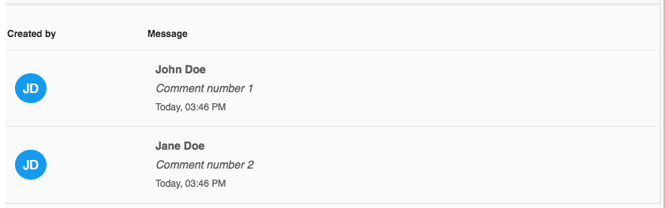

# [Comment list component](../../../lib/core/src/lib/comments/comment-list/comment-list.component.ts "Defined in comment-list.component.ts")

Shows a list of comments.



## Basic Usage

Populate the comments in the component class:

```ts
import { CommentModel } from '@alfresco/adf-core';

export class SomeComponent implements OnInit {

  comments: CommentModel[] = [
    {
      id: 1,
      message: 'Comment number 1',
      created: new Date(),
      createdBy: {
        id: 1,
        email: 'john.doe@alfresco.com',
        firstName: 'John',
        lastName: 'Doe'
      },
    },
    {
      id: 2,
      message: 'Comment number 2',
      created: new Date(),
      createdBy: {
        id: 2,
        email: 'jane.doe@alfresco.com',
        firstName: 'Jane',
        lastName: 'Doe'
      },
    }
  ];

  onClickCommentRow(comment: CommentModel) {
    console.log('Clicked row: ', comment);
  }
}
```

## Avatar Display Logic

The component displays user avatars based on the presence of `pictureId` or `avatarId` properties on the user model:

- If the user has a `pictureId`, the component fetches and displays the avatar image using that ID.
- If no `pictureId` but an `avatarId` is present, it fetches and displays the avatar image using the `avatarId`.
- If neither `pictureId` nor `avatarId` is available, the component displays the user's initials as a fallback.

Example user objects:

```ts
[
  {
    id: 'user1',
    firstName: 'Alice',
    lastName: 'Smith',
    pictureId: 1234
  },
  {
    id: 'user2',
    firstName: 'Bob',
    lastName: 'Jones',
    avatarId: 'avatar-xyz'
  },
  {
    id: 'user3',
    firstName: 'Charlie',
    lastName: 'Brown'
  }
]
```

In the component template use the [comment list component](comment-list.component.md):

```html
<adf-comment-list
    [comments]="comments"
    (clickRow)="onClickCommentRow($event)">
</adf-comment-list>
```

## Class members

### Properties

| Name | Type | Default value | Description |
| ---- | ---- | ------------- | ----------- |
| comments | [`CommentModel`](../../../lib/core/src/lib/models/comment.model.ts)`[]` |  | The comments data used to populate the list. |

### Events

| Name | Type | Description |
| ---- | ---- | ----------- |
| clickRow | [`EventEmitter`](https://angular.io/api/core/EventEmitter)`<`[`CommentModel`](../../../lib/core/src/lib/models/comment.model.ts)`>` | Emitted when the user clicks on one of the comment rows. |
