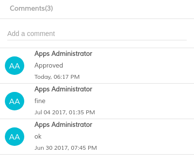

# [Comments Component](../../../lib/core/src/lib/comments/comments.component.ts "Defined in comments.component.ts")

Displays comments from users involved in a specified environment and allows an involved user to add a comment to a environment.



## Basic Usage Task

```html
<adf-comments
    [id]="YOUR_ID"
    [readOnly]="YOUR_READ_ONLY_FLAG">
</adf-comments>
```

## Class members

### Properties

| Name | Type | Default value | Description |
| ---- | ---- | ------------- | ----------- |
| id | `string` |  | The numeric ID of the task. |
| readOnly | `boolean` | false | Are the comments read only? |

### Events

| Name | Type | Description |
| ---- | ---- | ----------- |
| error | [`EventEmitter`](https://angular.io/api/core/EventEmitter)`<any>` | Emitted when an error occurs while displaying/adding a comment. |
