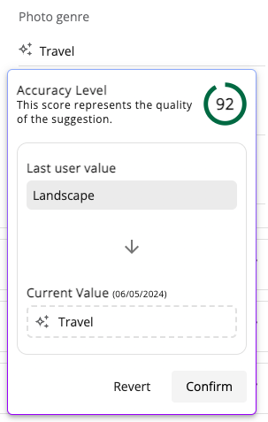

# [Content Enrichment Menu Component](../../../lib/core/src/lib/prediction/components/content-enrichment-menu/content-enrichment-menu.component.ts "Defined in content-enrichment-menu.component.ts")

Allows the user to handle AI predictions by confirming or rejecting changes.



## Basic Usage

```html
<mat-form-field>
    <mat-label>Form field</mat-label>
    <adf-content-enrichment-menu matPrefix [prediction]="prediction"></adf-content-enrichment-menu>
    <input matInput>
</mat-form-field>
```

### Properties

| Name       | Type                                                                             | Default value | Description                       |
|------------|----------------------------------------------------------------------------------|---------------|-----------------------------------|
| prediction | [`Prediction`](../../../lib/js-api/src/api/hxi-connector-api/docs/Prediction.md) |               | Prediction for the node property. |

## See also

-   [Prediction Status Update Interface](../interfaces/prediction-status-update.interface.md)
