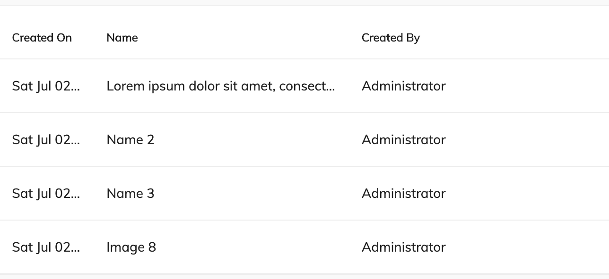
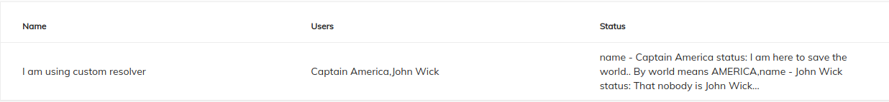
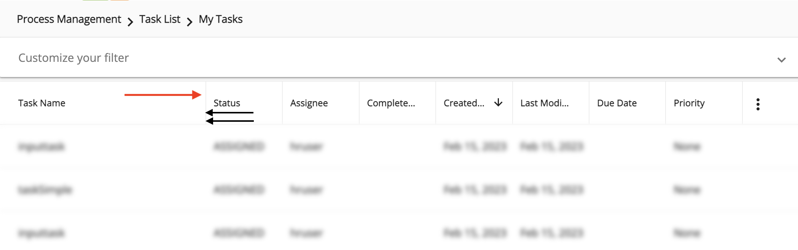

# [DataTable component](../../../lib/core/src/lib/datatable/components/datatable/datatable.component.ts "Defined in datatable.component.ts")

Displays data as a table with customizable columns and presentation.


See it live: [DataTable Quickstart](https://embed.plnkr.co/80qr4YFBeHjLMdAV0F6l/)

## Contents

-   [Basic usage](#basic-usage)
    -   [Setting the rows and column schema](#setting-the-rows-and-column-schema)
    -   [Transclusions](#transclusions)
    -   [Row Update](#row-update)
-   [Class members](#class-members)
    -   [Properties](#properties)
    -   [Events](#events)
-   [Details](#details)
    -   [Supplying data for the table](#supplying-data-for-the-table)
    -   [Customizing columns](#customizing-columns)
    -   [DataTable DOM Events](#datatable-dom-events)
    -   [Card view](#card-view)
    -   [Using events](#using-events)
    -   [Customizing the component's styles](#customizing-the-components-styles)
-   [Resolver Function](#resolver-function)
-   [See also](#see-also)

## Basic usage

**app.component.html**

```html
<adf-datatable
    [data]="data">
</adf-datatable>
```

**app.component.ts**

```ts
import { ObjectDataTableAdapter }  from '@alfresco/adf-core';

@Component({...})
export class DataTableDemo {
    data: ObjectDataTableAdapter;

    constructor() {
        this.data = new ObjectDataTableAdapter(
            // data
            [
                {id: 1, name: 'Name 1'},
                {id: 2, name: 'Name 2'}
            ],
            // schema
            [
                {
                    type: 'text',
                    key: 'id',
                    title: 'Id',
                    sortable: true
                },
                {
                    type: 'text',
                    key: 'name',
                    title: 'Name',
                    cssClass: 'full-width',
                    sortable: true
                }
            ]
        );
    }
}
```

### Setting the rows and column schema

You can set rows and columns in the [`ObjectDataTableAdapter`](../../../lib/core/src/lib/datatable/data/object-datatable-adapter.ts) as shown below:

```ts
import { ObjectDataTableAdapter }  from '@alfresco/adf-core';

@Component({...})
export class DataTableDemo {
    data: ObjectDataTableAdapter;

    constructor() {
        this.data = new ObjectDataTableAdapter(
            // data
            [
                {id: 1, name: 'Name 1'},
                {id: 2, name: 'Name 2'}
            ],
            // columns
            [
                {
                    type: 'text',
                    key: 'id',
                    title: 'Id',
                    sortable: true
                },
                {
                    type: 'text',
                    key: 'name',
                    title: 'Name',
                    cssClass: 'full-width',
                    sortable: true
                }
            ]
        );
    }
}
```

```html
<adf-datatable
    [data]="data">
</adf-datatable>
```

You can also set rows and use an HTML-based schema declaration as shown below:

```ts
import { ObjectDataTableAdapter }  from '@alfresco/adf-core';

@Component({...})
export class DataTableDemo {
    data: ObjectDataTableAdapter;

    constructor() {
        this.data = new ObjectDataTableAdapter(
            // data
            [
                {id: 1, name: 'Name 1'},
                {id: 2, name: 'Name 2'}
            ],
            []
        );
    }
}
```

```html
<adf-datatable [data]="data">
    <data-columns>
        <data-column key="icon" type="image" [sortable]="false"></data-column>
        <data-column key="id" title="Id"></data-column>
        <data-column key="createdOn" title="Created"></data-column>
        <data-column key="name" title="Name" class="full-width name-column"></data-column>
        <data-column key="createdBy.name" title="Created By"></data-column>
    </data-columns>
</adf-datatable>
```

You can also set rows in the [`ObjectDataTableAdapter`](../../../lib/core/src/lib/datatable/data/object-datatable-adapter.ts) and set columns as an input as shown below :

```ts
import { ObjectDataTableAdapter }  from '@alfresco/adf-core';

@Component({...})
export class DataTableDemo {
    data: ObjectDataTableAdapter;
    schema: any;

    constructor() {
        this.data = new ObjectDataTableAdapter(
            // data
            [
                {id: 1, name: 'Name 1'},
                {id: 2, name: 'Name 2'}
            ],
            []
        );
        // columns
        this.schema =
            [
                {
                    type: 'text',
                    key: 'id',
                    title: 'Id',
                    sortable: true
                },
                {
                    type: 'text',
                    key: 'name',
                    title: 'Name',
                    sortable: true
                }
            ];
    }
}
```

```html
<adf-datatable
    [data]="data"
    [columns]="schema">
</adf-datatable>
```

You can also set rows and columns through inputs as shown below :

```ts
import { ObjectDataTableAdapter }  from '@alfresco/adf-core';

@Component({...})
export class DataTableDemo {
    rows: any;
    schema: any;

    constructor() {
        // data
        this.rows =
            [
                {id: 1, name: 'Name 1'},
                {id: 2, name: 'Name 2'}
            ];
        // columns
        this.schema =
            [
                {
                    type: 'text',
                    key: 'id',
                    title: 'Id',
                    sortable: true
                },
                {
                    type: 'text',
                    key: 'name',
                    title: 'Name',
                    sortable: true
                }
            ];
    }
}
```

```html
<adf-datatable
    [rows]="rows"
    [columns]="schema">
</adf-datatable>
```

### Row Update

Starting with v6.0.0, you need to provide a [`DataTableService`](../../lib/core/src/lib/datatable/services/datatable.service.ts) to update a row of your table.
The model to update the DataTable require the `id` of the row that is being changed, and the new data Object of the row:

```typescript
interface DataRowUpdateModel {
    obj: any;
    id: string;
}
```

For example, if your table use entry nodes you can pass:

```typescript
this.dataTableService.rowUpdate.next({
    id: node.id, 
    obj: {
        entry: node
    }
});
```

As good practice, it is suggested to provide a [`DataTableService`](../../lib/core/src/lib/datatable/services/datatable.service.ts) at the component level:

```typescript
@Component({
    selector: 'app-files-component',
    templateUrl: './files.component.html',
    styleUrls: ['./files.component.scss'],
    encapsulation: ViewEncapsulation.None,
    providers: [
        DataTableService
    ]
})
export class FilesComponent implements OnInit {
    constructor(private dataTableService: DataTableService,
                private nodeService: NodesApiService) {
    }
    
    ngOnInit() {
        this.nodeService.nodeUpdated.subscribe((node) => {
            this.dataTableService.rowUpdate.next({
                id: node.id, 
                obj: {
                    entry: node
                }
            });
        });
    }
}
```

### [Transclusions](../../user-guide/transclusion.md)

You can add [Data column component](data-column.component.md) instances to define columns for thetable as described in the usage examples and the [Customizing columns](#customizing-columns) section.

```html
<adf-datatable ...>
    <data-column>
        <!--Add your custom empty template here-->
        <ng-template>
            <div></div>
            <span> My custom value </span>
        </ng-template>
    </data-column>
</adf-datatable>
```

You can also supply a `<adf-no-content-template>` or an
[Empty list component](empty-list.component.md) sub-component to show when the table is empty:

```html
<adf-datatable ...>
    <adf-no-content-template>
        <!--Add your custom empty template here-->
        <ng-template>
            <h1>Sorry, no content</h1>
        </ng-template>
    </adf-no-content-template>
</adf-datatable>
```

```html
<adf-datatable ...>
    <adf-empty-list>
        <adf-empty-list-header>"'My custom Header'"</adf-empty-list-header>
        <adf-empty-list-body>"'My custom body'"</adf-empty-list-body>
        <adf-empty-list-footer>"'My custom footer'"</adf-empty-list-footer>
        <ng-content>"'HTML Layout'"</ng-content>
    </adf-empty-list>
</adf-datatable>
```

Another useful transclusion is the `<adf-loading-content-template>`, which is shown
while the data for the table is loading:

```html
<adf-datatable ...>
    <adf-loading-content-template>
        <ng-template>
            <!--Add your custom loading template here-->
            <mat-progress-spinner
                class="adf-document-list-loading-margin"
                [color]="'primary'"
                [mode]="'indeterminate'">
            </mat-progress-spinner>
        </ng-template>
    </adf-loading-content-template>
</adf-datatable>
```

```js
    isLoading(): boolean {
        //your custom logic to identify if you are in a loading state
    }
```

You can also show main menu for datatable using `<adf-main-menu-datatable-template>`

```html
<adf-datatable ...>
   <adf-main-menu-datatable-template>
        <ng-template let-mainMenuTrigger>
            <!--Add your custom main menu template here-->
            <adf-datatable-column-selector
                [columns]="data.getColumns()"
                [mainMenuTrigger]="mainMenuTrigger"
                (submitColumnsVisibility)="onColumnsVisibilityChange($event)">
            </adf-datatable-column-selector>
        </ng-template>
    </adf-main-menu-datatable-template>
</adf-datatable>
```

Provided template receives `let-mainMenuTrigger`, so you can programaticaly work with the menu (please see [MatMenuTrigger](https://material.angular.io/components/menu/overview#toggling-the-menu-programmatically)).

For convenience, you can use `<adf-datatable-column-selector>` which will allow you to change column visibility.

\###Styling transcluded content

When adding your custom templates you can style them as you like. However, for an out of the box experience, if you want to apply datatable styles to your column you will need to follow this structure:

```html
<adf-datatable ...>
    <data-column>
        <!--Add your custom empty template here-->
        <ng-template>
            <div class="adf-datatable-content-cell">
                <span class="adf-datatable-cell-value"> My custom value </span>
            </div>
        </ng-template>
    </data-column>
</adf-datatable>
```

Notice above those two classes. Apply `adf-datatable-content-cell` for the container of the value that you are going to place in that column and `adf-datatable-cell-value` for the value itself.

If you follow these structure you will be able to apply classes like `.adf-ellipsis-cell` and much more.

Note that you can use both the `<adf-no-content-template>` and the `<adf-loading-content-template>`
together in the same datatable.

Learm more about styling your datatable: [Customizing the component's styles](#customizing-the-components-styles)

## Class members

### Properties

| Name | Type | Default value | Description |
| ---- | ---- | ------------- | ----------- |
| actions | `boolean` | false | Toggles the data actions column. |
| actionsPosition | `string` | "right" | Position of the actions dropdown menu. Can be "left" or "right". |
| actionsVisibleOnHover | `boolean` | false | Toggles whether the actions dropdown should only be visible if the row is hovered over or the dropdown menu is open. |
| allowFiltering | `boolean` | false | Flag that indicate if the datatable allow the use [facet widget](../../../lib/content-services/src/lib/search/models/facet-widget.interface.ts) search for filtering. |
| columns | `any[]` | \[] | The columns that the datatable will show. |
| contextMenu | `boolean` | false | Toggles custom context menu for the component. |
| data | [`DataTableAdapter`](../../../lib/core/src/lib/datatable/data/datatable-adapter.ts) |  | Data source for the table |
| display | `string` | DisplayMode.List | Selects the display mode of the table. Can be "list" or "gallery". |
| fallbackThumbnail | `string` |  | Fallback image for rows where the thumbnail is missing. |
| isResizingEnabled | `boolean` | false | Flag that indicates if the datatable allows column resizing. |
| loading | `boolean` | false | Flag that indicates if the datatable is in loading state and needs to show the loading template (see the docs to learn how to configure a loading template). |
| mainTableAction | `boolean` | true | Toggles main data table action column. |
| multiselect | `boolean` | false | Toggles multiple row selection, which renders checkboxes at the beginning of each row. |
| noPermission | `boolean` | false | Flag that indicates if the datatable should show the "no permission" template. |
| resolverFn | `Function` | null | Custom resolver function which is used to parse dynamic column objects see the docs to learn how to configure a resolverFn. |
| rowMenuCacheEnabled | `boolean` | true | Should the items for the row actions menu be cached for reuse after they are loaded the first time? |
| rowStyle | `Function` |  | The inline style to apply to every row. See [NgStyle](https://angular.io/docs/ts/latest/api/common/index/NgStyle-directive.html) docs for more details and usage examples. |
| rowStyleClass | `string` | "" | The CSS class to apply to every row. |
| rows | `any[]` | \[] | The rows that the datatable will show. |
| selectionMode | `string` | "single" | Row selection mode. Can be none, `single` or `multiple`. For `multiple` mode, you can use Cmd (macOS) or Ctrl (Win) modifier key to toggle selection for multiple rows. |
| showHeader | `ShowHeaderMode` |  | Toggles the header. |
| showMainDatatableActions | `boolean` | false | Toggles the main datatable action. |
| sorting | `any[]` | \[] | Define the sort order of the datatable. Possible values are : [`created`, `desc`], [`created`, `asc`], [`due`, `desc`], [`due`, `asc`] |
| stickyHeader | `boolean` | false | Toggles the sticky header mode. |

### Events

| Name | Type | Description |
| ---- | ---- | ----------- |
| columnOrderChanged | [`EventEmitter`](https://angular.io/api/core/EventEmitter)`<`[`DataColumn`](../../../lib/core/src/lib/datatable/data/data-column.model.ts)`<>[]>` | Emitted when the column order is changed. |
| columnsWidthChanged | [`EventEmitter`](https://angular.io/api/core/EventEmitter)`<`[`DataColumn`](../../../lib/core/src/lib/datatable/data/data-column.model.ts)`<>[]>` | Emitted when the column width is changed. |
| executeRowAction | [`EventEmitter`](https://angular.io/api/core/EventEmitter)`<`[`DataRowActionEvent`](../../../lib/core/src/lib/datatable/components/data-row-action.event.ts)`>` | Emitted when the user executes a row action. |
| rowClick | [`EventEmitter`](https://angular.io/api/core/EventEmitter)`<`[`DataRowEvent`](../../../lib/core/src/lib/datatable/data/data-row-event.model.ts)`>` | Emitted when the user clicks a row. |
| rowDblClick | [`EventEmitter`](https://angular.io/api/core/EventEmitter)`<`[`DataRowEvent`](../../../lib/core/src/lib/datatable/data/data-row-event.model.ts)`>` | Emitted when the user double-clicks a row. |
| showRowActionsMenu | [`EventEmitter`](https://angular.io/api/core/EventEmitter)`<`[`DataCellEvent`](../../../lib/core/src/lib/datatable/components/data-cell.event.ts)`>` | Emitted before the actions menu is displayed for a row. |
| showRowContextMenu | [`EventEmitter`](https://angular.io/api/core/EventEmitter)`<`[`DataCellEvent`](../../../lib/core/src/lib/datatable/components/data-cell.event.ts)`>` | Emitted before the context menu is displayed for a row. |

## Details

### Supplying data for the table

The column layout and row data are supplied to the table using an object that implements the
[`DataTableAdapter`](../../../lib/core/src/lib/datatable/data/datatable-adapter.ts) interface. This interface hides the internal details of the class that provides
the data, which gives a lot of flexibility in how the data can be stored and accessed. The DataTable
library includes a standard adapter class called [`ObjectDataTableAdapter`](../../../lib/core/src/lib/datatable/data/object-datatable-adapter.ts) that is useful in many
common cases. See the [`DataTableAdapter`](../../../lib/core/src/lib/datatable/data/datatable-adapter.ts) for full details about the interface and the [`ObjectDataTableAdapter`](../../../lib/core/src/lib/datatable/data/object-datatable-adapter.ts) class.

### Customizing columns

You can define custom HTML templates for columns and also add tooltips, automatic column title translation and other features. See the [Data Column component](data-column.component.md) page
for more information.

### DataTable DOM Events

Below are the DOM events emitted by the DataTable component.
These events bubble up the component tree and can be handled by any parent component.

| Name | Description |
| ---- | ----------- |
| row-click | Raised when user clicks a row |
| row-dblclick | Raised when user double-clicks a row |
| row-select | Raised after user selects a row |
| row-unselect | Raised after user unselects a row |
| row-keyup | Raised on the 'keyup' event for the focused row. |
| sorting-changed | Raised after user clicks the sortable column header. |
| header-dragover | Raised when dragging content over the header. |
| header-drop | Raised when data is dropped on the column header. |
| cell-dragover | Raised when dragging data over the cell. |
| cell-drop | Raised when data is dropped on the column cell. |

#### Sorting-changed

sorting-changed event contains

```ts
direction: "asc"
key: "timestamp"
sortingKey: ""
```

#### Drop Events

All custom DOM events related to `drop` handling expose the following interface:

```ts
export interface DataTableDropEvent {
    detail: {
        target: 'cell' | 'header';
        event: Event;
        column: DataColumn;
        row?: DataRow
    };

    preventDefault(): void;
}
```

Note that `event` is the original `drop` event,
and `row` is not available for Header events.

According to the [HTML5 Drag and Drop API](https://developer.mozilla.org/en-US/docs/Web/API/HTML_Drag_and_Drop_API),
you need to handle both `dragover` and `drop` events to handle the drop correctly.

Given that DataTable raises bubbling DOM events, you can handle drop behavior from the parent elements as well:

```html
<div
    (header-dragover)="onDragOver($event)"
    (header-drop)="onDrop($event)"
    (cell-dragover)="onDragOver($event)"
    (cell-drop)="onDrop($event)">

    <adf-datatable [data]="data">
    </adf-datatable>
</div>
```

Where the implementation of the handlers can look like following:

```ts
onDragOver(event: CustomEvent) {
    // always needed for custom drop handlers (!)
    event.preventDefault();
}

onDrop(event: DataTableDropEvent) {
    event.preventDefault();

    const { column, row, target } = event.detail;
    // do something with the details
}
```

#### Example

```html
<root-component (row-click)="onRowClick($event)">
    <child-component>
        <adf-datatable></adf-datatable>
    </child-component>
</root-component>
```

```ts
onRowClick(event) {
    console.log(event);
}
```


### Card view

Set the `display` property to "gallery" to enable Card View mode:

```html
<adf-datatable
    [data]="data"
    [display]="'gallery'">
</adf-datatable
```


### Using events

#### row-keyup DOM event

Emitted on the 'keyup' event for the focused row.

This is an instance of `CustomEvent` with the `details` property containing the following object:

```ts
row: DataRow,
keyboardEvent: KeyboardEvent,
sender: any
```

#### rowClick event

Emitted when the user clicks a row.

Event properties:

```ts
sender: any     // DataTable instance
value: DataRow, // row clicked
event: Event    // original HTML DOM event
```

Handler example:

```ts
onRowClicked(event: DataRowEvent) {
    console.log(event.value);
}
```

This event is cancellable. You can use `event.preventDefault()` to prevent the default behavior.

#### rowDblClick event

Emitted when the user double-clicks a row.

Event properties:

```ts
sender: any     // DataTable instance
value: DataRow, // row clicked
event: Event    // original HTML DOM event
```

Handler example:

```ts
onRowDblClicked(event: DataRowEvent) {
    console.log(event.value);
}
```

This event is cancellable. You can use `event.preventDefault()` to prevent the default behavior.

#### showRowContextMenu event

Emitted before the context menu is displayed for a row.

Note that the DataTable itself does not populate the context menu with items.
You can provide all necessary content via the handler.

Event properties:

```ts
value: {
    row: DataRow,
    col: DataColumn,
    actions: []
}
```

Handler example:

```ts
onShowRowContextMenu(event: DataCellEvent) {
    event.value.actions = [
        { ... },
        { ... }
    ]
}
```

This event is cancellable. You can use `event.preventDefault()` to prevent the default behavior.

The DataTable will automatically render the supplied menu items.

See the [ContextMenu](https://www.npmjs.com/package/ng2-alfresco-core)
documentation for more details on the format and behavior of context actions.

#### showRowActionsMenu event

Emitted before the actions menu is displayed for a row.
Requires the `actions` property to be set to `true`.

Event properties:

```ts
value: {
    row: DataRow,
    action: any
}
```

Note that the DataTable itself does not populate the action menu with items.
You can provide all necessary content via the handler.

This event is cancellable. You can use `event.preventDefault()` to prevent the default behavior.

#### executeRowAction event

Emitted when the user executes a row action.

This usually accompanies a `showRowActionsMenu` event.
The DataTable itself does not execute actions but provides support for external
integration. If actions are provided using the `showRowActionsMenu` event
then `executeRowAction` will be automatically executed when the user clicks a
corresponding menu item.

```html
<adf-datatable
    [data]="data"
    [multiselect]="multiselect"
    [actions]="true"
    (showRowActionsMenu)="onShowRowActionsMenu($event)"
    (executeRowAction)="onExecuteRowAction($event)">
</adf-datatable>
```

```ts
import { DataCellEvent, DataRowActionEvent } from '@alfresco/adf-core';

onShowRowActionsMenu(event: DataCellEvent) {
    let myAction = {
        title: 'Hello'
        // your custom metadata needed for onExecuteRowAction
    };
    event.value.actions = [
        myAction
    ];
}

onExecuteRowAction(event: DataRowActionEvent) {
    let args = event.value;
    console.log(args.row);
    console.log(args.action);
    window.alert(`My custom action: ${args.action.title}`);
}
```


You can use any payloads for row actions. The only requirement for the objects is that they
must have a `title` property.

When an action is selected in the dropdown menu, the DataTable invokes the `executeRowAction` event.
Use this to handle the response, inspect the action payload (and all custom properties defined
earlier), and perform the corresponding actions.

### Customizing the component's styles

The datatable component is ready to be used out of the box but you can
customize the styling to suit your needs as described in the following
sections.

#### Truncated text

By default, the content of the cells is wrapped so you can see all the data inside, as shown below:


However, you can also truncate the text within these cells using the `adf-ellipsis-cell` class in the desired column:

```js
{
    type: 'text',
    key: 'createdOn',
    title: 'Created On',
    sortable: true,
    cssClass: 'adf-ellipsis-cell'
}
```


#### Expanded cells

This component uses a flexible layout. By default, all cells are assumed
to have the same semantic importance, so all of them have the same width. We provide a predefined set of CSS classes that you can use to
vary the relative widths of the columns.

The classes have names of the form `adf-expand-cell-X`, going from `adf-expand-cell-1` to `adf-expand-cell-5`. The higher the number in the
class the wider the column will be. Use these classes to vary the column
widths according to your needs:


#### No-growing cells

As mentioned before, all cells initially have the same width. You can prevent cells from
growing by using the `adf-no-grow-cell` class.

```js
{
    type: 'date',
    key: 'created',
    title: 'Created On',
    cssClass: 'adf-ellipsis-cell adf-no-grow-cell'
}
```

Note that this class is compatible with `adf-ellipsis-cell` and for that reason it has a `min-width` of `100px`. You can override this property in your custom class to better suit your needs.



#### Combining classes

You can combine the CSS classes described above to customize the table as needed:

```js
{
    type: 'text',
    key: 'name',
    title: 'Name',
    cssClass: 'adf-ellipsis-cell adf-expand-cell-3'
}
```

#### Sticky header

If you have a long table with many rows, you might want to fix the header in place so it is
always visible. You can do this using the following steps.

First, set the `stickyHeader` property of your datatable to `true`:

```html
<adf-datatable
    [data]="data"
    [stickyHeader]="true">
</adf-datatable>
```

Then, set the height of your datatable in its parent's container so that the datatable adapts to it (i.e. `height: 300px;` in the example below). You must also set the parent's
[`overflow-y`](https://developer.mozilla.org/en-US/docs/Web/CSS/overflow-y) attribute to `auto`. This will allow the list to scroll when
the total height of all rows exceeds the fixed height of the parent element.

```html
<div style="height: 300px; overflow-y: auto;">
    <adf-datatable
        [data]="data"
        [stickyHeader]="'true'">
    </adf-datatable>
</div>
```

Once set up, the sticky header behaves as shown in the image below:


## Resolver Function

If you have a table with complex object, you might want to parse it before to display. you can do this using following steps.

# what is resolver

Resolver is a pure function which gets executed on each row and columns.

# purpose

It helps to parse the complex object in the data table.

# example

Assume we want to merge two properties and show them in a text format

```json
                {
                    name: 'I am using custom resolver',
                    users: [
                        {
                            firstName: 'Captain',
                            lastName: 'America'
                        },
                        {
                            firstName: 'John',
                            lastName: 'Wick'
                        }
                    ],
                    status: [
                        'I am here to save the world.. By world means AMERICA',
                        'That nobody is John Wick…'
                    ]
                }
```

here is the sample resolver which merge the users property and status and it will show in one column

```javascript
    resolver(row: DataRow, col: DataColumn): any {
        const value = row.getValue(col.key);

        // Desired parsing logic
        if (col.key === 'status') {
            const users = row.getValue('users');
            return (value || []).map((status, index) => `name - ${users[index].firstName} ${users[index].lastName} status: ${status}` ).toString();
        }

        return value;
    }
```

```html
    <adf-datatable
        [data]="data"
        [resolverFn]="resolver">
        <data-columns>
            <data-column type="text" key="name" title="Name"></data-column>
            <data-column type="text" key="users" title="Users"></data-column>
            <data-column type="text" key="status" title="Status"></data-column>
        </data-columns>
    </adf-datatable>
```



# Tooltip

You can define the tooltip format for cells of type date using a configuration in `app.config.json`:

```json
 "dateValues": {
    "defaultTooltipDateFormat": "medium"
 }
```

## See also

-   [Data column component](data-column.component.md)
-   [Pagination component](pagination.component.md)
-   [Data Table Adapter interface](../interfaces/datatable-adapter.interface.md)
-   [Document list component](../../content-services/components/document-list.component.md)

#### Column Resizing

It is possible to have the ability to resize columns by clicking on the right border of each column and dragging it to the left.
You can do this by setting the `isResizingEnabled` property of your datatable to `true`:

```html
<adf-datatable
    [data]="data"
    [isResizingEnabled]="true">
</adf-datatable>
```

Once set up, the column resizing behaves as shown in the image below:


