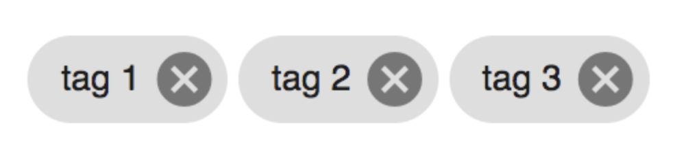

# [Dynamic Chip List component](../../../lib/core/src/lib/dynamic-chip-list/dynamic-chip-list.component.ts "Defined in dynamic-chip-list.component.ts")

This component shows dynamic list of chips which render depending on free space.



## Basic Usage

```html
<adf-dynamic-chip-list
    [chips]="chips"
    [limitChipsDisplayed]="true"
    [showDelete]="true"
    [roundUpChips]="true"
    (displayNext)="onDisplayNext()"
    (removedChip)="onRemovedChip($event)">
</adf-dynamic-chip-list>
```

## Class members

### Properties

| Name                | Type                                                                            | Default value | Description                                                    |
|---------------------|---------------------------------------------------------------------------------|---------------|----------------------------------------------------------------|
| limitChipsDisplayed | `boolean`                                                                       | false         | Should limit number of chips displayed.                        |
| showDelete          | `boolean`                                                                       | true          | Show delete button.                                            |
| disableDelete       | `boolean`                                                                       | false         | Disable delete button.                                         |
| roundUpChips        | `boolean`                                                                       | false         | Round up chips increasing the border radius of a chip to 20px. |
| pagination          | [`Pagination`](../../../lib/js-api/src/api/content-rest-api/docs/Pagination.md) |               | Provide if you want to use paginated chips.                    |
| chips               | [`Chip`](../../../lib/core/src/lib/dynamic-chip-list/chip.ts)`[]`               |               | List of chips to display.                                      |


### Events

| Name        | Type                                                                 | Description                                   |
|-------------|----------------------------------------------------------------------|-----------------------------------------------|
| displayNext | [`EventEmitter`](https://angular.io/api/core/EventEmitter)`<void>`   | Emitted when button for view more is clicked. |
| removedChip | [`EventEmitter`](https://angular.io/api/core/EventEmitter)`<string>` | Emitted when any chip is removed.             |

## Details

### Limit number of chips displayed initially

To limit number of chips initially displayed set `limitChipsDisplayed` to `true`.

```html
<adf-dynamic-chip-list
    [chips]="chips"
    [limitChipsDisplayed]="true">
</adf-dynamic-chip-list>
```

Now when chips will exceed the size of the container number of displayed chips will be limited to as much as fits together with view more button. At least one chip will always be displayed, when one chip and view more button won't fit into one line the button will be displayed under the chip.
