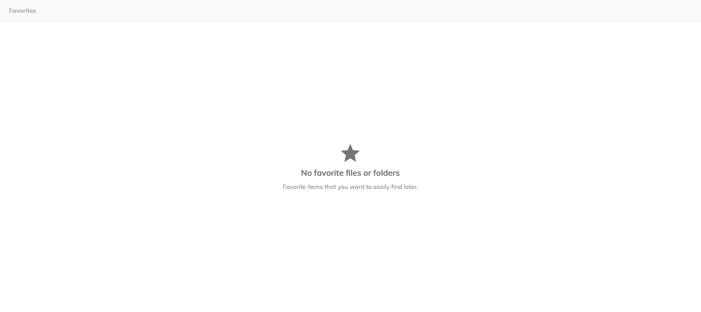

# [Empty Content Component](../../../lib/core/src/lib/templates/empty-content/empty-content.component.ts "Defined in empty-content.component.ts")

Provides a generic "Empty Content" placeholder for components.



## Basic usage

```html
<adf-document-list>
    <adf-custom-empty-content-template>
        <adf-empty-content
            icon="star_rate"
            title="APP.BROWSE.FAVORITES.EMPTY_STATE.TITLE"
            subtitle="APP.BROWSE.FAVORITES.EMPTY_STATE.TEXT">
        </adf-empty-content>
    </adf-custom-empty-content-template>
</adf-document-list>
```

## Class members

### Properties

| Name | Type | Default value | Description |
| ---- | ---- | ------------- | ----------- |
| icon | `string` | "cake" | Material Icon to use. |
| subtitle | `string` | "" | String or Resource Key for the subtitle. |
| title | `string` | "" | String or Resource Key for the title. |

## Details

### Usage examples

```html
<adf-document-list>
    <adf-custom-empty-content-template>
        <adf-empty-content
            icon="star_rate"
            title="APP.BROWSE.FAVORITES.EMPTY_STATE.TITLE"
            subtitle="APP.BROWSE.FAVORITES.EMPTY_STATE.TEXT">
        </adf-empty-content>
    </adf-custom-empty-content-template>
</adf-document-list>
```


You can also use multiple lines instead of the subtitle section:

```html
<adf-document-list>
    <adf-custom-empty-content-template>
        <adf-empty-content
            icon="delete"
            title="APP.BROWSE.TRASHCAN.EMPTY_STATE.TITLE">
            <p class="adf-empty-content__text">{{ 'APP.BROWSE.TRASHCAN.EMPTY_STATE.FIRST_TEXT' | translate }}</p>
            <p class="adf-empty-content__text">{{ 'APP.BROWSE.TRASHCAN.EMPTY_STATE.SECOND_TEXT' | translate }}</p>
        </adf-empty-content>
    </adf-custom-empty-content-template>
</adf-document-list>
```


## See also

-   [Error content component](error-content.component.md)
