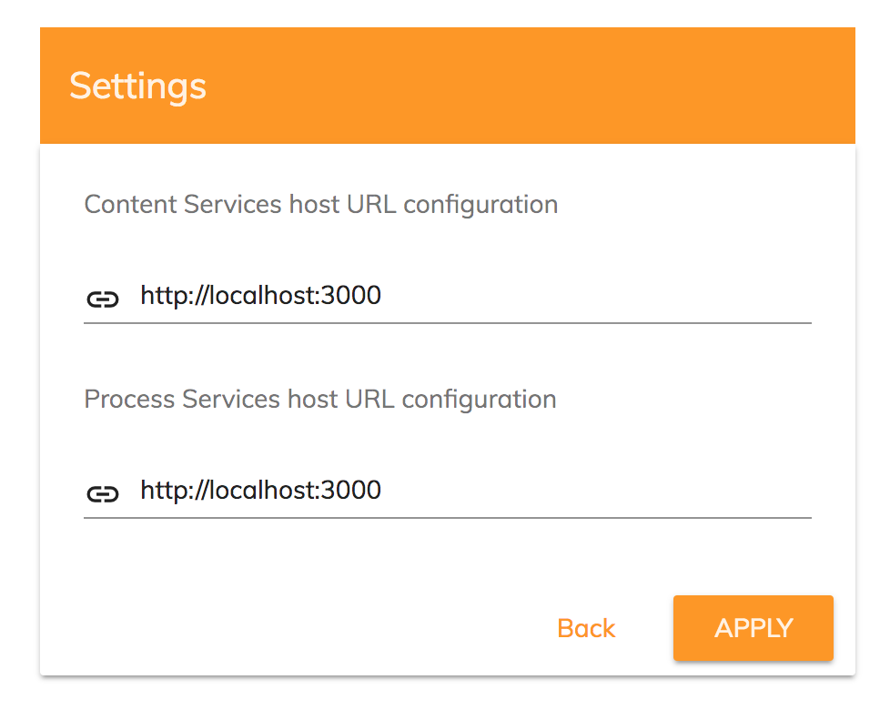

# [Host settings component](../../../lib/core/src/lib/settings/host-settings.component.ts "Defined in host-settings.component.ts")

Validates the URLs for ACS and APS and saves them in the user's local storage

**Note:** this is an internal component and is not meant to be used in production.



## Basic Usage

```html
<adf-host-settings>
</adf-host-settings>
```

```ts
@NgModule({
 providers: [
        { provide: AppConfigService, useClass: DebugAppConfigService },
    ]
)]
```

## Class members

### Properties

| Name | Type | Default value | Description |
| ---- | ---- | ------------- | ----------- |
| providers | `string[]` |  | Tells the component which provider options are available. Possible valid values are "ECM" (Content), "BPM" (Process) , "ALL" (Content and Process), 'OAUTH2' SSO. |

### Events

| Name | Type | Description |
| ---- | ---- | ----------- |
| cancel | [`EventEmitter`](https://angular.io/api/core/EventEmitter)`<boolean>` | Emitted when the user cancels the changes. |
| error | [`EventEmitter`](https://angular.io/api/core/EventEmitter)`<string>` | Emitted when the URL is invalid. |
| success | [`EventEmitter`](https://angular.io/api/core/EventEmitter)`<boolean>` | Emitted when the changes are successfully applied. |
