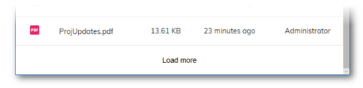

# [Infinite Pagination component](../../../lib/core/pagination/infinite-pagination.component.ts "Defined in infinite-pagination.component.ts")

Adds "infinite" pagination to the component it is used with.



## Basic Usage

```html
<adf-infinite-pagination
    [pageSize]="pageSize"
    [loading]="infiniteLoading"
    (loadMore)="loadNextPage($event)">
</adf-infinite-pagination>
```

### Integrating with Document List

```html
<adf-document-list #documentList ...></adf-document-list>

<adf-infinite-pagination 
    [target]="documentList"
    [loading]="documentList.infiniteLoading">
</adf-infinite-pagination>
```

## Class members

### Properties

| Name | Type | Default value | Description |
| --- | --- | --- | --- |
| isLoading | `boolean` | false | Is a new page loading? |
| pageSize | `number` |  | Number of items that are added with each "load more" event. |
| target | [`PaginatedComponent`](../../../lib/core/pagination/paginated-component.interface.ts) |  | Component that provides custom pagination support. |

### Events

| Name | Type | Description |
| --- | --- | --- |
| loadMore | [`EventEmitter`](https://angular.io/api/core/EventEmitter)`<`[`RequestPaginationModel`](../../../lib/core/models/request-pagination.model.ts)`>` | Emitted when the "Load More" button is clicked. |

## Details

[`Pagination`](../../../lib/content-services/document-list/models/document-library.model.ts) is the process of dividing a list into separate ranges or "pages" with a
certain number of items each. This allows a long list to be delivered in manageable pieces
rather than all at once. "Infinite" pagination means that there is no upper limit on
the number of items that can be displayed visually; a single page is shown initially but
the user can extend the list one page at a time by clicking a "Load More" button.

The `loadMore` event is emitted when the button is pressed. It is passed a
[`Pagination`](../../../lib/content-services/document-list/models/document-library.model.ts)
parameter which contains the details of the current page (the start offset of the
page within the list to be shown, whether there are more items left to show, etc).

See the [Pagination component](pagination.component.md) for more information about the alternative "finite" pagination scheme.

## See also

*   [Document list component](../../content-services/components/document-list.component.md)
*   [Pagination component](pagination.component.md)
