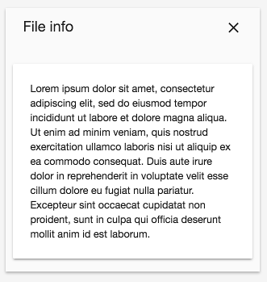

# [Info drawer layout component](../../../lib/core/src/lib/info-drawer/info-drawer-layout.component.ts "Defined in info-drawer-layout.component.ts")

Displays a sidebar-style information panel.



## Basic usage

### [Transclusions](../../user-guide/transclusion.md)

There are three regions where you can add your own content using `<div>` elements
with the following names:

-   info-drawer-title
-   info-drawer-buttons
-   info-drawer-content

```html
<adf-info-drawer-layout [showHeader]="true">
    <div info-drawer-title>File info</div>

    <div info-drawer-buttons>
        <mat-icon>clear</mat-icon>
    </div>

    <div info-drawer-content>
        <mat-card>
            Lorem ipsum dolor sit amet...
        </mat-card>
    </div>
</adf-info-drawer-layout>
```

## Class members

### Properties

| Name | Type | Default value | Description |
| ---- | ---- | ------------- | ----------- |
| showHeader | `boolean` | true | The visibility of the header. |

## Details

As the name suggests, this is basically just a layout with CSS styling.

See the [Info drawer tab component](info-drawer-tab.component.md) for an alternative approach that uses tabs to structure the content of the info drawer.

## See also

-   [Info drawer component](info-drawer.component.md)
-   [Info drawer tab component](info-drawer-tab.component.md)
