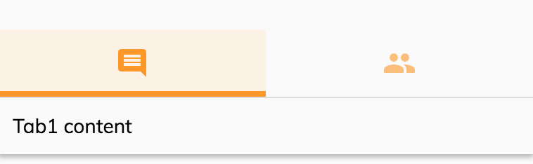

# [Info Drawer Tab component](../../../lib/core/src/lib/info-drawer/info-drawer.component.ts "Defined in info-drawer.component.ts")

Renders tabs in a [Info drawer component](info-drawer.component.md).


## Basic usage

Render a tab with label:

```html
<adf-info-drawer>

    <adf-info-drawer-tab label="Tab1">
        <div>Tab1 content</div>
    </adf-info-drawer-tab>

    <adf-info-drawer-tab label="Tab2">
        <div>Tab2 content</div>
    </adf-info-drawer-tab>

</adf-info-drawer>
```

Render tab with icons instead of labels:

```html
<adf-info-drawer>

    <adf-info-drawer-tab icon="comment">
        <div>Tab1 content</div>
    </adf-info-drawer-tab>

    <adf-info-drawer-tab icon="people">
        <div>Tab2 content</div>
    </adf-info-drawer-tab>

</adf-info-drawer>
```



You can also combine `icon` and `label` properties.

## Class members

### Properties

| Name | Type | Default value | Description |
| ---- | ---- | ------------- | ----------- |
| icon | `string` | null | Icon to render for the tab. |
| label | `string` | "" | The title of the tab (string or translation key). |

## Details

See the [Info drawer component](info-drawer.component.md) page for details of how to use this subcomponent.

## See also

-   [Info drawer component](info-drawer.component.md)
-   [Info drawer layout component](info-drawer-layout.component.md)
