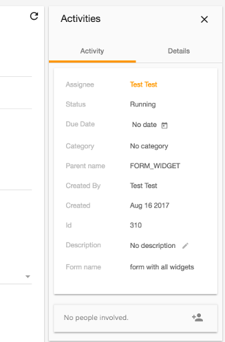

# [Info Drawer component](../../../lib/core/src/lib/info-drawer/info-drawer.component.ts "Defined in info-drawer.component.ts")

Displays a sidebar-style information panel with tabs.



## Basic usage

### [Transclusions](../../user-guide/transclusion.md)

There are three regions where you can add your own content using `<div>` elements
with the following names (as with the [Info drawer layout component](info-drawer-layout.component.md)):

-   info-drawer-title
-   info-drawer-buttons
-   info-drawer-content

The tabs are added using one or more `<adf-info-drawer-tab>` elements, which can
have any content you like:

```html
<adf-info-drawer [showHeader]="true" title="Activities" (currentTab)="getActiveTab($event)">
    <div info-drawer-buttons>
        <mat-icon (click)="close()">clear</mat-icon>
    </div>

    <adf-info-drawer-tab label="Activity">
        <mycomponent1></mycomponent1>
        <mycomponent2></mycomponent2>
    </adf-info-drawer-tab>

    <adf-info-drawer-tab label="Details">
        <mycomponent3></mycomponent3>
    </adf-info-drawer-tab>

</adf-info-drawer>
```

## Class members

### Properties

| Name | Type | Default value | Description |
| ---- | ---- | ------------- | ----------- |
| selectedIndex | `number` | 0 | The selected index tab. |
| showHeader | `boolean` | true | The visibility of the header. |
| title | `string \| null` | null | The title of the info drawer (string or translation key). |

### Events

| Name | Type | Description |
| ---- | ---- | ----------- |
| currentTab | [`EventEmitter`](https://angular.io/api/core/EventEmitter)`<number>` | Emitted when the currently active tab changes. |

## Details

This is a variant of the [Info Drawer Layout component](info-drawer-layout.component.md) that displays information in tabs. You can use the Info drawer tab subcomponent to add tabs (as shown in the example) and the `currentTab` output property to select the currently active tab.

## See also

-   [Info drawer layout component](info-drawer-layout.component.md)
-   [Info drawer tab component](info-drawer-tab.component.md)
