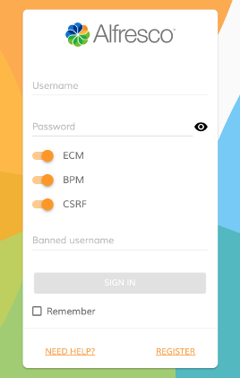
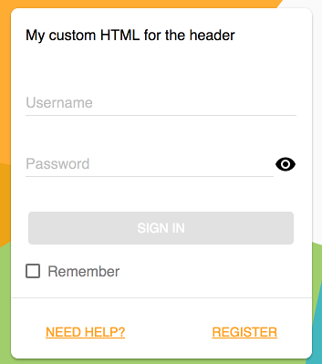
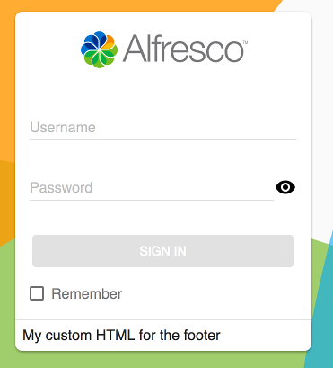
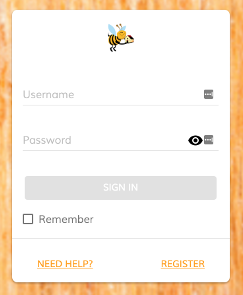
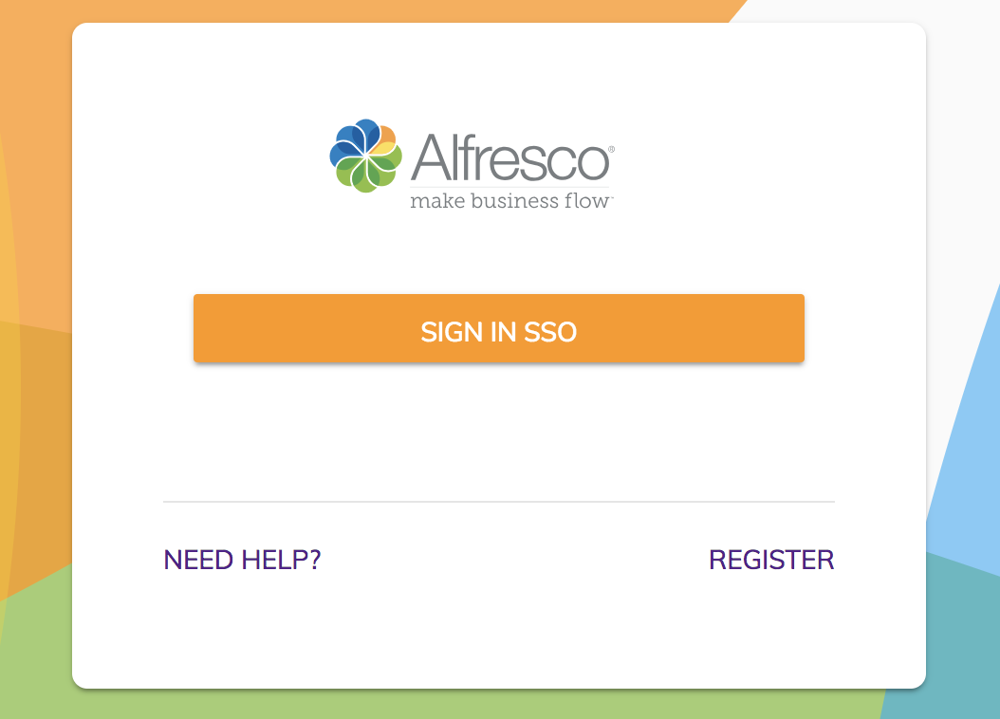

# [Login component](../../../lib/core/src/lib/login/components/login.component.ts "Defined in login.component.ts")

Authenticates to Alfresco Content Services and Alfresco Process Services.



## Contents

-   [Basic usage](#basic-usage)
    -   [Transclusions](#transclusions)
-   [Class members](#class-members)
    -   [Properties](#properties)
    -   [Events](#events)
-   [Details](#details)
    -   [Handling events](#handling-events)
    -   [Custom logo and background](#custom-logo-and-background)
    -   [Customizing validation rules](#customizing-validation-rules)
    -   [Call an external identity provider to fetch the auth token](#call-an-external-identity-provider-to-fetch-the-auth-token)
    -   [Override the successRoute from app.config.json with Basic Auth](#override-the-successroute-from-appconfigjson-with-basic-auth)
    -   [Controlling form submit execution behaviour](#controlling-form-submit-execution-behaviour)
    -   [Single Sign-On (SSO)](#single-sign-on-sso)
    -   [Kerberos](#kerberos)
-   [See Also](#see-also)

## Basic usage

```html
<adf-login 
    successRoute="/home">
</adf-login>
```

### [Transclusions](../../user-guide/transclusion.md)

You can replace the content of the header and footer of the [Login component](login.component.md) with your own custom content:

```html
<adf-login ...>
    <adf-login-header><ng-template>My custom HTML for the header</ng-template></adf-login-header>
    <adf-login-footer><ng-template>My custom HTML for the footer</ng-template></adf-login-footer>
</adf-login>`
```

Header:



Footer:



Also, any content that you put inside the `<adf-login>` tags will be rendered as part
of the Login dialog:

```html
<adf-login ...>
    <div>
        <div><!-- Custom content goes here --></div>
    </div>
</adf-login>
```

This is useful if you need to extend the functionality of the dialog
with custom input fields handled by your application or parent component:


## Class members

### Properties

| Name | Type | Default value | Description |
| ---- | ---- | ------------- | ----------- |
| backgroundImageUrl | `string` |  | Path to a custom background image. |
| copyrightText | `string` |  | The copyright text below the login box. |
| fieldsValidation | `any` |  | Custom validation rules for the login form. |
| logoImageUrl | `string` |  | Path to a custom logo image. |
| needHelpLink | `string` | "" | Sets the URL of the NEED HELP link in the footer. |
| registerLink | `string` | "" | Sets the URL of the REGISTER link in the footer. |
| showLoginActions | `boolean` | true | Should the extra actions (`Need Help`, `Register`, etc) be shown? |
| showRememberMe | `boolean` | true | Should the `Remember me` checkbox be shown? When selected, this option will remember the logged-in user after the browser is closed to avoid logging in repeatedly. |
| successRoute | `string` | null | Route to redirect to on successful login. |

### Events

| Name | Type | Description |
| ---- | ---- | ----------- |
| error | [`EventEmitter`](https://angular.io/api/core/EventEmitter)`<`[`LoginErrorEvent`](../../../lib/core/src/lib/login/models/login-error.event.ts)`>` | Emitted when the login fails. |
| executeSubmit | [`EventEmitter`](https://angular.io/api/core/EventEmitter)`<`[`LoginSubmitEvent`](../../../lib/core/src/lib/login/models/login-submit.event.ts)`>` | Emitted when the login form is submitted. |
| success | [`EventEmitter`](https://angular.io/api/core/EventEmitter)`<`[`LoginSuccessEvent`](../../../lib/core/src/lib/login/models/login-success.event.ts)`>` | Emitted when the login is successful. |

## Details

### Handling events

**app.component.html**

```html
<adf-login 
    (success)="mySuccessMethod($event)"
    (error)="myErrorMethod($event)">
</adf-login>
```

**app.component.ts**

```ts
export class AppComponent {

    mySuccessMethod($event) {
        console.log('Success Login EventEmitt called with: ' + $event.value);
    }

    myErrorMethod($event) {
        console.log('Error Login EventEmitt called with: ' + $event.value);
    }
}
```

### Custom logo and background

You can change the logo and background images using the `backgroundImageUrl` and
`logoImageUrl` properties:

```html
<adf-login 
    [backgroundImageUrl]="'http://images.freeimages.com/images/previews/638/wood-wall-for-background-1634466.jpg'"
    [logoImageUrl]="'http://images.freeimages.com/images/previews/eac/honeybee-with-a-house-1633609.jpg'">
</adf-login>
```



You can also bind to your component properties and provide values dynamically if you need to:

```html
<adf-login
    [backgroundImageUrl]="myCustomBackground"
    [logoImageUrl]="myCustomLogo">
</adf-login>
```

### Customizing validation rules

You can add to or modify the default validation rules of the login form if you
need your own custom validation:

**MyCustomLogin.component.html**

```html
<adf-login 
    [fieldsValidation]="customValidation"
    #alfrescoLogin>
</adf-login>
```

**MyCustomLogin.component.ts**

```ts
export class MyCustomLogin {
    
    @ViewChild('alfrescoLogin')
    alfrescoLogin: any;

    customValidation: any;

    constructor(public router: Router) {
        this.customValidation = {
            username: ['', Validators.compose([Validators.required, Validators.minLength(8), Validators.maxLength(10)])],
            password: ['', Validators.required]
        };
    }

    ngAfterViewInit() {
        this.alfrescoLogin.addCustomValidationError('username', 'minlength', 'Username must be at least 8 characters.');
        this.alfrescoLogin.addCustomValidationError('username', 'maxlength', 'Username must not be longer than 11 characters.');
    }
}
```

### Call an external identity provider to fetch the auth token

You can access an external provider to get an auth token for a user:

**app.config.json**

```json
{
    "oauth2" : {
      "host": "http://myhost.com",
      "authPath": "/my-custom-auth/token",
      "clientId": "my-client-id",
      "secret": ""
    }
}
```

**MyCustomLogin.component.html**

```html
<adf-login 
    [providers]="'OAUTH'"
    (success)="onMyAuthLogin($event)">
</adf-login>
```

**MyCustomLogin.component.ts**

```ts
export class MyCustomLogin {
 
    constructor(public router: Router) {
    }

    onMyAuthLogin($event) {
        console.log("My token " + $event.token.ticket)
        this.router.navigate(['/home']);
    }
}
```

### Override the successRoute from app.config.json with Basic Auth

When the user is logged in the login componet redirect him to the successRoute. This route can be overriden from the app.config.json. The successRoute must to be a valid app route.

**app.config.json**

```json
{
    "successRoute" : "/my-landing-page"
}
```

### Controlling form submit execution behaviour

The standard form submission system is suitable for most tasks but you can
take full control of submission if you need to. Use the `executeSubmit` event
to modify the submission process with your own code just after the form is
submitted.

If you want to replace the submission process completely (rather than just extend
it), you can use `event.preventDefault()` in the handler to avoid the default
behavior. You could use this, for example, to customize the validation heavily or
to present a summary of validation before submitting the form.

**MyCustomLogin.component.html**

```html
<adf-login 
    (executeSubmit)="validateForm($event)" 
    #alfrescoLogin>
</adf-login>
```

**MyCustomLogin.component.ts**

```ts
export class MyCustomLogin {

    validateForm(event: any) {
        let values = event.values;
        
        // check if the username is in the blacklist
        if (values.controls['username'].value === 'invalidUsername') {
            this.alfrescoLogin.addCustomFormError('username', 'the username is in blacklist');
            event.preventDefault();
        }
    }
    
}
```

Note that if you do not call `event.preventDefault()` then the default behaviour
will execute _after_ your custom code has completed.

### Single Sign-On (SSO)

#### Implicit Flow

If you used the host-setting component to enable SSO Oauth (or if you
enabled the setting in `app.config.json`) then the [login component](login.component.md) will show only a button to login:

```JSON
{
    "providers": "ECM",
    "authType" :"OAUTH",
    "oauth2": {
      "host": "<AUTH-SERVER>/auth/realms/alfresco",
      "clientId": "activiti",
      "scope": "openid",
      "secret": "",
      "implicitFlow": true,
      "silentLogin": false,
      "redirectUri": "/",
      "redirectUriLogout": "/logout"
    }
}
```



Note that if the `silentLogin` property in the `oauth2` configuration is set to true
then the login page will not be shown. Instead, the application will redirect
automatically to the authorization server when the user is not logged-in

#### Silent login

You can also enable automatic redirection to the OAuth provider using the following properties:

-   `silentLogin`
-   `redirectSilentIframeUri`

```json
{
  "providers": "ECM",
  "authType": "OAUTH",
  "oauth2": {
    "host": "<AUTH-SERVER>/auth/realms/alfresco",
    "clientId": "alfresco",
    "scope": "openid",
    "secret": "",
    "implicitFlow": true,
    "silentLogin": true,
    "redirectSilentIframeUri": "/assets/silent-refresh.html",
    "redirectUri": "/",
    "redirectUriLogout": "/logout"
  },
```

Note that if you deploy the application to a virtual folder
(for example `http://<ADDRESS>/my-app`) then `redirectSilentIframeUri`
must contain the full URI value:

```json
{
    "redirectSilentIframeUri": "http://<ADDRESS>/my-app/assets/silent-refresh.html",
}
```

> In the default ADF application configurations the `silent-refresh.html` file
> gets automatically copied to the application output when building for production.

#### Public urls

To enable public accessible urls, that don't need authentication, these must be defined using `publicUrls` property. The list supports absolute urls or partial urls that are valid [minimatch](https://github.com/isaacs/minimatch#readme) patterns

```json
{
    ...
    "publicUrls": ["http://<ADDRESS>/my-app/some/path", "**/my-app/*/path"]
    ...
}
```

#### Oauth2 Properties

You can find all the oauth2 configurations in the [JS-API oauth2 properties documentation](https://github.com/Alfresco/alfresco-js-api#login-with-oauth2-alfresco-authorization-server)

### Kerberos

The configuration for Kerberos authentication will allow users to access Alfresco products by entering their credentials only once when first logging into their Windows environment.

**You don't need to use the [login component](../../core/components/login.component.md) in order to enable Kerberos SSO in ADF**.

See [Kerberos Configuration](../../../docs/user-guide/kerberos.md) for instructions on configuring Kerberos for an ADF app.

## See Also

-   [Logout directive](../directives/logout.directive.md)
