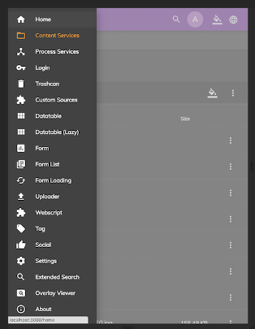

# [Sidenav Layout component](../../../lib/core/layout/components/sidenav-layout/sidenav-layout.component.ts "Defined in sidenav-layout.component.ts")

Displays the standard three-region ADF application layout.


## Contents

*   [Basic Usage](#basic-usage)
    *   [Transclusions](#transclusions)
*   [Class members](#class-members)
    *   [Properties](#properties)
    *   [Events](#events)
*   [Details](#details)
    *   [Template context](#template-context)
    *   [menuOpenState$](#menuopenstate)
    *   [Preserving the menu state](#preserving-the-menu-state)

## Basic Usage

### [Transclusions](../../user-guide/transclusion.md)

The content for the header, navigation area, and main content are transcluded using three special
sub-components (note the use of `<ng-template>` in the sub-components' body sections):

```html
<adf-sidenav-layout
    [sidenavMin]="70"
    [sidenavMax]="220"
    [stepOver]="600"
    [hideSidenav]="false"
    [expandedSidenav]="true"
    (expanded)="setState($event)">

    <adf-sidenav-layout-header>
        <ng-template let-toggleMenu="toggleMenu">
            <div class="app-header">
                <button (click)="toggleMenu()">toggle menu</button>
            </div>
        </ng-template>
    </adf-sidenav-layout-header>

    <adf-sidenav-layout-navigation>
        <ng-template let-isMenuMinimized="isMenuMinimized">
            <div *ngIf="isMenuMinimized()" class="app-compact-navigation"></div>
            <div *ngIf="!isMenuMinimized()" class="app-expanded-navigation"></div>
        </ng-template>
    </adf-sidenav-layout-navigation>

    <adf-sidenav-layout-content>
        <ng-template>
            <router-outlet></router-outlet>
        </ng-template>
    </adf-sidenav-layout-content>

</adf-sidenav-layout>
```

## Class members

### Properties

| Name | Type | Default value | Description |
| --- | --- | --- | --- |
| expandedSidenav | `boolean` | true | Should the navigation region be expanded initially? |
| hideSidenav | `boolean` | false | Toggles showing/hiding the navigation region. |
| position | `string` | "start" | The side that the drawer is attached to. Possible values are 'start' and 'end'. |
| sidenavMax | `number` |  | Maximum size of the navigation region. |
| sidenavMin | `number` |  | Minimum size of the navigation region. |
| stepOver | `number` |  | Screen size at which display switches from small screen to large screen configuration. |

### Events

| Name | Type | Description |
| --- | --- | --- |
| expanded | [`EventEmitter`](https://angular.io/api/core/EventEmitter)`<boolean>` | Emitted when the menu toggle and the collapsed/expanded state of the sideNav changes. |

## Details

This component displays the familiar ADF layout consisting of three regions: header, navigation
and content.

The layout will select between a small screen (ie, mobile) configuration and a large screen
configuration according to the screen size in pixels (the `stepOver` property sets the
number of pixels at which the switch will occur).

The small screen layout uses the Angular Material [Sidenav component](https://material.angularjs.org/latest/api/directive/mdSidenav) which is
described in detail on their website.

The ADF-style (ie, large screen) Sidenav has two states: **expanded** and **compact**.
The navigation is always displayed regardless of the state but it will have a reduced width
when compacted. Set the widths for the expanded and compact states with the `sidenavMin` and
`sidenavMax` properties.

The contents of the 3 regions can be injected through Angular's template transclusion as shown
in the usage example above.

Desktop layout (screen width greater than the `stepOver` value):


Mobile layout (screen width less than the `stepOver` value):



### Template context

Each template is given a context containing the following methods:

*   `toggleMenu(): void`
    Triggers menu toggling.

*   `isMenuMinimized(): boolean`
    The expanded/compact (minimized) state of the navigation. This one only makes sense in case of desktop size, when the screen size is above the value of stepOver.

### menuOpenState$

Beside the template context's **isMenuMinimized** variable, another way to listen to the component's menu's open/closed state is with the `menuOpenState$` observable, which is driven by a `BehaviorSubject` in the background. The value emitted by this observable is the opposite of the `isMenuMinimized` template variable.

| Name           | Type                                                                          | Default | Description                                     |
| -------------- | ----------------------------------------------------------------------------- | ------- | ----------------------------------------------- |
| menuOpenState$ | [`Observable`](http://reactivex.io/documentation/observable.html)\<boolean> | true    | Another way to listen to menu open/closed state |

Every time the menu state is changed, the following values are emitted:

*   true, if the menu changed to the opened state
*   false, if the menu changed to the closed state

### Preserving the menu state

You can preserve the state of the menu between sessions. To do this, you first need to
set a property in the `app.config.json` file:

```json
"sideNav" : {
    "preserveState" : true
}
```

When this property is set, the collapsed/expanded state will be stored in the local storage
and restored when the page is reloaded or when the user next uses the app.

You can also set the default state in the `app.config.json` file:

```json
"sideNav" : {
    "expandedSidenav" : true
}
```

Note that if `preserveState` is set then the current state of the sidenav (set by the user)
will override this default setting.
