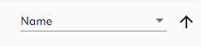

# [Sorting Picker Component](../../../lib/core/src/lib/sorting-picker/sorting-picker.component.ts "Defined in sorting-picker.component.ts")

Selects from a set of predefined sorting definitions and directions.



## Basic Usage

```html
<adf-sorting-picker
    [options]="options"
    [selected]="value"
    [ascending]="ascending"
    (change)="onChanged($event)">
</adf-sorting-picker>
```

## Class members

### Properties

| Name | Type | Default value | Description |
| ---- | ---- | ------------- | ----------- |
| ascending | `boolean` | true | Current sorting direction |
| options | `Array<Function>` | \[] | Available sorting options |
| selected | `string` |  | Currently selected option key |

### Events

| Name | Type | Description |
| ---- | ---- | ----------- |
| sortingChange | [`EventEmitter`](https://angular.io/api/core/EventEmitter)`<boolean>` | Raised each time direction gets changed. |
| valueChange | [`EventEmitter`](https://angular.io/api/core/EventEmitter)`<string>` | Raised each time sorting key gets changed. |

## Details

The picker shows the user a menu of sorting options (which could be data columns to sort on
alphabetical vs numerical search, etc) and the choice of ascending vs descending sort order.
Note that picker only implements the menu, so you are responsible for implementing the sorting
options yourself.

The `options` property contains an array of any objects that expose the following properties:

```ts
{
    key: string;
    label: string;
}
```

The `key` is an identifying value and the `label` is the text that the user will see in the
picker. The selected `key` is reported by the `change` event, which passes an object like the
following as its parameter:

```ts
{
    key: string,
    ascending: boolean
}
```
