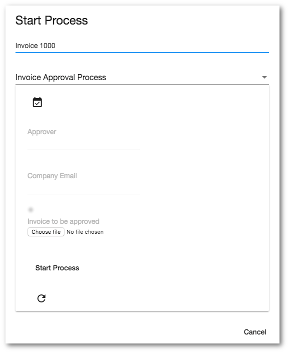

# [Start Form component](../../../lib/process-services/src/lib/form/start-form.component.ts "Defined in start-form.component.ts")

Displays the Start [`Form`](../../../lib/process-services/src/lib/task-list/models/form.model.ts) for a process.



## Basic Usage

```html
<adf-start-form
    [processDefinitionId]="currentProcessDef.id"
    (outcomeClick)="onOutcomeClick($event)">
</adf-start-form>
```

## Class members

### Properties

| Name | Type | Default value | Description |
| ---- | ---- | ------------- | ----------- |
| data | [`FormValues`](../../../lib/core/src/lib/form/components/widgets/core/form-values.ts) |  | Custom form values map to be used with the rendered form. |
| disableCompleteButton | `boolean` | false | If true then the `Complete` outcome button is shown but it will be disabled. |
| disableSaveButton | `boolean` | false | If true then the `Save` outcome button is shown but will be disabled. |
| disableStartProcessButton | `boolean` | false | If true then the `Start Process` outcome button is shown but it will be disabled. |
| enableFixedSpacedForm | `boolean` | true | The form will set a prefixed space for invisible fields. |
| fieldValidators | [`FormFieldValidator`](../../../lib/core/src/lib/form/components/widgets/core/form-field-validator.ts)`[]` |  | Contains a list of form field validator instances. |
| form | [`FormModel`](../../../lib/core/src/lib/form/components/widgets/core/form.model.ts) |  | Underlying form model instance. |
| formId | `number` |  | The id of the form definition to load and display with custom values. |
| formName | `string` |  | Name of the form definition to load and display with custom values. |
| nameNode | `string` |  | Name to assign to the new node where the metadata are stored. |
| nodeId | `string` |  | Content Services node ID for the form metadata. |
| path | `string` |  | Path of the folder where the metadata will be stored. |
| processDefinitionId | `string` |  | Definition ID of the process to start, this parameter can not be use in combination with processId |
| processId | `string` |  | Process ID of the process to start, this parameter can not be use in combination with processDefinitionId |
| readOnly | `boolean` | false | Toggle readonly state of the form. Forces all form widgets to render as readonly if enabled. |
| readOnlyForm | `boolean` | false | Is the form read-only (ie, can't be edited)? |
| saveMetadata | `boolean` | false | Toggle saving of form metadata. |
| showCompleteButton | `boolean` | true | Toggle rendering of the `Complete` outcome button. |
| showOutcomeButtons | `boolean` | true | Should form outcome buttons be shown? |
| showRefreshButton | `boolean` | true | Should the refresh button be shown? |
| showSaveButton | `boolean` | true | Toggle rendering of the `Save` outcome button. |
| showTitle | `boolean` | true | Toggle rendering of the form title. |
| showValidationIcon | `boolean` | true | Toggle rendering of the validation icon next to the form title. |
| taskId | `string` |  | Task id to fetch corresponding form and values. |

### Events

| Name | Type | Description |
| ---- | ---- | ----------- |
| error | [`EventEmitter`](https://angular.io/api/core/EventEmitter)`<any>` | Emitted when any error occurs. |
| executeOutcome | [`EventEmitter`](https://angular.io/api/core/EventEmitter)`<`[`FormOutcomeEvent`](../../../lib/core/src/lib/form/components/widgets/core/form-outcome-event.model.ts)`>` | Emitted when any outcome is executed. Default behaviour can be prevented via `event.preventDefault()`. |
| formCompleted | [`EventEmitter`](https://angular.io/api/core/EventEmitter)`<`[`FormModel`](../../../lib/core/src/lib/form/components/widgets/core/form.model.ts)`>` | Emitted when the form is submitted with the `Complete` outcome. |
| formContentClicked | [`EventEmitter`](https://angular.io/api/core/EventEmitter)`<`[`ContentLinkModel`](../../../lib/core/src/lib/form/components/widgets/core/content-link.model.ts)`>` | Emitted when a field of the form is clicked. |
| formDataRefreshed | [`EventEmitter`](https://angular.io/api/core/EventEmitter)`<`[`FormModel`](../../../lib/core/src/lib/form/components/widgets/core/form.model.ts)`>` | Emitted when form values are refreshed due to a data property change. |
| formError | [`EventEmitter`](https://angular.io/api/core/EventEmitter)`<`[`FormFieldModel`](../../core/models/form-field.model.md)`[]>` | Emitted when the supplied form values have a validation error. |
| formLoaded | [`EventEmitter`](https://angular.io/api/core/EventEmitter)`<`[`FormModel`](../../../lib/core/src/lib/form/components/widgets/core/form.model.ts)`>` | Emitted when the form is loaded or reloaded. |
| formSaved | [`EventEmitter`](https://angular.io/api/core/EventEmitter)`<`[`FormModel`](../../../lib/core/src/lib/form/components/widgets/core/form.model.ts)`>` | Emitted when the form is submitted with the `Save` or custom outcomes. |
| outcomeClick | [`EventEmitter`](https://angular.io/api/core/EventEmitter)`<any>` | Emitted when the user clicks one of the outcome buttons that completes the form. |

## Details

The [Start Process component](../../process-services/components/start-process.component.md) uses the Start [`Form`](../../../lib/process-services/src/lib/task-list/models/form.model.ts) component
to display the
[start form](http://docs.alfresco.com/process-services1.6/topics/none_start_event.html)
for the process.

The `outcomeClick` event is passed a string containing the ID of the outcome button that
the user clicked. You can pass this value to the `startProcess` method (defined in the
[Process service](../../process-services/services/process.service.md)) when activating the process, if necessary.

## See also

-   [Process service](../../process-services/services/process.service.md)
