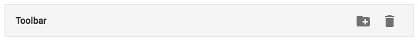
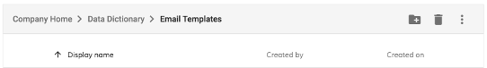
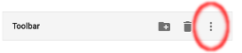
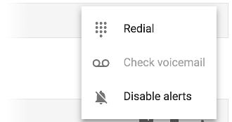
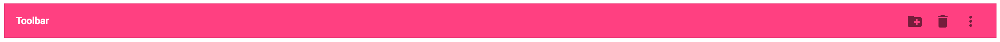

# [Toolbar Component](../../../lib/core/src/lib/toolbar/toolbar.component.ts "Defined in toolbar.component.ts")

Simple container for headers, titles, actions and breadcrumbs.



## Contents

-   [Basic Usage](#basic-usage)
    -   [Transclusions](#transclusions)
-   [Class members](#class-members)
    -   [Properties](#properties)
-   [Details](#details)
    -   [Dropdown menu](#dropdown-menu)
    -   [Custom color](#custom-color)
-   [See also](#see-also)

## Basic Usage

```html
<adf-toolbar title="Toolbar">
    <button mat-icon-button>
        <mat-icon>create_new_folder</mat-icon>
    </button>
    <button mat-icon-button>
        <mat-icon>delete</mat-icon>
    </button>
</adf-toolbar>
```

### [Transclusions](../../user-guide/transclusion.md)

You can set the title content using an `<adf-toolbar-title>` element (although
you can also set a simple textual title with the `title` attribute).
All other content in the toolbar is free-form but you can use one or more
`<adf-toolbar-divider>` elements between your own elements to add a visual
separator. Also, any content following a `<div>` element with the CSS class
`adf-toolbar--spacer` will be pushed across to the right-hand side of the
toolbar:

```html
<adf-toolbar>
    <adf-toolbar-title>
        <adf-breadcrumb ...></adf-breadcrumb>
    </adf-toolbar-title>

    <adf-toolbar-divider></adf-toolbar-divider>

    <button></button>
    <button></button>

    <div class="adf-toolbar--spacer"></div>

    <button></button>
</adf-toolbar>
```

For example, the image below shows a toolbar with a
[Breadcrumb component](../../content-services/components/breadcrumb.component.md) title, and then some buttons
pushed to the right by a spacer:



## Class members

### Properties

| Name | Type | Default value | Description |
| ---- | ---- | ------------- | ----------- |
| color | [`ThemePalette`](https://github.com/angular/components/blob/master/src/material/core/common-behaviors/color.ts) |  | Toolbar color. Can be changed to empty value (default), `primary`, `accent` or `warn`. |
| title | `string` | "" | Toolbar title. |

## Details

### Dropdown menu

The following example shows how to create a dropdown menu. The code is based
on the `<mat-menu>` component from the `@angular/material` library
but you could also use your own custom menu components:

```html
<adf-toolbar title="Toolbar">
    ...

    <button mat-icon-button [matMenuTriggerFor]="menu">
        <mat-icon>more_vert</mat-icon>
    </button>
    <mat-menu #menu="matMenu">
        <button mat-menu-item>
            <mat-icon>dialpad</mat-icon>
            <span>Redial</span>
        </button>
        <button mat-menu-item disabled>
            <mat-icon>voicemail</mat-icon>
            <span>Check voicemail</span>
        </button>
        <button mat-menu-item>
            <mat-icon>notifications_off</mat-icon>
            <span>Disable alerts</span>
        </button>
    </mat-menu>
</adf-toolbar>
```



With the menu set up like this, you would see the following menu items as defined earlier
when you click the menu button:



### Custom color

Besides the default color you can use 'primary', 'accent', or 'warn' values:

You might also want to change colors to follow your application's color
[theme](../../user-guide/theming.md):

For example:





## See also

-   [Toolbar Divider component](toolbar-divider.component.md)
-   [Toolbar Title component](toolbar-title.component.md)
