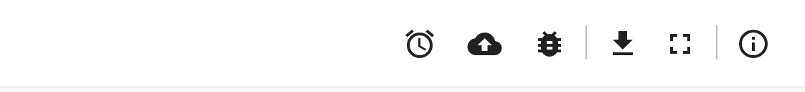
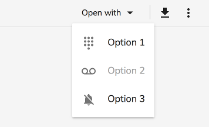
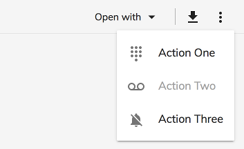

# [Viewer component](../../../lib/core/src/lib/viewer/components/viewer.component.ts "Defined in viewer.component.ts")

Displays content from blob file or url file.

## Contents

-   [Basic usage](#basic-usage)
    -   [Transclusions](#transclusions)
-   [Class members](#class-members)
    -   [Properties](#properties)
    -   [Events](#events)
-   [Keyboard shortcuts](#keyboard-shortcuts)
-   [Details](#details)
    -   [Custom file parameters](#custom-file-parameters)
    -   [Supported file formats](#supported-file-formats)
    -   [Configuring PDF.js library](#configuring-pdfjs-library)
    -   [Extending the Viewer](#extending-the-viewer)
    -   [Custom layout](#custom-layout)
-   [Handling non responsive file preview](#handling-non-responsive-file-preview)
-   [See also](#see-also)

## Basic usage

Using with blob file:

```html
<adf-viewer 
    [showViewer]="true" 
    [overlayMode]="true" 
    [blobFile]="blobFile"
    [fileName]="'filename.pdf'">
</adf-viewer>
```

Using with file url:

```html
<adf-viewer 
    [overlayMode]="true" 
    [urlFile]="'https://fileUrl.com/filename.pdf'">
</adf-viewer>
```

### [Transclusions](../../user-guide/transclusion.md)

The [Viewer component](viewer.component.md) lets you transclude content for the toolbar (and toolbar buttons),
the sidebar, thumbnails, and the "Open with" and "More actions" menus.
See the [Custom layout](#custom-layout) section for full details of all available tranclusions.

## Class members

### Properties

| Name | Type | Default value | Description |
| ---- | ---- | ------------- | ----------- |
| allowFullScreen | `boolean` | true | Toggles the 'Full Screen' feature. |
| allowGoBack | `boolean` | true | Allows `back` navigation |
| allowLeftSidebar | `boolean` | false | Allow the left the sidebar. |
| allowNavigate | `boolean` | false | Toggles before/next navigation. You can use the arrow buttons to navigate between documents in the collection. |
| allowRightSidebar | `boolean` | false | Allow the right sidebar. |
| blobFile | [`Blob`](https://developer.mozilla.org/en-US/docs/Web/API/Blob) |  | Loads a [Blob](https://developer.mozilla.org/en-US/docs/Web/API/Blob) File |
| canNavigateBefore | `boolean` | true | Toggles the "before" ("&lt;") button. Requires `allowNavigate` to be enabled. |
| canNavigateNext | `boolean` | true | Toggles the next (">") button. Requires `allowNavigate` to be enabled. |
| fileName | `string` |  | Override Content filename. |
| mimeType | `string` |  | Overload mimeType |
| overlayMode | `boolean` | false | If `true` then show the Viewer as a full page over the current content. Otherwise fit inside the parent div. |
| readOnly | `boolean` | true | Enable when where is possible the editing functionalities |
| showLeftSidebar | `boolean` | false | Toggles left sidebar visibility. Requires `allowLeftSidebar` to be set to `true`. |
| showRightSidebar | `boolean` | false | Toggles right sidebar visibility. Requires `allowRightSidebar` to be set to `true`. |
| showToolbar | `boolean` | true | Hide or show the toolbar |
| showViewer | `boolean` | true | Hide or show the viewer |
| sidebarLeftTemplate | [`TemplateRef`](https://angular.io/api/core/TemplateRef)`<any>` | null | The template for the left sidebar. The template context contains the loaded node data. |
| sidebarLeftTemplateContext |  | null | Context object available for binding by the local sidebarLeftTemplate with let declarations. |
| sidebarRightTemplate | [`TemplateRef`](https://angular.io/api/core/TemplateRef)`<any>` | null | The template for the right sidebar. The template context contains the loaded node data. |
| sidebarRightTemplateContext |  | null | Context object available for binding by the local sidebarRightTemplate with let declarations. |
| tracks | [`Track`](../../../lib/core/src/lib/viewer/models/viewer.model.ts)`[]` | \[] | media subtitles for the media player |
| urlFile | `string` | "" | If you want to load an external file that does not come from ACS you can use this URL to specify where to load the file from. |

### Events

| Name             | Type                                                                                                                            | Description                                                                |
|------------------|---------------------------------------------------------------------------------------------------------------------------------|----------------------------------------------------------------------------|
| navigateBefore   | [`EventEmitter`](https://angular.io/api/core/EventEmitter)`<KeyboardEvent \| MouseEvent>`                                       | Emitted when user clicks 'Navigate Before' ("&lt;") button.                |
| navigateNext     | [`EventEmitter`](https://angular.io/api/core/EventEmitter)`<KeyboardEvent \| MouseEvent>`                                       | Emitted when user clicks 'Navigate Next' (">") button.                     |
| showViewerChange | [`EventEmitter`](https://angular.io/api/core/EventEmitter)`<boolean>`                                                           | Emitted when the viewer close                                              |
| submitFile       | [`EventEmitter`](https://angular.io/api/core/EventEmitter)`<`[`Blob`](https://developer.mozilla.org/en-US/docs/Web/API/Blob)`>` | Emitted when the img is submitted in the img viewer.                       |
| downloadFile     | [`EventEmitter`](https://angular.io/api/core/EventEmitter)`<`[`void`](https://developer.mozilla.org/en-US/docs/Web/API/Blob)`>` | Emitted when download button is clicked on the Download File Prompt. |

## Keyboard shortcuts

| Name | Description |
| ---- | ----------- |
| Esc | Close the viewer (overlay mode only). |
| Left | Invoke 'Navigate before' action. |
| Right | Invoke 'Navigate next' action. |
| Ctrl+F | Activate full-screen mode. |

## Details

### Custom file parameters

You can provide custom file parameters, for example a value for the `mimeType` or `fileName` when using URL values that have no file names or extensions:

```html
<adf-viewer
    [fileName]="fileName"
    [allowGoBack]="false"
    [mimeType]="mimeType"
    [urlFile]="fileUrl">
</adf-viewer>
```

### Supported file formats

The [Viewer component](viewer.component.md) consists of separate Views that handle particular file types or type families based on either a file extension or a mime type:

-   PDF View
    -   application/pdf
    -   \*.pdf
-   Image View
    -   image/png
    -   image/jpeg
    -   image/gif
    -   image/bmp
    -   image/svg+xml
    -   \*.png
    -   \*.jpg
    -   \*.jpeg
    -   \*.gif
    -   \*.bpm
    -   \*.svg
-   Text View
    -   text/plain
    -   text/csv
    -   text/xml
    -   text/html
    -   application/x-javascript
    -   \*.txt
    -   \*.xml
    -   \*.js
    -   \*.html
    -   \*.json
    -   \*.ts
-   Media View
    -   video/mp4
    -   video/webm
    -   video/ogg
    -   audio/mpeg
    -   audio/ogg
    -   audio/wav
    -   \*.wav
    -   \*.mp4
    -   \*.mp3
    -   \*.webm
    -   \*.ogg

### Configuring PDF.js library

Configure your webpack-enabled application with the PDF.js library as follows.

1.  Install pdfjs-dist

```sh
npm install pdfjs-dist
```

2.  Update `vendors.ts` by appending the following code. This will enable the [viewer component](viewer.component.md)
    and compatibility mode for all browsers. It will also configure the web worker for the PDF.js
    library to render PDF files in the background:

```ts
// PDF.js
require('pdfjs-dist/web/compatibility.js');
const pdfjsLib = require('pdfjs-dist');
pdfjsLib.PDFJS.workerSrc = './pdf.worker.js';
require('pdfjs-dist/web/pdf_viewer.js');
```

3.  Update the `plugins` section of the `webpack.common.js` file with the following lines:

```js
new CopyWebpackPlugin([
    ...
    {
        from: 'node_modules/pdfjs-dist/build/pdf.worker.js',
        to: 'pdf.worker.js'
    }
])
```

The [Viewer component](viewer.component.md) should now be able to display PDF files.

### Extending the Viewer

#### Internal extension mechanism

The Viewer supports dynamically-loaded viewer preview extensions, to know more about it [Preview Extension component](../../extensions/components/preview-extension.component.md). This 

#### Code extension mechanism]

You can define your own custom handler to handle other file formats that are not yet supported by
the [Viewer component](viewer.component.md). Below is an example that shows how to use the `adf-viewer-extension`
to handle 3D data files:

```html
<adf-viewer [urlFile]="urlFile">
    
    <adf-viewer-extension [supportedExtensions]="['obj','3ds']" #extension>
        <ng-template let-urlFileContent="urlFileContent" let-extension="extension">
            <threed-viewer 
                [urlFile]="urlFileContent" 
                [extension]="extension">
            </threed-viewer>
        </ng-template>
    </adf-viewer-extension>

</adf-viewer> 
```

Note: you need to add the `ng2-3d-editor` dependency to your `package.json` file to make the example above work.

You can define multiple `adf-viewer-extension` templates if required:

```html
<adf-viewer [urlFile]="urlFile">

    <adf-viewer-extension [supportedExtensions]="['xls','xlsx']" #extension>
        <ng-template let-urlFileContent="urlFileContent">
            <my-custom-xls-component 
                urlFileContent="urlFileContent">
            </my-custom-xls-component>
        </ng-template>
    </adf-viewer-extension>

    <adf-viewer-extension [supportedExtensions]="['txt']" #extension>
        <ng-template let-urlFileContent="urlFileContent" >               
            <my-custom-txt-component 
                urlFileContent="urlFileContent">
            </my-custom-txt-component>
        </ng-template>
    </adf-viewer-extension>
</adf-viewer> 
```

### Custom layout

The [Viewer component](viewer.component.md) lets you transclude custom content in several different places as
explained in the sections below.

#### Custom toolbar

You can replace the standard viewer toolbar with your own custom implementation:

```html
<adf-viewer>
    <adf-viewer-toolbar>
        <h1>toolbar</h1>
    </adf-viewer-toolbar>
</adf-viewer>
```

Everything you put inside the "adf-viewer-toolbar" tags will be rendered instead of the
standard toolbar.

#### Custom toolbar buttons

If you are happy with the custom toolbar's behaviour but want to add some extra buttons
then you can do so as shown in the following example:

```html
<adf-viewer>
    <adf-viewer-toolbar-actions>
        <button mat-icon-button>
            <mat-icon>alarm</mat-icon>
        </button>
        <button mat-icon-button>
            <mat-icon>backup</mat-icon>
        </button>
        <button mat-icon-button>
            <mat-icon>bug_report</mat-icon>
        </button>
    </adf-viewer-toolbar-actions>
</adf-viewer>
```

The result should look like this:



#### Custom sidebar

The [Viewer component](viewer.component.md) also supports custom sidebar components and layouts.
Set the `allowRightSidebar` property to `true` to enable this feature.

The custom sidebar can be injected in two different ways. The first way is to use
transclusion, which will display all content placed inside the `<adf-viewer-sidebar>` element:

```html
<adf-viewer [allowRightSidebar]="true">
    <adf-viewer-sidebar>
        <h1>My info</h1>
    </adf-viewer-sidebar>
</adf-viewer>
```

#### Custom "Open With" menu

You can enable a custom "Open With" menu by providing at least one action inside the
`adf-viewer-open-with` tag:

```html
<adf-viewer [urlFile]="urlFile">

    <adf-viewer-open-with>
        <button mat-menu-item>
            <mat-icon>dialpad</mat-icon>
            <span>Option 1</span>
        </button>
        <button mat-menu-item disabled>
            <mat-icon>voicemail</mat-icon>
            <span>Option 2</span>
        </button>
        <button mat-menu-item>
            <mat-icon>notifications_off</mat-icon>
            <span>Option 3</span>
        </button>
    </adf-viewer-open-with>

</adf-viewer>
```



#### Custom "More actions" menu

You can enable a custom "More actions" menu by providing at least one action inside the `adf-viewer-more-actions` tag:

```html
<adf-viewer [urlFile]="urlFile">

    <adf-viewer-more-actions>
        <button mat-menu-item>
            <mat-icon>dialpad</mat-icon>
            <span>Action One</span>
        </button>
        <button mat-menu-item disabled>
            <mat-icon>voicemail</mat-icon>
            <span>Action Two</span>
        </button>
        <button mat-menu-item>
            <mat-icon>notifications_off</mat-icon>
            <span>Action Three</span>
        </button>
    </adf-viewer-more-actions>

</adv-viewer>
```



#### Custom zoom scaling

You can set a default zoom scaling value for pdf viewer by adding the following code in `app.config.json`.
Note: For the pdf viewer the value has to be within the range of 25 - 1000.

"adf-viewer": {
"pdf-viewer-scaling": 150
}

In the same way you can set a default zoom scaling value for the image viewer by adding the following code in `app.config.json`.

"adf-viewer": {
"image-viewer-scaling": 150
}

By default the viewer's zoom scaling is set to 100%.

## Handling non responsive file preview

It is possible that trying to load a large file, especially over a slow network, can cause the [viewer component](../../core/components/viewer.component.md) to get stuck in the loading state. To handle such cases, 
the viewer can be configured to display a prompt to ask the user to either download the file locally and then close the viewer, or wait for the viewer to load the file.
In case the user decides to wait, the viewer can further be configured to display subsequent reminder prompts asking the same options.

In order to configure this feature, add the following code in `app.config.json`.

```
  "viewer": {
    "enableDownloadPrompt":  true,
    "enableDownloadPromptReminder": true,
    "downloadPromptDelay": 50,
    "downloadPromptReminderDelay": 30
  }
```

Here `enableDownloadPrompt: true` enables the dialog to be visible after a set period of time. This time can be configured by updating the value in the 
`downloadPromptDelay` property. 

The second boolean flag `enableDownloadPromptReminder: true` can be used to configure whether the reminder prompts should be displayed or not. 
`downloadPromptReminderDelay` property can be used to configure the time to wait between reminder prompts.

Note: All times in this configuration must be provided in seconds

## See also

-   [Document List component](../../content-services/components/document-list.component.md)
-   [Preview Extension component](../../extensions/components/preview-extension.component.md)
