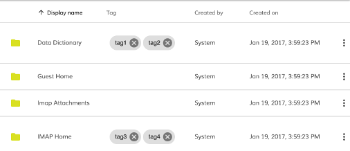
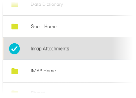
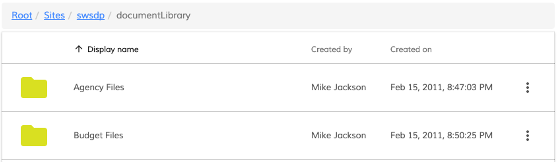
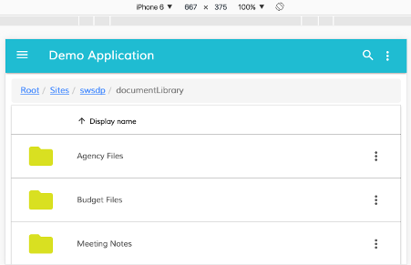

# [Data Column Component](../../lib/core/data-column/data-column.component.ts "Defined in data-column.component.ts")

Defines column properties for DataTable, Tasklist, Document List and other components.

## Contents

-   [Basic Usage](#basic-usage)
-   [Class members](#class-members)
    -   [Properties](#properties)
-   [Details](#details)
    -   [Conditional visibility](#conditional-visibility)
    -   [Automatic column header translation](#automatic-column-header-translation)
    -   [Custom tooltips](#custom-tooltips)
    -   [Column Template](#column-template)
    -   [Styling Techniques](#styling-techniques)
-   [See also](#see-also)

## Basic Usage

```html
<adf-datatable [data]="data">
    <data-columns>
        <data-column key="icon" type="image" [sortable]="false"></data-column>
        <data-column key="id" title="Id"></data-column>
        <data-column key="createdOn" title="Created"></data-column>
        <data-column key="name" title="Name" class="full-width name-column"></data-column>
        <data-column key="createdBy.name" title="Created By"></data-column>
    </data-columns>
</adf-datatable>
```

## Class members

### Properties

| Name | Type | Default value | Description |
| ---- | ---- | ------------- | ----------- |
| cssClass | `string` |  | Additional CSS class to be applied to column (header and cells). |
| format | `string` |  | Value format (if supported by the parent component), for example format of the date. |
| formatTooltip | `Function` |  | Custom tooltip formatter function. |
| key | `string` |  | Data source key. Can be either a column/property key like `title`  or a property path like `createdBy.name`. |
| sortable | `boolean` | true | Toggles ability to sort by this column, for example by clicking the column header. |
| srTitle | `string` |  | Title to be used for screen readers. |
| title | `string` | "" | Display title of the column, typically used for column headers. You can use the i18n resource key to get it translated automatically. |
| type | `string` | "text" | Value type for the column. Possible settings are 'text', 'image', 'date', 'fileSize' and 'location'. |

## Details

### Conditional visibility

You can use `ngIf` directives to provide conditional visibility support for the columns:

```html
<data-column
    *nfIg="showNameColumn"
    key="name"
    title="MY.RESOURCE.KEY">
</data-column>
```

### Automatic column header translation

You can use i18n resource keys with the
[`DataColumn`](../../lib/core/datatable/data/data-column.model.ts) `title` property.
The component will automatically check the appropriate i18n resources and fetch the corresponding value.

```html
<data-column
    key="name"
    title="MY.RESOURCE.KEY">
</data-column>
```

This feature is optional. Regular text (either plain or converted via the `translate` pipe) will still work as normal.

### Custom tooltips

You can create custom tooltips for the table cells by providing a `formatTooltip` property with a tooltip formatter function when declaring a data column.

```html
<data-column
    title="Name"
    key="name"
    [formatTooltip]="getNodeNameTooltip"
    class="full-width ellipsis-cell">
</data-column>
```

And the code in this case will be similar to the following:

```ts
import { DataColumn, DataRow } from '@alfresco/adf-core';

@Component({...})
export class MyComponent {
    ...

    getNodeNameTooltip(row: DataRow, col: DataColumn): string {
        if (row) {
            return row.getValue('name');
        }
        return null;
    }
}
```

To disable the tooltip your function can return `null` or an empty string.

### Column Template

You can provide custom column/cell templates that may contain other Angular components or HTML elements:

Every cell in the DataTable component is bound to the dynamic data context containing the following properties:

| Name | Type | Description |
| ---- | ---- | ----------- |
| data | [`DataTableAdapter`](../../lib/core/datatable/data/datatable-adapter.ts) | Data adapter instance. |
| row | [`DataRow`](../../lib/core/datatable/data/data-row.model.ts) | Current data row instance. |
| col | [`DataColumn`](../../lib/core/datatable/data/data-column.model.ts) | Current data column instance. |

You can use all three properties to gain full access to underlying data from within your custom templates. 
In order to wire HTML templates with the data context you will need to define a variable that is bound to `$implicit` as shown below:

```html
<ng-template let-context="$implicit">
    <!-- template body -->
</ng-template>
```

The name format is `let-VARIABLE_NAME="$implicit"` where `VARIABLE_NAME` is the name of the variable you want to bind the template data context to.

You can also get a cell value from the underlying [`DataTableAdapter`](../../lib/core/datatable/data/datatable-adapter.ts):

```ts
context.data.getValue(entry.row, entry.col);
```

You can retrieve all property values for the underlying node, including nested properties (via property paths):

```ts
context.row.getValue('name')
context.row.getValue('createdByUser.displayName')
```

You may want to use the **row** API to get access to the raw values.

<!--  -->

```html
<data-column title="Name" key="name" sortable="true" class="full-width ellipsis-cell">
    <ng-template let-context="$implicit">
        <span>Hi! {{context.row.getValue('createdByUser.displayName')}}</span>
        <span>Hi! {{context.row.getValue('name')}}</span>
    </ng-template>
</data-column>
```

<!--  -->

Use the **data** API to get values with post-processing (eg, datetime or icon conversion).

In the Example below we will prepend `Hi!` to each file and folder name in the list: 

<!--  -->

```html
<data-column title="Name" key="name" sortable="true" class="full-width ellipsis-cell">
    <ng-template let-entry="$implicit">
        <span>Hi! {{entry.data.getValue(entry.row, entry.col)}}</span>
    </ng-template>
</data-column>
```

<!--  -->

In the Example below we will integrate the [adf-tag-node-list](../content-services/tag-node-list.component.md) component
within the document list.

<!--  -->

```html
<data-column
    title="{{'DOCUMENT_LIST.COLUMNS.TAG' | translate}}"
    key="id"
    sortable="true"
    class="full-width ellipsis-cell">
    <ng-template let-entry="$implicit">
        <adf-tag-node-list  [nodeId]="entry.data.getValue(entry.row, entry.col)"></adf-tag-node-list>
    </ng-template>
</data-column>
```

<!--  -->



### Styling Techniques

You can add a custom CSS class to a column using its `class` property. This is useful for
many purposes - some examples are given below.

#### Custom icons for selected rows

Custom styling can be used to change the look and feel of the icon for the selected rows.

Let's start by assigning an "image-table-cell" class to the thumbnail column:

```html
<adf-document-list ...>
    <data-columns>
        
        <data-column
            key="$thumbnail"
            type="image"
            [sortable]="false"
            class="adf-image-table-cell">
        </data-column>
        
        ...
    </data-columns>
</adf-document-list>
```

Now your application can define styles to change the content of the column based on conditions such as the selection state:

```css
adf-document-list ::ng-deep adf-datatable > table > tbody > tr.is-selected > td.adf-datatable-cell.adf-datatable-cell--image.adf-image-table-cell > div > div > mat-icon > svg {
    fill: #00bcd4;
}
```

Once your application starts you should see the following icon for each selected row:



#### Hiding columns on small screens

You can hide columns on small screens using custom CSS rules:

```css
@media all and (max-width: 768px) {

    alfresco-document-list ::ng-deep th.desktop-only .cell-value {
        display: none;
    }

    alfresco-document-list ::ng-deep td.desktop-only .cell-value {
        display: none;
    }
}
```

Now you can declare columns and assign the `desktop-only` class where needed:

```html
<adf-document-list ...>
    <data-columns>
        
        <!-- always visible columns -->
        
        <data-column key="$thumbnail" type="image"></data-column>
        <data-column 
                title="Name" 
                key="name" 
                class="full-width ellipsis-cell">
        </data-column>
        
        <!-- desktop-only columns -->
        
        <data-column
                title="Created by"
                key="createdByUser.displayName"
                class="desktop-only">
        </data-column>
        <data-column
                title="Created on"
                key="createdAt"
                type="date"
                format="medium"
                class="desktop-only">
        </data-column>
    </data-columns>
</adf-document-list>
```

**Desktop View**



**Mobile View**



## See also

-   [Document list component](../content-services/document-list.component.md)
-   [Datatable component](datatable.component.md)
-   [Task list component](../process-services/task-list.component.md)
