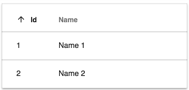
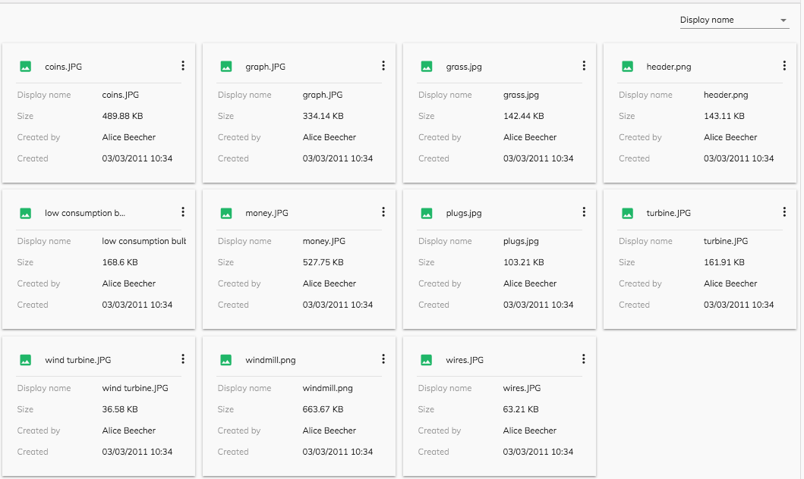
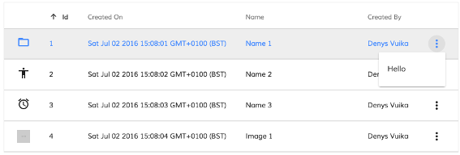
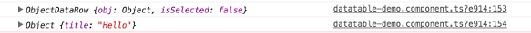
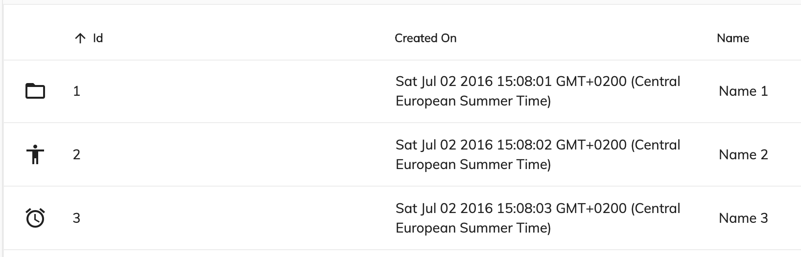
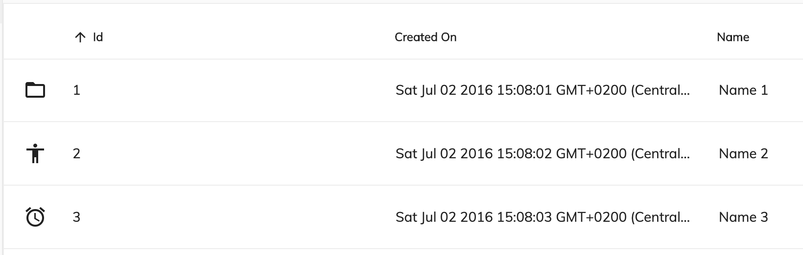
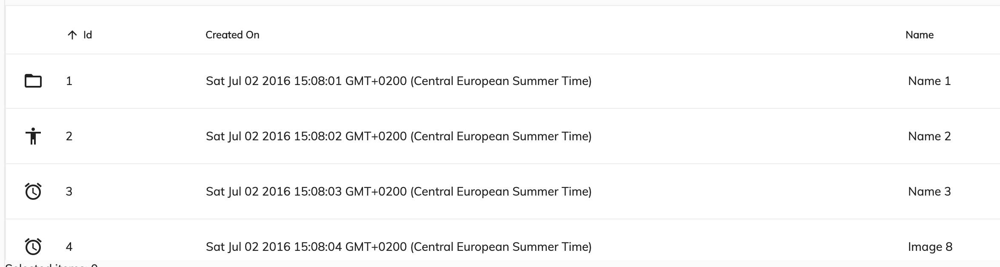
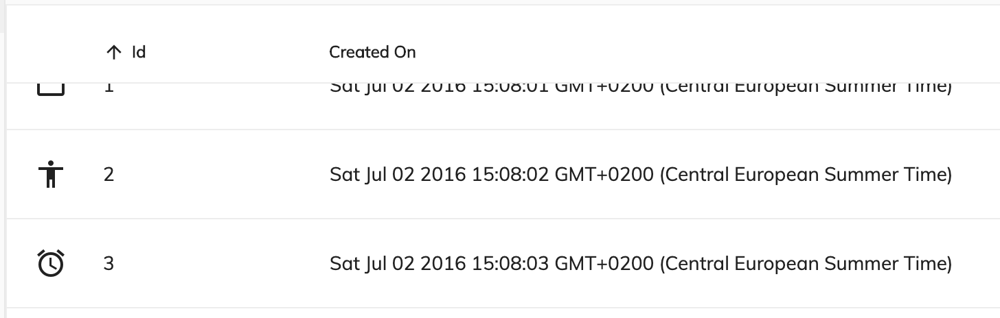

# [DataTable component](../../lib/core/datatable/components/datatable/datatable.component.ts "Defined in datatable.component.ts")

Displays data as a table with customizable columns and presentation.



See it live: [DataTable Quickstart](https://embed.plnkr.co/80qr4YFBeHjLMdAV0F6l/)

## Contents

-   [Basic usage](#basic-usage)
    -   [Setting the rows and column schema](#setting-the-rows-and-column-schema)
    -   [Transclusions](#transclusions)
-   [Class members](#class-members)
    -   [Properties](#properties)
    -   [Events](#events)
-   [Details](#details)
    -   [Supplying data for the table](#supplying-data-for-the-table)
    -   [Customizing columns](#customizing-columns)
    -   [DataTable DOM Events](#datatable-dom-events)
    -   [Card view](#card-view)
    -   [Using events](#using-events)
    -   [Customizing the component's styles](#customizing-the-components-styles)
-   [See also](#see-also)

## Basic usage

**[app.component](../../demo-shell/src/app/app.component.ts).html**

```html
<adf-datatable 
    [data]="data">
</adf-datatable>
```

**[app.component](../../demo-shell/src/app/app.component.ts).ts**

```ts
import { ObjectDataTableAdapter }  from '@alfresco/adf-core';

@Component({...})
export class DataTableDemo {
    data: ObjectDataTableAdapter;

    constructor() {
        this.data = new ObjectDataTableAdapter(
            // data
            [
                {id: 1, name: 'Name 1'},
                {id: 2, name: 'Name 2'}
            ],
            // schema
            [
                {
                    type: 'text',
                    key: 'id',
                    title: 'Id',
                    sortable: true
                },
                {
                    type: 'text',
                    key: 'name',
                    title: 'Name',
                    cssClass: 'full-width',
                    sortable: true
                }
            ]
        );
    }
}
```

### Setting the rows and column schema

You can set rows and columns in the [`ObjectDataTableAdapter`](../../lib/core/datatable/data/object-datatable-adapter.ts) as shown below:

```ts
import { ObjectDataTableAdapter }  from '@alfresco/adf-core';

@Component({...})
export class DataTableDemo {
    data: ObjectDataTableAdapter;

    constructor() {
        this.data = new ObjectDataTableAdapter(
            // data
            [
                {id: 1, name: 'Name 1'},
                {id: 2, name: 'Name 2'}
            ],
            // columns
            [
                {
                    type: 'text',
                    key: 'id',
                    title: 'Id',
                    sortable: true
                },
                {
                    type: 'text',
                    key: 'name',
                    title: 'Name',
                    cssClass: 'full-width',
                    sortable: true
                }
            ]
        );
    }
}
```

```html
<adf-datatable 
    [data]="data">
</adf-datatable>
```

You can also set rows and use an HTML-based schema declaration as shown below:

```ts
import { ObjectDataTableAdapter }  from '@alfresco/adf-core';

@Component({...})
export class DataTableDemo {
    data: ObjectDataTableAdapter;

    constructor() {
        this.data = new ObjectDataTableAdapter(
            // data
            [
                {id: 1, name: 'Name 1'},
                {id: 2, name: 'Name 2'}
            ],
            []
        );
    }
}
```

```html
<adf-datatable [data]="data">
    <data-columns>
        <data-column key="icon" type="image" [sortable]="false"></data-column>
        <data-column key="id" title="Id"></data-column>
        <data-column key="createdOn" title="Created"></data-column>
        <data-column key="name" title="Name" class="full-width name-column"></data-column>
        <data-column key="createdBy.name" title="Created By"></data-column>
    </data-columns>
</adf-datatable>
```

You can also set rows to the [`ObjectDataTableAdapter`](../../lib/core/datatable/data/object-datatable-adapter.ts) and set columns as an input as shown below :

```ts
import { ObjectDataTableAdapter }  from '@alfresco/adf-core';

@Component({...})
export class DataTableDemo {
    data: ObjectDataTableAdapter;
    schema: any;

    constructor() {
        this.data = new ObjectDataTableAdapter(
            // data
            [
                {id: 1, name: 'Name 1'},
                {id: 2, name: 'Name 2'}
            ],
            []
        );
        // columns
        this.schema =
            [
                { 
                    type: 'text', 
                    key: 'id', 
                    title: 'Id', 
                    sortable: true 
                },
                {
                    type: 'text', 
                    key: 'name', 
                    title: 'Name', 
                    sortable: true
                }
            ];
    }
}
```

```html
<adf-datatable
    [data]="data"
    [columns]="schema">
</adf-datatable>
```

You can also set rows and columns through inputs as shown below :

```ts
import { ObjectDataTableAdapter }  from '@alfresco/adf-core';

@Component({...})
export class DataTableDemo {
    rows: any;
    schema: any;

    constructor() {
        // data
        this.rows =
            [
                {id: 1, name: 'Name 1'},
                {id: 2, name: 'Name 2'}
            ];
        // columns
        this.schema =
            [
                { 
                    type: 'text', 
                    key: 'id', 
                    title: 'Id', 
                    sortable: true 
                },
                {
                    type: 'text', 
                    key: 'name', 
                    title: 'Name', 
                    sortable: true
                }
            ];
    }
}
```

```html
<adf-datatable
    [rows]="rows"
    [columns]="schema">
</adf-datatable>
```

### [Transclusions](../user-guide/transclusion.md)

You can add [Data column component](data-column.component.md) instances to define columns for the
table as described in the usage examples and the [Customizing columns](#customizing-columns) section.

You can also supply a `<adf-no-content-template>` or an
[Empty list component](empty-list.component.md) sub-component to show when the table is empty:

```html
<adf-datatable ...>
    <adf-no-content-template>
        <!--Add your custom empty template here-->
        <ng-template>
            <h1>Sorry, no content</h1>
        </ng-template>
    </adf-no-content-template>
</adf-datatable>
```

```html
<adf-datatable ...>        
    <adf-empty-list>
        <adf-empty-list-header>"'My custom Header'"</adf-empty-list-header>
        <adf-empty-list-body>"'My custom body'"</adf-empty-list-body>
        <adf-empty-list-footer>"'My custom footer'"</adf-empty-list-footer>
        <ng-content>"'HTML Layout'"</ng-content>
    </adf-empty-list>
</adf-datatable>
```

Another useful transclusion is the `<adf-loading-content-template>`, which is shown
while the data for the table is loading:

```html
<adf-datatable ...>
    <adf-loading-content-template>
        <ng-template>
            <!--Add your custom loading template here-->
            <mat-progress-spinner
                class="adf-document-list-loading-margin"
                [color]="'primary'"
                [mode]="'indeterminate'">
            </mat-progress-spinner>
        </ng-template>
    </adf-loading-content-template>
</adf-datatable>
```

```js
    isLoading(): boolean {
        //your custom logic to identify if you are in a loading state 
    }
```

Note that you can use both the `<adf-no-content-template>` and the `<adf-loading-content-template>`
together in the same datatable.

## Class members

### Properties

| Name | Type | Default value | Description |
| ---- | ---- | ------------- | ----------- |
| actions | `boolean` | false | Toggles the data actions column. |
| actionsPosition | `string` | "right" | Position of the actions dropdown menu. Can be "left" or "right". |
| allowDropFiles | `boolean` | false | Toggles file drop support for rows (see [Upload directive](upload.directive.md) for further details). |
| columns | `any[]` | \[] | The columns that the datatable will show. |
| contextMenu | `boolean` | false | Toggles custom context menu for the component. |
| data | [`DataTableAdapter`](../../lib/core/datatable/data/datatable-adapter.ts) |  | Data source for the table |
| display | `string` | DisplayMode.List | Selects the display mode of the table. Can be "list" or "gallery". |
| fallbackThumbnail | `string` |  | Fallback image for rows where the thumbnail is missing. |
| loading | `boolean` | false | Flag that indicates if the datatable is in loading state and needs to show the loading template (see the docs to learn how to configure a loading template). |
| multiselect | `boolean` | false | Toggles multiple row selection, which renders checkboxes at the beginning of each row. |
| noPermission | `boolean` | false | Flag that indicates if the datatable should show the "no permission" template. |
| rowMenuCacheEnabled | `boolean` | true | Should the items for the row actions menu be cached for reuse after they are loaded the first time? |
| rowStyle | `string` |  | The inline style to apply to every row. See [NgStyle](https://angular.io/docs/ts/latest/api/common/index/NgStyle-directive.html) docs for more details and usage examples. |
| rowStyleClass | `string` | "" | The CSS class to apply to every row. |
| rows | `any[]` | \[] | The rows that the datatable will show. |
| selectionMode | `string` | "single" | Row selection mode. Can be none, `single` or `multiple`. For `multiple` mode, you can use Cmd (macOS) or Ctrl (Win) modifier key to toggle selection for multiple rows. |
| showHeader | `boolean` | true | Toggles the header. |
| sorting | `any[]` | \[] | Define the sort order of the datatable. Possible values are : [`created`, `desc`], [`created`, `asc`], [`due`, `desc`], [`due`, `asc`] |
| stickyHeader | `boolean` | false | Toggles a sticky (fixed) header that stays in place while the rows become scrollable. [Sticky header](#sticky-header)|

### Events

| Name | Type | Description |
| ---- | ---- | ----------- |
| executeRowAction | [`EventEmitter`](https://angular.io/api/core/EventEmitter)`<`[`DataRowActionEvent`](../../lib/core/datatable/components/datatable/data-row-action.event.ts)`>` | Emitted when the user executes a row action. |
| rowClick | [`EventEmitter`](https://angular.io/api/core/EventEmitter)`<`[`DataRowEvent`](../../lib/core/datatable/data/data-row-event.model.ts)`>` | Emitted when the user clicks a row. |
| rowDblClick | [`EventEmitter`](https://angular.io/api/core/EventEmitter)`<`[`DataRowEvent`](../../lib/core/datatable/data/data-row-event.model.ts)`>` | Emitted when the user double-clicks a row. |
| showRowActionsMenu | [`EventEmitter`](https://angular.io/api/core/EventEmitter)`<`[`DataCellEvent`](../../lib/core/datatable/components/datatable/data-cell.event.ts)`>` | Emitted before the actions menu is displayed for a row. |
| showRowContextMenu | [`EventEmitter`](https://angular.io/api/core/EventEmitter)`<`[`DataCellEvent`](../../lib/core/datatable/components/datatable/data-cell.event.ts)`>` | Emitted before the context menu is displayed for a row. |

## Details

### Supplying data for the table

The column layout and row data are supplied to the table using an object that implements the
[`DataTableAdapter`](../../lib/core/datatable/data/datatable-adapter.ts) interface. This interface hides the internal details of the class that provides
the data, which gives a lot of flexibility in how the data can be stored and accessed. The DataTable
library includes a standard adapter class called [`ObjectDataTableAdapter`](../../lib/core/datatable/data/object-datatable-adapter.ts) that is useful in many
common cases. See the [`DataTableAdapter`](../../lib/core/datatable/data/datatable-adapter.ts) for full details about the interface and the [`ObjectDataTableAdapter`](../../lib/core/datatable/data/object-datatable-adapter.ts) class.

### Customizing columns

You can define custom HTML templates for columns and also add tooltips, automatic column title translation and other features. See the [Data Column component](data-column.component.md) page
for more information.

### DataTable DOM Events

Below are the DOM events emitted by the DataTable component.
These events bubble up the component tree and can be handled by any parent component.

| Name | Description |
| ---- | ----------- |
| row-click | Raised when user clicks a row |
| row-dblclick | Raised when user double-clicks a row |
| row-select | Raised after user selects a row |
| row-unselect | Raised after user unselects a row |
| row-keyup | Raised on the 'keyup' event for the focused row. |
| sorting-changed | Raised after user clicks the sortable column header. |

For example:

```html
<root-component (row-click)="onRowClick($event)">
    <child-component>
        <adf-datatable></adf-datatable>
    </child-component>
</root-component>
```

```ts
onRowClick(event) {
    console.log(event);
}
```


### Card view

Set the `display` property to "gallery" to enable Card View mode:

```html
<adf-datatable
    [data]="data"
    [display]="'gallery'">
</adf-datatable
```



### Using events

#### row-keyup DOM event

Emitted on the 'keyup' event for the focused row. 

This is an instance of `CustomEvent` with the `details` property containing the following object:

```ts
row: DataRow,
keyboardEvent: KeyboardEvent,
sender: any
```

#### rowClick event

Emitted when the user clicks a row.

Event properties:

```ts
sender: any     // DataTable instance 
value: DataRow, // row clicked
event: Event    // original HTML DOM event
```

Handler example:

```ts
onRowClicked(event: DataRowEvent) {
    console.log(event.value);
}
```

This event is cancellable. You can use `event.preventDefault()` to prevent the default behavior.

#### rowDblClick event

Emitted when the user double-clicks a row.

Event properties:

```ts
sender: any     // DataTable instance 
value: DataRow, // row clicked
event: Event    // original HTML DOM event
```

Handler example:

```ts
onRowDblClicked(event: DataRowEvent) {
    console.log(event.value);
}
```

This event is cancellable. You can use `event.preventDefault()` to prevent the default behavior.

#### showRowContextMenu event

Emitted before the context menu is displayed for a row.

Note that the DataTable itself does not populate the context menu with items.
You can provide all necessary content via the handler.

Event properties:

```ts
value: {
    row: DataRow,
    col: DataColumn,
    actions: []
}
```

Handler example:

```ts
onShowRowContextMenu(event: DataCellEvent) {
    event.value.actions = [
        { ... },
        { ... }
    ]
}
```

This event is cancellable. You can use `event.preventDefault()` to prevent the default behavior.

The DataTable will automatically render the supplied menu items.

See the [ContextMenu](https://www.npmjs.com/package/ng2-alfresco-core)
documentation for more details on the format and behavior of context actions.

#### showRowActionsMenu event

Emitted before the actions menu is displayed for a row.
Requires the `actions` property to be set to `true`.

Event properties:

```ts
value: {
    row: DataRow,
    action: any
}
```

Note that the DataTable itself does not populate the action menu with items.
You can provide all necessary content via the handler.

This event is cancellable. You can use `event.preventDefault()` to prevent the default behavior.

#### executeRowAction event

Emitted when the user executes a row action.

This usually accompanies a `showRowActionsMenu` event. 
The DataTable itself does not execute actions but provides support for external
integration. If actions are provided using the `showRowActionsMenu` event
then `executeRowAction` will be automatically executed when the user clicks a
corresponding menu item.

```html
<adf-datatable
    [data]="data"
    [multiselect]="multiselect"
    [actions]="true"
    (showRowActionsMenu)="onShowRowActionsMenu($event)"
    (executeRowAction)="onExecuteRowAction($event)">
</adf-datatable>
```

```ts
import { DataCellEvent, DataRowActionEvent } from '@alfresco/adf-core';

onShowRowActionsMenu(event: DataCellEvent) {
    let myAction = {
        title: 'Hello'
        // your custom metadata needed for onExecuteRowAction
    };
    event.value.actions = [
        myAction
    ];
}

onExecuteRowAction(event: DataRowActionEvent) {
    let args = event.value;
    console.log(args.row);
    console.log(args.action);
    window.alert(`My custom action: ${args.action.title}`);
}
```





You can use any payloads for row actions. The only requirement for the objects is that they
must have a `title` property.

When an action is selected in the dropdown menu, the DataTable invokes the `executeRowAction` event.
Use this to handle the response, inspect the action payload (and all custom properties defined
earlier), and perform the corresponding actions.

### Customizing the component's styles

The datatable component is ready to be used out of the box although you might want to customize it to better fit your needs.

### Truncated text

By default, the content of the cells is wrapped so you can see all the data inside. See picture bellow.



However, you can also truncate the text within these cells by using the `adf-ellipsis-cell` class in the desired column. 

```json
{ 
    type: 'text', 
    key: 'createdOn', 
    title: 'Created On', 
    sortable: true, 
    cssClass: 'adf-ellipsis-cell' 
}
```



### Expanded cells

This component makes use of a flex layout. All cells have the same semantic importance, so all of them have the same width. You can alter this behavior by adding one of the following classes in the desired column to make it grow wider. 



This classes go from `adf-expand-cell-1` to `adf-expand-cell-5`. The higher the number in the class the wider the column will get. You can choose the one that better suits your needs.


### Combining classes

All these classes can be combined together to fully fit your needs and make your datatable component look as you want.

```json
{ 
    type: 'text', 
    key: 'name', 
    title: 'Name', 
    cssClass: 'adf-ellipsis-cell adf-expand-cell-3' 
}
```


### Sticky header
If you have a long list of rows and you want to fix the header in place so you always see it you only have to follow this 2-step process.

First, you will need to set the stickyHeader property of your datatable to `true`:

```html
<adf-datatable 
    [data]="data"
    [stickyHeader]="true">
</adf-datatable>
```

Second and last, you will need to set the height of your datatable in its parent's container so that the datatable adapts to it, i.e. `height: 300px;`. You will also need to set the overflow-y attribute to auto, `overflow-y: auto;`, so it hides when the rows exceed the height of the datatable component.

```html
<div style="height: 300px; overflow-y: auto;">
    <adf-datatable
        [data]="data"
        [stickyHeader]="'true'">
    </adf-datatable>
</div>
```

Final result



## See also

-   [Data column component](data-column.component.md)
-   [Pagination component](pagination.component.md)
-   [`DataTableAdapter`](../../lib/core/datatable/data/datatable-adapter.ts)
-   [Document list component](../content-services/document-list.component.md)
