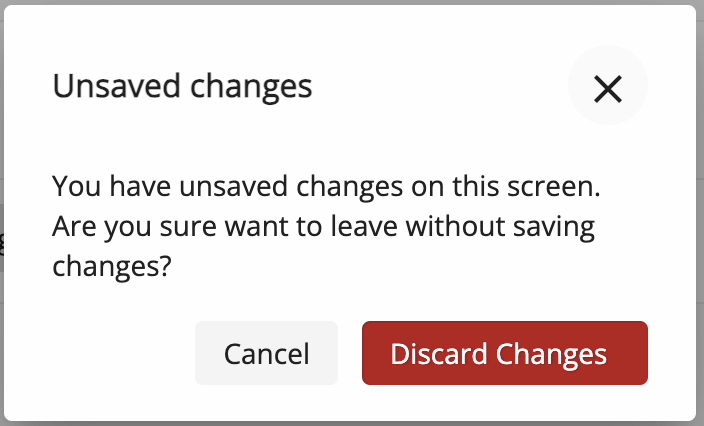

# [Unsaved Changes Dialog component](../../../lib/core/src/lib/dialogs/unsaved-changes-dialog/unsaved-changes-dialog.component.ts "Defined in unsaved-changes-dialog.component.ts")

Dialog which informs about unsaved changes. Allows discard them and proceed or close dialog and stop proceeding.



## Basic Usage

```ts
this.dialog.open(UnsavedChangesDialogComponent);
```
## Details

### Detecting if changes should be discarded.

To detect if changes should be discarded you need to check value passed on dialog's close. If value is true then changes should be discard, false otherwise.

## See also

-   [Unsaved Changes guard](../services/unsaved-changes.guard.md)
