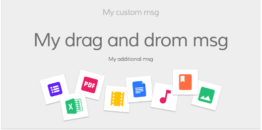

# Empty list component

Displays a message indicating that a list is empty.



## Basic Usage

```html
<adf-datatable ...>

    <adf-empty-list>
        <adf-empty-list-header>"'My custom Header'"</adf-empty-list-header>
        <adf-empty-list-body>"'My custom body'"</adf-empty-list-body>
        <adf-empty-list-footer>"'My custom footer'"</adf-empty-list-footer>
        <ng-content>"'HTML Layout'"</ng-content>
    </adf-empty-list>

</adf-datatable>
```

### [Transclusions](../user-guide/transclusion.md)

You can supply a custom header, body, and footer for an empty list using special
sub-components:

```html
<adf-empty-list>
    <adf-empty-list-header>"'My custom Header'"</adf-empty-list-header>
    <adf-empty-list-body>"'My custom body'"</adf-empty-list-body>
    <adf-empty-list-footer>"'My custom footer'"</adf-empty-list-footer>
    <ng-content>"'HTML Layout'"</ng-content>
</adf-empty-list>
```

## Class members

### Properties

| Name | Type | Default value | Description |
| ---- | ---- | ------- | ----------- |
| emptyListImageUrl | `string` | "empty_doc_lib.svg" | The default image used as the background |
| emptyMsg | `string` | "This list is empty" | The default title message |
| dragDropMsg | `string` | "Drag and drop" | The default drag and drop message |
| additionalMsg | `string` | "Drag and drop" | The default additional message |

## Details

This component provides a custom display to show when a [Datatable component](datatable.component.md) has
no content.

## See also

- [Datatable component](datatable.component.md)