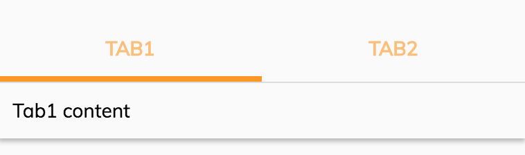

# Info Drawer Tab component

Renders tabs in a [Info drawer component](../core/info-drawer.component.md).



## Basic usage

Render a tab with label:

```html
<adf-info-drawer>

    <adf-info-drawer-tab [label]="'Tab1'">
        <div> Tab1 content</div>
    </adf-info-drawer-tab>

    <adf-info-drawer-tab [label]="'Tab2'">
        <div> Tab2 content</div>
    </adf-info-drawer-tab>
</adf-info-drawer>
```

Render tab with icon instead of labels:

```html
<adf-info-drawer>

    <adf-info-drawer-tab [label]="'Tab1'" icon="comment">
        <div> Tab1 content</div>
    </adf-info-drawer-tab>

    <adf-info-drawer-tab [label]="'Tab2'" icon="people">
            <div> Tab2 content</div>
    </adf-info-drawer-tab>

</adf-info-drawer>
```


## Class members

### Properties

| Name | Type | Default value | Description |
| ---- | ---- | ------------- | ----------- |
| icon | `string` | null | Icon to render for the tab. |
| label | `string` | "Main tab" | The title of the tab. |

## Details

See the [Info drawer component](../core/info-drawer.component.md) page for details of how to use this subcomponent.

## See also

-   [Info drawer component](info-drawer.component.md)
-   [Info drawer layout component](info-drawer-layout.component.md)
