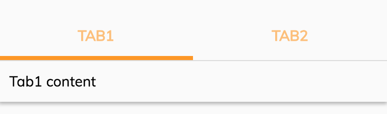

# Info Drawer Tab component



## Basic usage

Render a tab with label:

```html
<adf-info-drawer>

    <adf-info-drawer-tab [label]="'Tab1'">
        <div> Tab1 content</div>
    </adf-info-drawer-tab>

    <adf-info-drawer-tab [label]="'Tab2'">
        <div> Tab2 content</div>
    </adf-info-drawer-tab>
</adf-info-drawer>
```

Render tab with icon instead of labels:

```html
<adf-info-drawer>

    <adf-info-drawer-tab [label]="'Tab1'" icon="comment">
        <div> Tab1 content</div>
    </adf-info-drawer-tab>

    <adf-info-drawer-tab [label]="'Tab2'" icon="people">
            <div> Tab2 content</div>
    </adf-info-drawer-tab>

</adf-info-drawer>
```


## Class members

### Properties

| Name | Type | Default value | Description |
| -- | -- | -- | -- |
| label | `string` | '' | Tab label. |
| icon | `string` |  null | The material design icon. |

## See also

- [Info drawer layout component](info-drawer.component.md)
