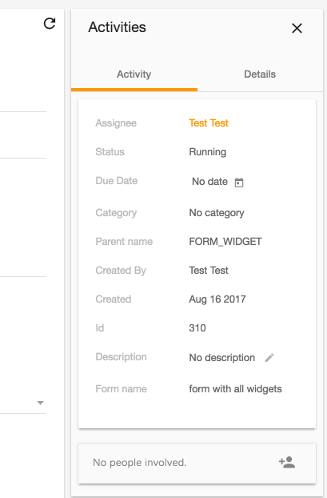

# Info Drawer component

Displays a sidebar-style information panel with tabs.



## Basic usage

```html
<adf-info-drawer title="Activities" (currentTab)="getActiveTab($event)">
    <div info-drawer-buttons>
        <mat-icon (click)="close()">clear</mat-icon>
    </div>

    <adf-info-drawer-tab label="Activity">
        <mycomponent1></mycomponent1>
        <mycomponent2></mycomponent2>
    </adf-info-drawer-tab>

    <adf-info-drawer-tab label="Details">
        <mycomponent3></mycomponent3>
    </adf-info-drawer-tab>

</adf-info-drawer>
```

## Class members

### Properties

| Name | Type | Default value | Description |
| ---- | ---- | ------------- | ----------- |
| selectedIndex | `number` | 0 | The selected index tab. |
| title | `string \| null` | null | The title of the info drawer. |

### Events

| Name | Type | Description |
| ---- | ---- | ----------- |
| currentTab | [`EventEmitter`](https://angular.io/api/core/EventEmitter)`<number>` | Emitted when the currently active tab changes. |

## Details

This is a variant of the [Info Drawer Layout component](info-drawer-layout.component.md) that displays information in tabs. You can use the Info drawer tab subcomponent to add tabs (as shown in the example) and the `currentTab` output property to select the currently active tab.

You can also customize the three regions (title, buttons and content) as with the [Info Drawer Layout component](../core/info-drawer-layout.component.md).

## See also

-   [Info drawer layout component](info-drawer-layout.component.md)
-   [Info drawer tab component](info-drawer-tab.component.md)
