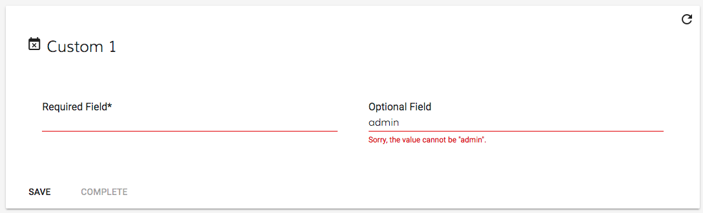

# [FormFieldValidator interface](../../../lib/core/src/lib/form/components/widgets/core/form-field-validator.ts "Defined in form-field-validator.ts")

Defines how the input fields of [`Form`](../../../lib/process-services/src/lib/task-list/models/form.model.ts) and Task Details components are validated.

## Basic Usage

```html
<adf-form [fieldValidators]="fieldValidators"></adf-form>
```

```ts
import { FORM_FIELD_VALIDATORS } from '@alfresco/adf-core';

@Component({...})
export class AppComponent {

    fieldValidators = [
        // default set of ADF validators if needed
        ...FORM_FIELD_VALIDATORS,

        // custom validator
        new MyValidator()
    ];

}

export class MyValidator implements FormFieldValidator {

    isSupported(field: FormFieldModel): boolean {
        // Check if this validation can be used with 'field'.
    }
    
    validate(field: FormFieldModel): boolean {
        // Perform the validation.
    }
}
```

### Methods

`isSupported(field: FormFieldModel): boolean;`
Does this validator support the type of data used in `field`?

`validate(field: FormFieldModel): boolean;`
Perform validation on `field`.

## Details

You can supply a set of validator objects for a form using its `fieldValidators` property.
ADF will determine if a validator should be used with a given field by calling its
`isSupported` method, passing the field's [`FormFieldModel`](../../core/models/form-field.model.md) as a parameter. If the validator
does support the field then its `validate` method will be called on the [`FormFieldModel`](../../core/models/form-field.model.md)
during the validation phase.

Several validator classes are predefined for you to use:

| Validator name | Checks that: |
| -------------- | ------------ |
| [`RequiredFieldValidator`](../../../lib/core/src/lib/form/components/widgets/core/form-field-validator.ts) | Field is not left blank |
| [`NumberFieldValidator`](../../../lib/core/src/lib/form/components/widgets/core/form-field-validator.ts) | Field contains numeric data |
| [`MinLengthFieldValidator`](../../../lib/core/src/lib/form/components/widgets/core/form-field-validator.ts) | Field text has at least a minimum number of characters |
| [`MaxLengthFieldValidator`](../../../lib/core/src/lib/form/components/widgets/core/form-field-validator.ts) | Field text has no more than a maximum number of characters |
| [`MinValueFieldValidator`](../../../lib/core/src/lib/form/components/widgets/core/form-field-validator.ts) | Numeric field's value is greater than a lower limit |
| [`MaxValueFieldValidator`](../../../lib/core/src/lib/form/components/widgets/core/form-field-validator.ts) | Numeric field's vaue is less than an upper limit |
| [`RegExFieldValidator`](../../../lib/core/src/lib/form/components/widgets/core/form-field-validator.ts) | Field text matches a regular expression |
| [`DateFieldValidator`](../../../lib/core/src/lib/form/components/widgets/core/form-field-validator.ts) | Field contains a date in the correct format |
| [`MinDateFieldValidator`](../../../lib/core/src/lib/form/components/widgets/core/form-field-validator.ts) | Date within a field occurs after a certain starting point |
| [`MaxDateFieldValidator`](../../../lib/core/src/lib/form/components/widgets/core/form-field-validator.ts) | Date within a field occurs before a certain end point |

The `FORM_FIELD_VALIDATORS` array contains an instance of each of these classes. You can assign this to the `fieldValidators` property of a [`Form`](../../../lib/process-services/src/lib/task-list/models/form.model.ts) or [Task Details component](../../process-services/components/task-details.component.md) to enable standard validation.

### Custom validators

You can implement your own custom validator classes if the standard set doesn't provide the
features you need. For example, you could check for consistency between separate fields on
the form (currency values adding up to a given total, say).

The `type` property of [`FormFieldModel`](../../core/models/form-field.model.md) is often used in the `isSupported` function, since
validation methods typically apply only to specific types of data.
The [`FormFieldTypes`](../../../lib/core/src/lib/form/components/widgets/core/form-field-types.ts)
class defines convenient constants for the type strings. 

The validator in the example
below simply checks that "admin" is not entered into a text field:

```ts
import { FormFieldModel, FormFieldTypes, FormFieldValidator } from '@alfresco/adf-core';

export class DemoFieldValidator implements FormFieldValidator {

    isSupported(field: FormFieldModel): boolean {
        return field && field.type === FormFieldTypes.TEXT;
    }

    validate(field: FormFieldModel): boolean {
        if (this.isSupported(field)) {
            if (field.value && field.value.toLowerCase() === 'admin') {
                field.validationSummary = 'Sorry, the value cannot be "admin".';
                return false;
            }
        }
        return true;
    }

}
```

You will usually want to extend the existing `FORM_FIELD_VALIDATORS` set rather than replace
it entirely (although you can do this if necessary):

```ts
import { DemoFieldValidator } from './demo-field-validator';

@Component({...})
export class AppComponent {

    fieldValidators = [
        ...FORM_FIELD_VALIDATORS,
        new DemoFieldValidator()
    ];

}
```

You can now use the 'fieldValidators' property of the [`Form`](../../../lib/process-services/src/lib/task-list/models/form.model.ts) or Task Details components to assign your
custom validator set:

```html
<activiti-task-details
    [fieldValidators]="fieldValidators"
    taskId="123">
</<activiti-task-details>

<!-- OR -->

<adf-form
    [fieldValidators]="fieldValidators"
    taskI="123">
</adf-form>
```

If you now run the application and try to enter "admin" in one of the text fields (either optional or required), you should see the following error:



## See also

-   [Form field model](../models/form-field.model.md)
-   [Form component](../components/form.component.md)
