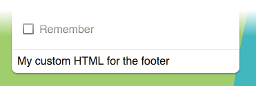

# Login component

Authenticates to Alfresco Content Services and Alfresco Process Services.



## Contents

-   [Basic usage](#basic-usage)

    -   [Properties](#properties)
    -   [Events](#events)

-   [Details](#details)

    -   [Handling events](#handling-events)
    -   [Changing content](#changing-content)
    -   [Custom logo and background](#custom-logo-and-background)
    -   [Customizing validation rules](#customizing-validation-rules)
    -   [Call an external identity provider to fetch the auth token](#call-an-external-identity-provider-to-fetch-the-auth-token)
    -   [Controlling form submit execution behaviour](#controlling-form-submit-execution-behaviour)

-   [See Also](#see-also)

## Basic usage

```html
<adf-login 
    providers="ECM"
    successRoute="/home">
</adf-login>
```

## Class members

### Properties

| Name | Type | Default value | Description |
| ---- | ---- | ------------- | ----------- |
| showRememberMe | `boolean` | `true` | Should the `Remember me` checkbox be shown? |
| showLoginActions | `boolean` | `true` | Should the extra actions (`Need Help`, `Register`, etc) be shown? |
| needHelpLink | `string` | `''` | Sets the URL of the NEED HELP link in the footer. |
| registerLink | `string` | `''` | Sets the URL of the REGISTER link in the footer. |
| logoImageUrl | `string` | `'./assets/images/alfresco-logo.svg'` | Path to a custom logo image. |
| backgroundImageUrl | `string` | `'./assets/images/background.svg'` | Path to a custom background image. |
| copyrightText | `string` | `'\u00A9 2016 Alfresco Software, Inc. All Rights Reserved.'` | The copyright text below the login box. |
| providers | `string` |  | Possible valid values are ECM, BPM or ALL. By default, this component will log in only to ECM. If you want to log in in both systems then use ALL. There is also a way to call your Auth token API using the string "OAUTH" (supported only for BPM) |
| fieldsValidation | `any` |  | Custom validation rules for the login form. |
| disableCsrf | `boolean` |  | Prevents the CSRF Token from being submitted. Only valid for Alfresco Process Services. |
| successRoute | `string` | `null` | Route to redirect to on successful login. |

### Events

| Name | Type | Description |
| ---- | ---- | ----------- |
| success | `EventEmitter<LoginSuccessEvent>` | Emitted when the login is successful. |
| error | `EventEmitter<LoginErrorEvent>` | Emitted when the login fails. |
| executeSubmit | `EventEmitter<LoginSubmitEvent>` | Emitted when the login form is submitted. |

## Details

### Handling events

**app.component.html**

```html
<adf-login 
    providers="ALL"
    (success)="mySuccessMethod($event)"
    (error)="myErrorMethod($event)">
</adf-login>
```

**app.component.ts**

```ts
export class AppComponent {

    mySuccessMethod($event) {
        console.log('Success Login EventEmitt called with: ' + $event.value);
    }

    myErrorMethod($event) {
        console.log('Error Login EventEmitt called with: ' + $event.value);
    }
}
```

### Changing content

You can replace the content of the header and footer of the Login component with
your own custom content, as shown in the examples below:

```html
<adf-login ...>
    <login-footer><ng-template>My custom HTML for the footer</ng-template></login-footer>
</adf-login>`
```


```html
<adf-login ...>
    <login-header><ng-template>My custom HTML for the header</ng-template></login-header>
</adf-login>`
```


Also, any content that you put inside the &lt;adf-login> tags will be rendered as part
of the Login dialog:

```html
<adf-login ...>
    <div>
        <div>Your extra content</div>
    </div>
</adf-login>
```

This is useful if you need to extend the functionality of the dialog
with custom input fields handled by your application or parent component:


### Custom logo and background

You can change the logo and background images using the `backgroundImageUrl` and
`logoImageUrl` properties:

```html
<adf-login 
    [backgroundImageUrl]="'http://images.freeimages.com/images/previews/638/wood-wall-for-background-1634466.jpg'"
    [logoImageUrl]="'http://images.freeimages.com/images/previews/eac/honeybee-with-a-house-1633609.jpg'">
</adf-login>
```


You can also bind to your component properties and provide values dynamically if you need to:

```html
<adf-login
    [backgroundImageUrl]="myCustomBackground"
    [logoImageUrl]="myCustomLogo">
</adf-login>
```

### Customizing validation rules

You can add to or modify the default validation rules of the login form if you
need your own custom validation:

**MyCustomLogin.component.html**

```html
<adf-login 
    [fieldsValidation]="customValidation"
    #alfrescologin>
</adf-login>
```

**MyCustomLogin.component.ts**

```ts
export class MyCustomLogin {
    
    @ViewChild('alfrescologin')
    alfrescologin: any;

    customValidation: any;

    constructor(public router: Router) {
        this.customValidation = {
            username: ['', Validators.compose([Validators.required, Validators.minLength(8), Validators.maxLength(10)])],
            password: ['', Validators.required]
        };
    }

    ngOnInit() {
        this.alfrescologin.addCustomValidationError('username', 'minlength', 'Username must be at least 8 characters.');
        this.alfrescologin.addCustomValidationError('username', 'maxlength', 'Username must not be longer than 11 characters.');
    }
}
```

### Call an external identity provider to fetch the auth token

You can access an external provider to get an auth token for a user:

**app.config.json**

```json
{
    "oauth2" : {
      "host": "http://myhost.com",
      "authPath": "/my-custom-auth/token",
      "clientId": "my-client-id",
      "secret": ""
    }
}
```

**MyCustomLogin.component.html**

```html
<adf-login 
    [providers]="'OAUTH'"
    (success)="onMyAuthLogin($event)">
</adf-login>
```

**MyCustomLogin.component.ts**

```ts
export class MyCustomLogin {
 
    constructor(public router: Router) {
    }

    onMyAuthLogin($event) {
        console.log("My token " + $event.token.ticket)
        this.router.navigate(['/home']);
    }
}
```

### Controlling form submit execution behaviour

The standard form submission system is suitable for most tasks but you can
take full control of submission if you need to. Use the `executeSubmit` event
to modify the submission process with your own code just after the form is
submitted.

If you want to replace the submission process completely (rather than just extend
it), you can use `event.preventDefault()` in the handler to avoid the default
behavior. You could use this, for example, to customize the validation heavily or
to present a summary of validation before submitting the form.

**MyCustomLogin.component.html**

```html
<adf-login 
    (executeSubmit)="validateForm($event)" 
    #alfrescologin>
</adf-login>
```

**MyCustomLogin.component.ts**

```ts
export class MyCustomLogin {

    validateForm(event: any) {
        let values = event.values;
        
        // check if the username is in the blacklist
        if (values.controls['username'].value === 'invalidUsername') {
            this.alfrescologin.addCustomFormError('username', 'the
            username is in blacklist');
            event.preventDefault();
        }
    }
    
}
```

Note that if you do not call `event.preventDefault()` then the default behaviour 
will execute _after_ your custom code has completed.

## See Also

-   [Logout directive](logout.directive.md)
