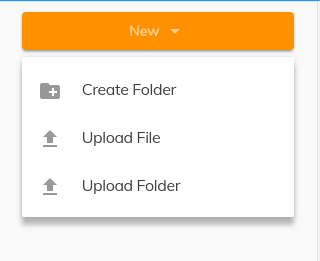
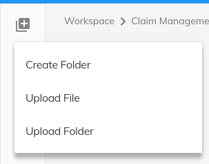

# Sidebar action menu component

Displays a sidebar-action menu information panel.




## Basic usage

```html
<adf-sidebar-action-menu>
    <mat-icon sidebar-menu-title-icon>arrow_drop_down</mat-icon>
    <div sidebar-menu-expand-icon>
        <mat-icon>queue</mat-icon>
    </div>
    <div sidebar-menu-options>
        <button mat-menu-item>
            <mat-icon>assignment</mat-icon>
            <span>Button Name</span>
        </button>
    </div>
</adf-sidebar-action-menu>
```

## Class members

### Properties

| Name | Type | Default value | Description |
| ---- | ---- | ------------- | ----------- |
| expanded | `boolean` |  | Toggle the sidebar action menu on expand. |
| title | `string` |  | The title of the sidebar action. |
| width | `number` | 272 | Width in pixels for sidebar action menu options |

## Details

As the name suggests, this is basically just a layout with CSS styling. There are three regions where you can add your own content, as shown in the example:

-   sidebar-menu-title-icon
-   sidebar-menu-options
-   sidebar-menu-expand-icon
