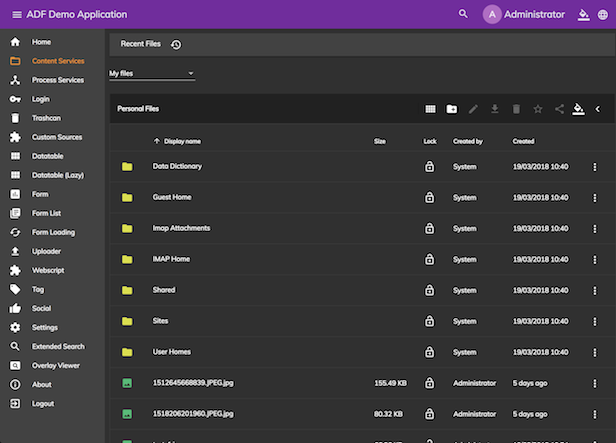

# Sidenav layout component

A generalised component to help displayig the "ADF style" application frame. The layout consists of 3 regions:

- header
- navigation
- content

The navigation (depending on the screensize) either uses the Angular Material Sidenav (on small breakpoint), or the ADF style Sidenav (on bigger breakpoint).

- For Angular Material Sidenav see examples on the Angular Material project's site.
- The ADF style Sidenav has 2 states: **expanded** and **compact***. Regardless of the state, it is always displayed on the screen, either in small width (compact) or in bigger width (expanded).

The contents of the 3 regions can be injected through Angular's template transclusion. For more details see the usage example of the components.



## Basic Usage

```html
<adf-sidenav-layout
    [sidenavMin]="70"
    [sidenavMax]="220"
    [stepOver]="600"
    [hideSidenav]="false"
    [expandedSidenav]="true">

    <ng-template adf-sidenav-layout-header let-toggleMenu="toggleMenu">
        <div class="app-header"></div>
    </ng-template>

    <ng-template adf-sidenav-layout-navigation let-isMenuMinimized="isMenuMinimized">
        <div class="app-navigation"></div>
    </ng-template>

    <ng-template adf-sidenav-layout-content>
        <router-outlet></router-outlet>
    </ng-template>

</adf-sidenav-layout>
```

### Properties

| Name | Type | Default | Description |
| --- | --- | --- | --- |
| sidenavMin | number | - | (**required**) the compact width in pixels |
| sidenavMax | number | - | (**required**) the expanded width in pixels |
| stepOver | number | - | (**required**) The breakpoint in pixels, where to step over to mobile/desktop |
| hideSidenav | boolean | false | Hide the navigation or not |
| expandedSidenav | boolean | true | The initial (expanded/compact) state of the navigation |

## Template context

Each template is given the context containing the following methods:

1) toggleMenu(): void *// trigger menu toggle*
2) isMenuMinimized(): boolean *// The expanded/compact (minimized) state of the navigation*