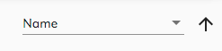

# Sorting Picker Component

Provides an ability to pick one of the predefined sorting definitions and define sorting direction:

```html
<adf-sorting-picker
    [options]="options"
    [selected]="value"
    [ascending]="ascending"
    (change)="onChanged($event)">
</adf-sorting-picker>
```



## Options format

You can bind a collection of any objects that expose the following properties:

```ts
{
    key: string;
    label: string;
}
```

## Properties

| Name | Type | Default Value | Description |
| options | `Array<{key: string, label: string}>` | `[]` | Available sorting options. |
| selected | `string` | | Currently selected option key. |
| ascending | `boolean` | true | Current sorting direction. |

## Events

| Name | Type | Description |
| ---- | ---- | ----------- |
| change | `EventEmitter<{ key: string, ascending: boolean }>` | Raised each time sorting key or direction gets changed. |
