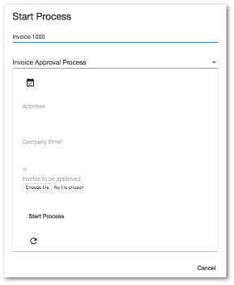

# Start Form component

Displays the Start Form for a process.



## Basic Usage

```html
<adf-start-form
    [processDefinitionId]="currentProcessDef.id"
    (outcomeClick)="onOutcomeClick($event)">
</adf-start-form>
```

## Class members

### Properties

| Name | Type | Default value | Description |
| ---- | ---- | ------------- | ----------- |
| processDefinitionId | `string` |  | Definition ID of the process to start.  |
| processId | `string` |  | Process ID of the process to start.  |
| showOutcomeButtons | `boolean` | `true` | Should form outcome buttons be shown?  |
| showRefreshButton | `boolean` | `true` | Should the refresh button be shown?  |
| readOnlyForm | `boolean` | `false` | Is the form read-only (ie, can't be edited)?  |
| form | `FormModel` |  | Underlying form model instance.  |
| taskId | `string` |  | Task id to fetch corresponding form and values.  |
| nodeId | `string` |  | Content Services node ID for the form metadata.  |
| formId | `string` |  | The id of the form definition to load and display with custom values.  |
| formName | `string` |  | Name of the form definition to load and display with custom values.  |
| saveMetadata | `boolean` | `false` | Toggle saving of form metadata.  |
| data | `FormValues` |  | Custom form values map to be used with the rendered form.  |
| path | `string` |  | Path of the folder where the metadata will be stored.  |
| nameNode | `string` |  | Name to assign to the new node where the metadata are stored.  |
| showTitle | `boolean` | `true` | Toggle rendering of the form title.  |
| showCompleteButton | `boolean` | `true` | Toggle rendering of the `Complete` outcome button.  |
| disableCompleteButton | `boolean` | `false` | If true then the `Complete` outcome button is shown but it will be disabled.  |
| disableStartProcessButton | `boolean` | `false` | If true then the `Start Process` outcome button is shown but it will be disabled.  |
| showSaveButton | `boolean` | `true` | Toggle rendering of the `Save` outcome button.  |
| showDebugButton | `boolean` | `false` | Toggle debug options.  |
| readOnly | `boolean` | `false` | Toggle readonly state of the form. Forces all form widgets to render as readonly if enabled.  |
| showRefreshButton | `boolean` | `true` | Toggle rendering of the `Refresh` button.  |
| showValidationIcon | `boolean` | `true` | Toggle rendering of the validation icon next to the form title.  |
| fieldValidators | `FormFieldValidator[]` | `[]` | Contains a list of form field validator instances.  |

### Events

| Name | Type | Description |
| ---- | ---- | ----------- |
| outcomeClick | `EventEmitter<any>` | Emitted when the user clicks one of the outcome buttons that completes the form. |
| formContentClicked | `EventEmitter<ContentLinkModel>` | Emitted when a field of the form is clicked. |
| formSaved | `EventEmitter<FormModel>` | Emitted when the form is submitted with the `Save` or custom outcomes. |
| formCompleted | `EventEmitter<FormModel>` | Emitted when the form is submitted with the `Complete` outcome. |
| formContentClicked | `EventEmitter<ContentLinkModel>` | Emitted when form content is clicked. |
| formLoaded | `EventEmitter<FormModel>` | Emitted when the form is loaded or reloaded. |
| formDataRefreshed | `EventEmitter<FormModel>` | Emitted when form values are refreshed due to a data property change. |
| executeOutcome | `EventEmitter<FormOutcomeEvent>` | Emitted when any outcome is executed. Default behaviour can be prevented via `event.preventDefault()`. |
| onError | `EventEmitter<any>` | Emitted when any error occurs. |

## Details

The [Start Process component](../process-services/start-process.component.md) uses the Start Form component
to display the
[start form](http://docs.alfresco.com/process-services1.6/topics/none_start_event.html)
for the process.

The `outcomeClick` event is passed a string containing the ID of the outcome button that
the user clicked. You can pass this value to the `startProcess` method (defined in the
[Process service](../process-services/process.service.md)) when activating the process, if necessary.

## See also

-   [Process service](../process-services/process.service.md)
